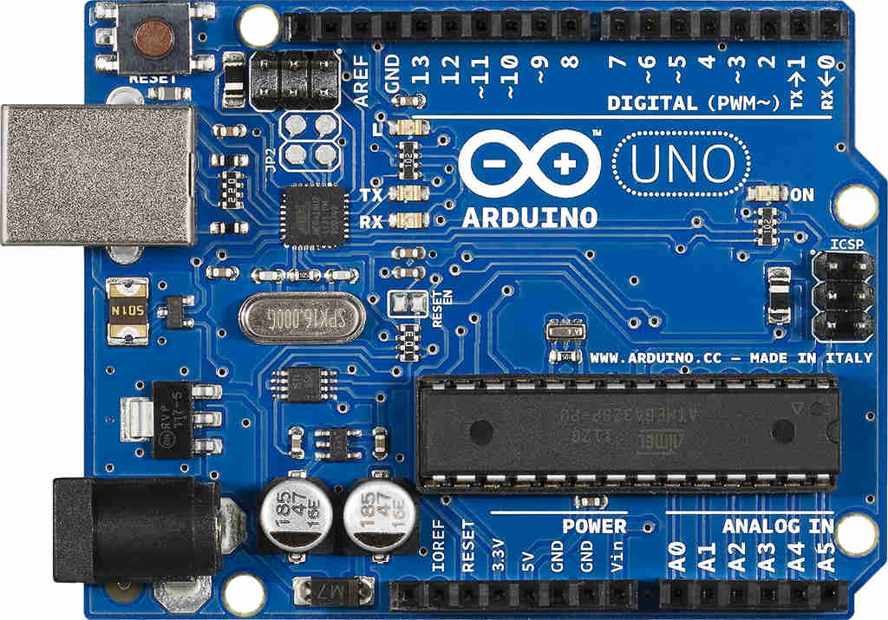
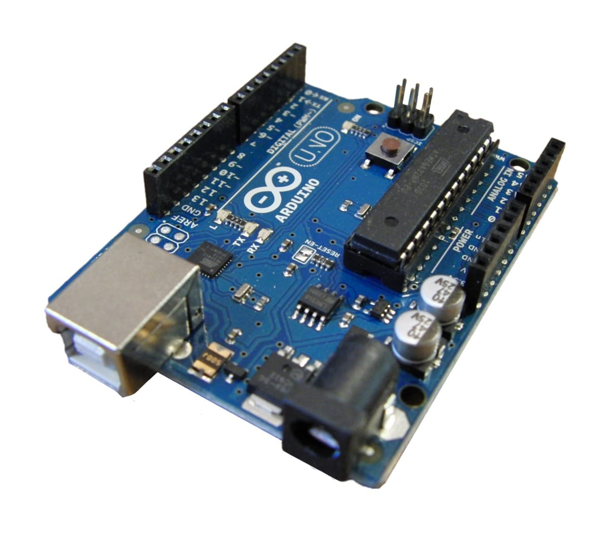

I recently got an Arduino.

When I got the idea of playing around with electronics after 15+ years of not touching a single resistor, I recall I spent some time searching which device was best for what I wanted to do.

Two of the most popular platforms for such a thing are Arduino and Raspberry PI. There are many, many others, but those are the two most popular and in this article I want to explain the difference between those 2.

Here is Arduino Uno, the board we'll take as an example, although Arduino offers many different boards. This is the board I chose, by the way:

Here is a Raspberry Pi model B+

They look pretty similar, at a first look. Chips, connectors, holes for screws.

Turns out, they are very, very different.

Starting from the core. Arduino comes with an 8-bit **microcontroller**. The Raspberry Pi comes with a 64-bit **microprocessor**.

Arduino has 2 Kilobytes of RAM.
Raspberry Pi has 1GB of RAM. (500x)

In terms of I/O, Arduino has an USB-B port that can be used by a computer to transfer new programs to run, a power input and a set of I/O pins.

A Raspberry Pi is much more sophisticated in this regard, having a Video output, an HDMI port, an SD card port, an Audio jack, CSI camera port, DSI display port, 4 USB 2.0 ports which you can use to attach USB devices, a Gigabit Ethernet jack, Wireless LAN, Bluetooth 4.2 and I/O pins (GPIO) as well. Lots of things.

Arduino has no operating system. It can only run programs that were compiled for the Arduino platform, which mostly means programs written in C++.

Raspberry Pi runs an operating system, which is usually Linux. It's a mini computer, while Arduino is much more simple.

## Which one should you use?

Given those differences you might think a Raspberry Pi is so much more powerful and capable than Arduino, so you should use that. Right? Wrong.

Arduino consumes much less power (`~50 mA` idle) than an a Raspberry Pi (`700+ mA`)

Arduino has 20 I/O pins. Raspberry Pi has 8.
Individual I/O pins in Arduino can drive `40mA` while Raspberry Pi GPIO pins can each drive a maximum of `16mA`.

> I researched those numbers, but I haven't measured them myself yet.

You can program a Raspberry Pi in pretty much any programming language you want, as if you run Linux there is a vast choice for you.

## What about programming?

Arduino is best to be programmed using C++ and its "Arduino language" which is just C++ with some convenience features that make it easy for beginners to start with.

However you are not limited to it. If you can live with the constraints of having the Arduino attached to the USB port of the computer, you can run Node.js code on it using the [Johnny Five](http://johnny-five.io) project, which is pretty cool.

There are similar tools for other languages, like [pyserial](https://github.com/pyserial/pyserial) and [Gobot](https://gobot.io/).

In my opinion Arduino is best when you want to compile a program for it, attach a battery or a power connector and put it somewhere to run, and play around with sensors and other nice stuff that interfaces with the real world.

You don't have to worry about anything as there is nothing else than your program running on the Arduino. It does not even have a network (I'm talking about the Uno) out of the box.

A Raspberry Pi is more like a small computer without a screen, which you program using more traditional tools.

I would use an Arduino to power my self-watering plants or track the temperature outside, or power some home automation stuff, but I would use a Raspberry Pi as a retro gaming platform or a web server.