<!-- TOC -->

- [Drag and Drop in the Elements panel](#drag-and-drop-in-the-elements-panel)
- [Reference the currently selected element in the Console](#reference-the-currently-selected-element-in-the-console)
- [Use the value of the last operation in the Console](#use-the-value-of-the-last-operation-in-the-console)
- [Add CSS and edit the element state](#add-css-and-edit-the-element-state)
- [Find where a CSS property is defined](#find-where-a-css-property-is-defined)
- [Save to file the modified CSS](#save-to-file-the-modified-css)
- [Screenshot a single element](#screenshot-a-single-element)
- [Find an element using CSS selectors](#find-an-element-using-css-selectors)
- [Shift-enter in the Console](#shift-enter-in-the-console)
- [Clear the Console](#clear-the-console)
- [Go to...](#go-to)
- [Watch Expression](#watch-expression)
- [XHR/Fetch debugging](#xhrfetch-debugging)
- [Debug on DOM modifications](#debug-on-dom-modifications)

<!-- /TOC -->

> Check out the [overview of Chrome DevTools](/browser-dev-tools/) if you're new to them

## Drag and Drop in the Elements panel

In the Elements panel you can drag and drop any HTML element and change its position across the page

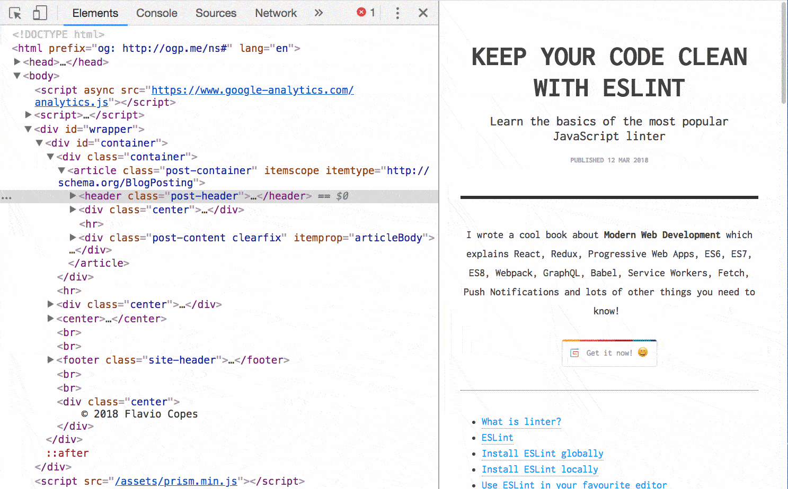

## Reference the currently selected element in the Console

Select a node in the Elements panel, and type `$0` in the console to reference it.

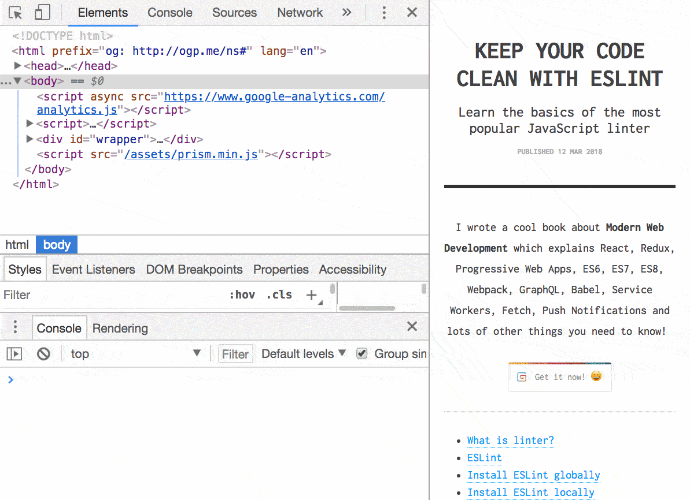

> Tip: if you're using jQuery, you can enter `$($0)` to access the jQuery API on this element.

## Use the value of the last operation in the Console

Use `$_` to reference the return value of the previous operation executed in the Console

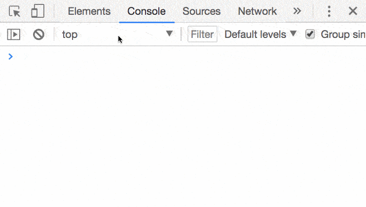

## Add CSS and edit the element state

In the Elements panel there are 2 super useful buttons.

The first lets you add a new CSS property, with any selector you want but pre-filling the currently selected element:

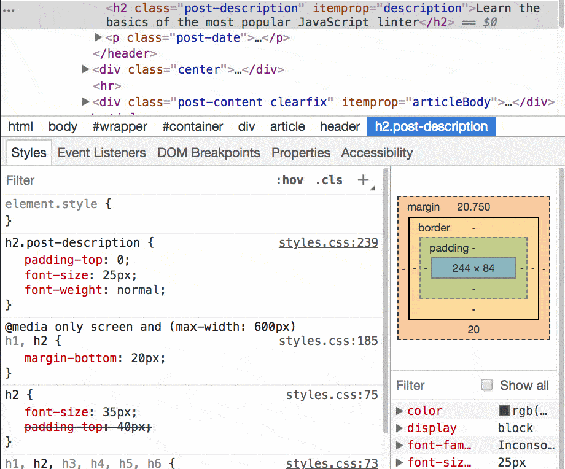

The second one lets you trigger a state for the selected element, so you can see the styles applied when it's active, hovered, on focus.

## Find where a CSS property is defined

`cmd-click` (`ctrl-click` on Windows) a CSS property in the Elements panel, the DevTools will point you to the place where that is defined, in the Source panel

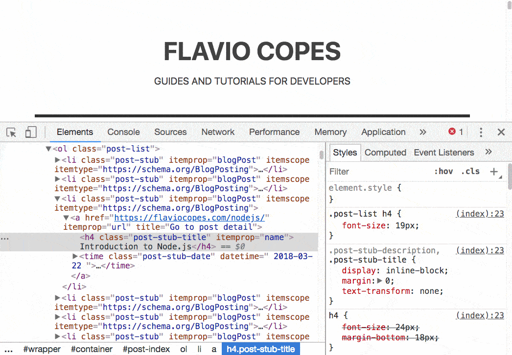

## Save to file the modified CSS

Click the name of the CSS file that you edited. The inspector opens it into the Sources pane and from there you can save it with the live edits you applied.

This trick does not work for new selectors added using +, or into the element.style properties, but only for modified, existing ones.

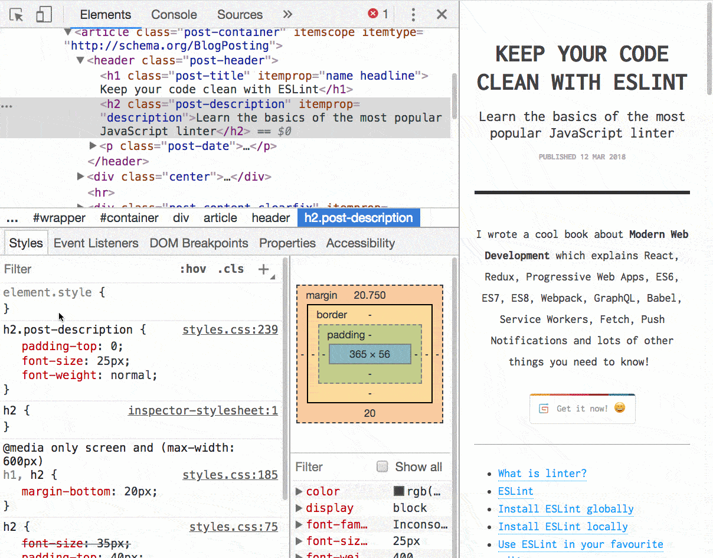

## Screenshot a single element

Select an element and press `cmd-shift-p` (or `ctrl-shift-p` in Windows) to open the Command Menu, and select **Capture node screenshot**

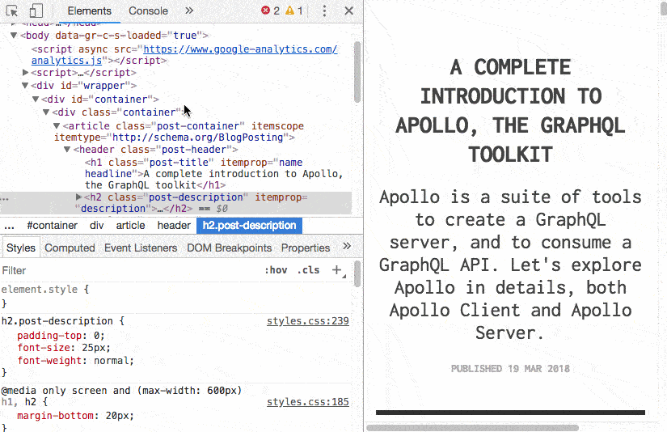

## Find an element using CSS selectors

Pressing `cmd-f` (`ctrl-f` in Windows) opens the search box in the Elements panel.

You can type any string in there to match the source code, or you can also use CSS selectors to have Chrome generate an image for you:

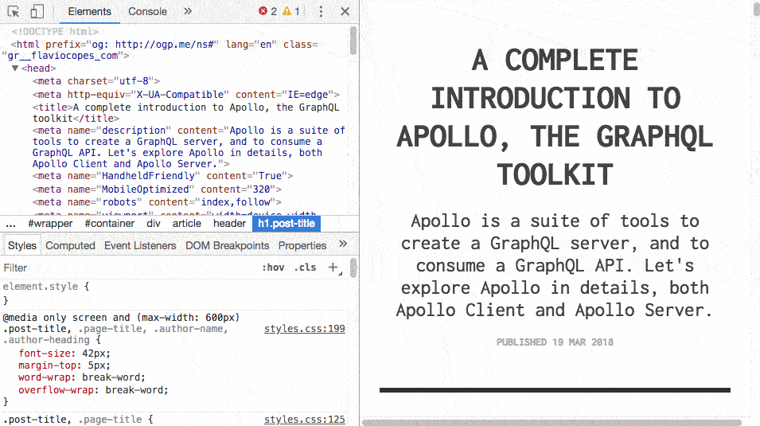

## Shift-enter in the Console

To write commands that span over multiple lines in the Console, press `shift-enter`.

Once you're ready, press enter at the end of the script to execute it:

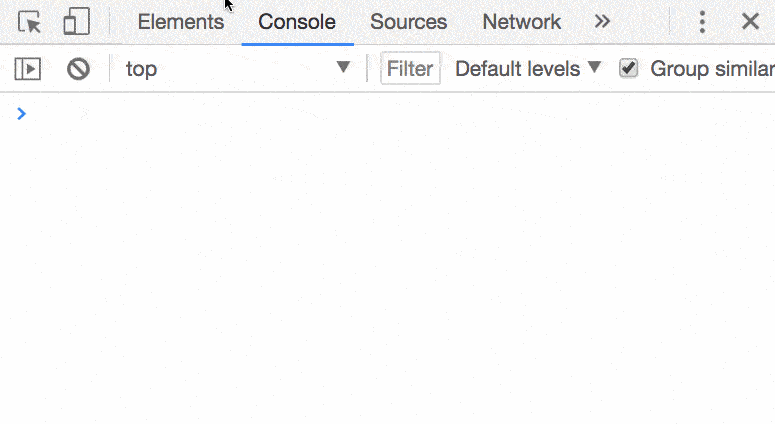

## Clear the Console

You can clear the console using the _Clear_ button on the top-left of the console, or by pressing `ctrl-l` or `cmd-k`.

## Go to...

In the Sources panel:

- `cmd-o` (`ctrl-o` in Windows), shows all the files loaded by your page.
- `cmd-shift-o` (`ctrl-shift-o` in Windows) shows the symbols (properties, functions, classes) in the current file.
- `ctrl-g` goes to a specific line.

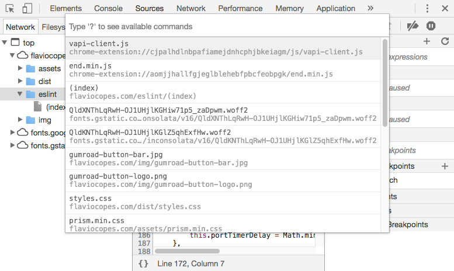

## Watch Expression

Instead of writing again and again a variable name or an expression you are going to check a lot during a debug session, add it to the _Watch Expression_ list.

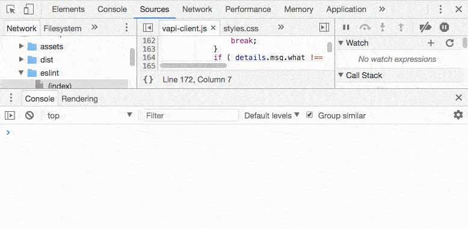

## XHR/Fetch debugging

From the debugger open the **XHR/Fetch Breakpoints** panel.

You can set it to break any time an [XHR](/xhr/) / [Fetch](/fetch-api/) call is sent, or just on specific ones:

## Debug on DOM modifications

Right-click an element and enable _Break on Subtree Modifications_: whenever a script traverses that element children and modifies them, the debugger stops automatically to let you inspect what's happening.

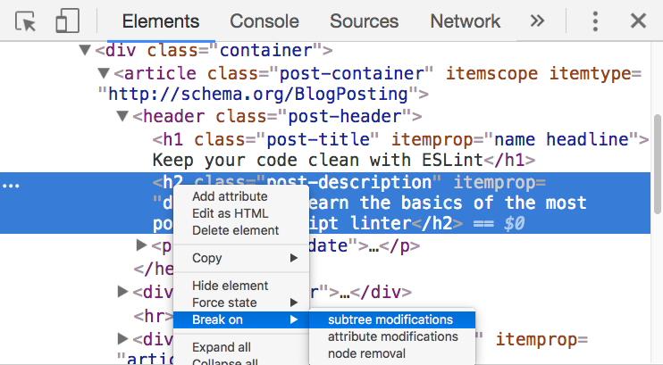
