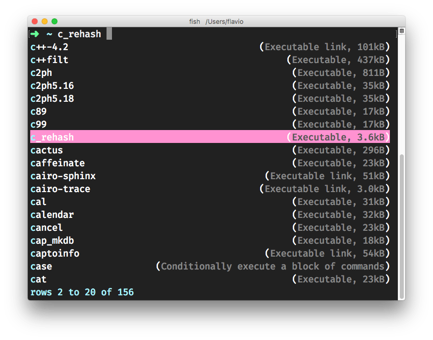
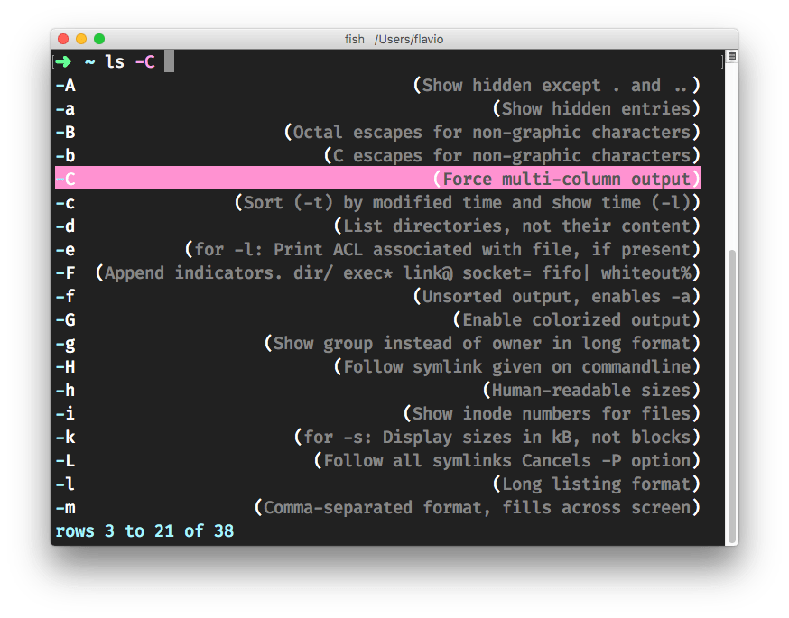

I've been using the [Fish Shell](https://fishshell.com) for months, and I think it's the best shell I ever used. For many reasons.

People seem to stick with [Bash](/bash/) which is the default on many systems (update: now the macOS default is Zsh) or use Zsh, with a great tool like [Oh My Zsh](https://github.com/robbyrussell/oh-my-zsh) to make it even more amazing.

Bash, while great, is a very basic shell, with a limited set of configurable options. I tend to use it mostly to run [Bash scripts](/bash-scripting/) (which are another topic) rather than as an interactive shell.
Zsh offers a lot of features but requires a little bit of configuration to set up, which might frighten beginners. Also, too many options and freedom means you can get in a configuration paralysis pretty easily, and you end up changing the options 20 times in a week to make sure you're not missing out.

> I don't want to "bash" on those projects, which are amazing and I used for a lot of time and sometimes still use. This description is my attempt at highlighting the benefits of Fish

Fish Shell to the rescue! This shell provides an amazing environment, and fully featured configuration out of the box.

My favorite features of Fish are:

- it has a better autocomplete features for commands you already executed and this alone is really making my day to day faster and less stressful.
- you begin typing a command and press the `up` key to see all the times in the shell history where you used that command before.
- you can install Fish on any system and it works in the same way everywhere, without having to customize too much to get the fancy things.

When it comes to scripting, it is fairly different from Bash scripting (in a better way IMHO), but you can run any Bash script provided it is prefixed with `#!/bin/bash`.

Right after the installation you get those nice things:

- syntax highlighting
- a nice prompt
- autocompletion
- parameter suggestion with man page hints
- web-based configuration

and in my opinion is the most beginner friendly shell.

One of the funny things I remember I noticed was the homepage. At first I could not understand if that was some sort of relic from the past:

> For those lucky few with a graphical computer, you can set your colors and view functions, variables, and history all from a web page.

Then I realized it was programmer's humor and it made me chuckle. Tech should always be fun, right?

## First things first: what is a shell?

A shell is an interface to the underlying operating system. It allows you to execute operations using text and commands, and it provides users advanced features like being able to create scripts.

## Installation

Install Fish by running `brew install fish` on macOS.

> Check out my [macOS terminal guide](/macos-terminal/)

`fish` is installed in `/usr/local/bin/fish`.

Since that is likely already in your path, run `fish` to start the Fish shell (type `exit` to return back to your default shell)

## Configuration

Once nice thing about Fish is a web-based configuration. Run `fish_config` to start the web client.


From here you can

- choose a color scheme from a list of predefined ones
- choose a prompt from a list of predefined ones
- inspect the Fish functions and variables configured
- see the commands history

The configuration is stored in the  `~/.config/fish` folder, and that's where you can edit it without having to use the (optional) web based configuration.

## Fish features: syntax highlighting, autocompletion and parameter suggestion with man page hints

Fish lets you execute the usual Unix commands available on your system. Filesystem operations, for example:

- `ls` to list files
- `cd` to change folder
- `rm` to remove a file or folder
- `mv` to move a file to another folder, or change a file name
- `cp` to copy a file

If you run one of those commands (or `any` command, really) you will start seeing the words you type get different colors. It makes it really easy to read and understand commands.

Fish also adds autocompletion. If you ran `cd ~/.config/fish/ ` previously, and now you type `cd `, Fish will suggest commands you might want to type, and you just press the right arrow to accept the suggestion (or you can continue to type to change the command). This suggestion is based on command history and file paths.

Suggestions based on autocomplete also work for commands. Here I typed `c` and pressed tab:



Fish also suggests parameters and how to use them. Type `ls -` and press `tab`. A list of the parameters you can use, and their meaning, is shown right below:



This inline help is generated from *man pages*, the helpful shell help (try running `man ls` for the complete help).

## Set Fish as the default shell

If you like Fish once you try it out and want to make it your default shell, open the file `/etc/shells`. I use `pico` to do those small file edits, with `pico /etc/shells`, but you can use any editor you prefer, even VS Code with `code /etc/shells`.

It should contain something similar to:

```
# List of acceptable shells for chpass(1).
# Ftpd will not allow users to connect who are not using
# one of these shells.

/bin/bash
/bin/csh
/bin/ksh
/bin/sh
/bin/tcsh
/bin/zsh
```

Add this line at the end to add the Fish shell:

```
/usr/local/bin/fish
```

next, run

```
chsh -s /usr/local/bin/fish
```

enter your password, and the shell will change for your user.


## Plugins

You can install Fish plugins.

[Fisher](https://github.com/jorgebucaran/fisher) is a popular Fish package manager.

Install it using

```
curl https://git.io/fisher --create-dirs -sLo ~/.config/fish/functions/fisher.fish
```

and it's available with the `fisher` command.

Now a package can be installed using `fisher add <github-repository-path>` and removed using `fisher rm <github-repository-path>`.

List all plugins installed using `fisher ls`.

Run `fisher` to update all the packages you installed.

Popular plugins are

- [`edc/bass`](https://github.com/edc/bass) make Bash utilities usable in fish
- [`jorgebucaran/fnm`](https://github.com/jorgebucaran/fnm) [Node.js](/nodejs/) version manager

[Here](https://github.com/oh-my-fish/packages-main/tree/master/packages) is a list of packages you can install.

## POSIX compliance

Various shells comply with the POSIX shell command standard.

[POSIX](https://it.wikipedia.org/wiki/POSIX) means

- Portable
- Operating
- System
- Interface
- X (for Unix)

and it's a standard meant to unify the various Unix environment that were built over time. There is a shell command standard subset, which is meant as a way to unify how Unix shells work.

> Unix is a specification/standard for a family of operating systems. Linux and macOS are based on Unix (Windows is _not_).

`bash`, `ksh` and others are POSIX compliant. Being POSIX compliant makes scripts written with POSIX compatibility work across POSIX compliant shells.

Fish (like `sh` or `csh` for example) is not compliant, so it's not a POSIX shell, and this means that writing commands and scripts for Fish is **different**. Scripts written for Fish won't work outside of Fish. Just like `csh` scripts only work on csh (and derivatives)

Why is it different? Various reasons, but I imagine having to support POSIX means the shell must adhere to a common language that might interfere with the shell philosophy and way of working. Not everyone want to have that baggage of tech to support forever.

This will very rarely be a problem with executing commands, but you need to keep it in mind when it comes to scripting and programming.
