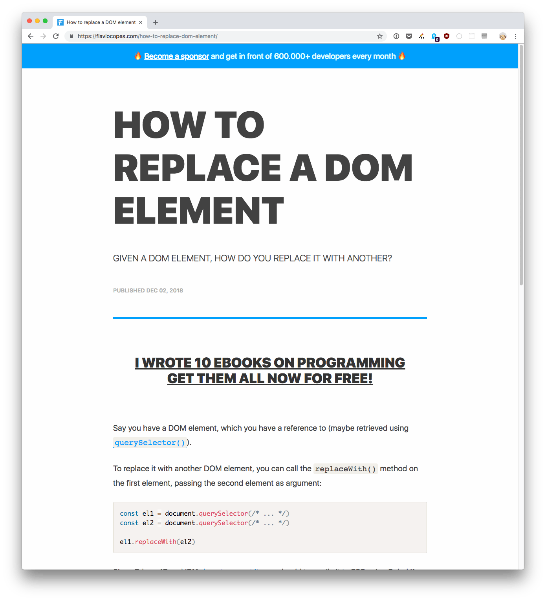
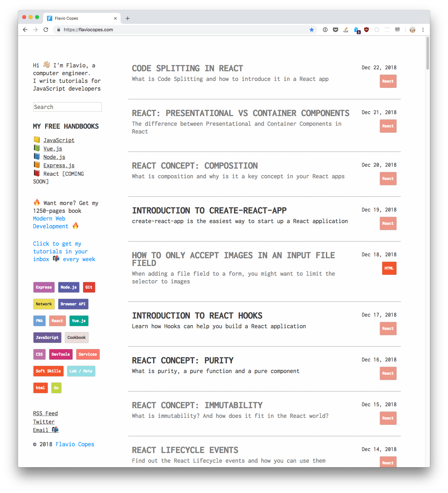
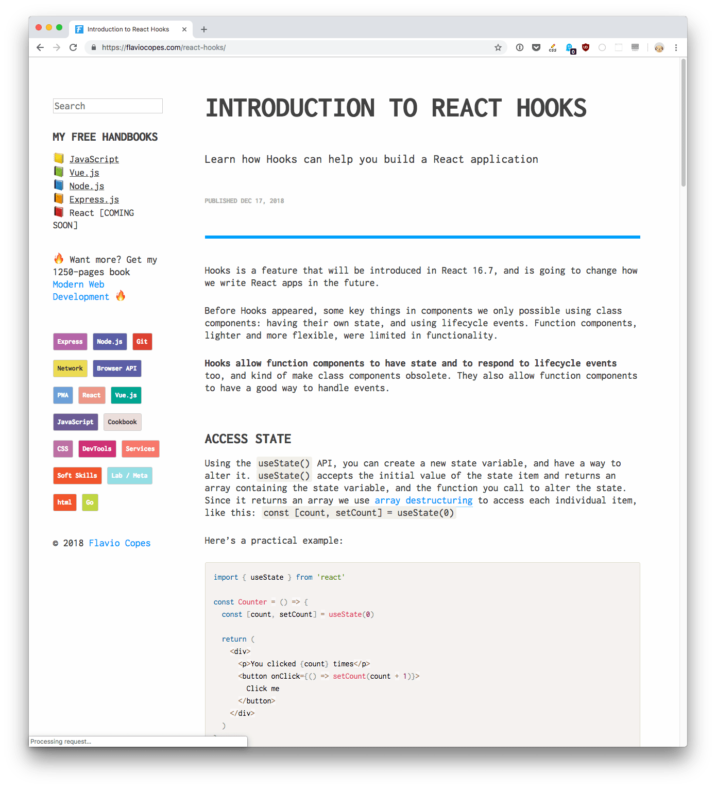
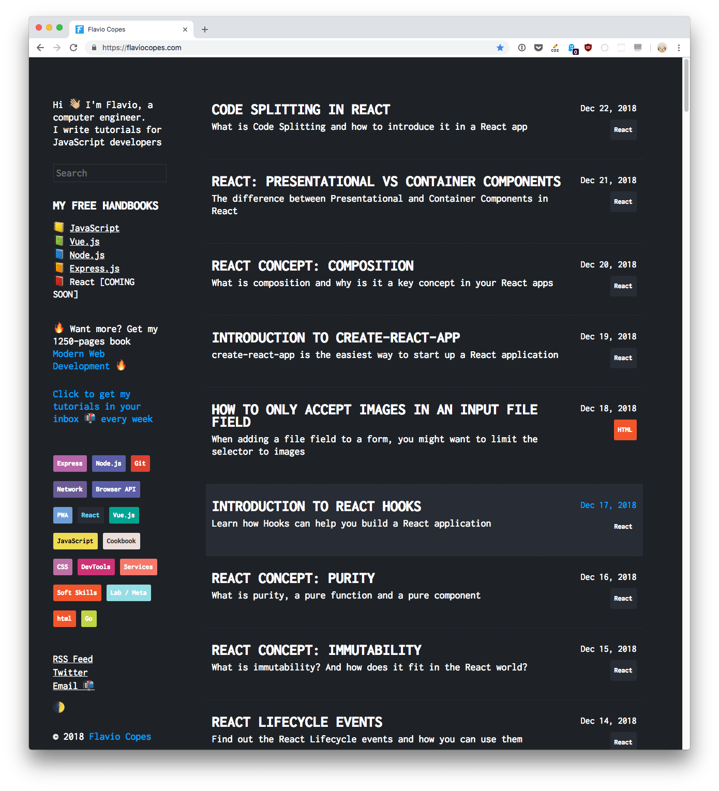
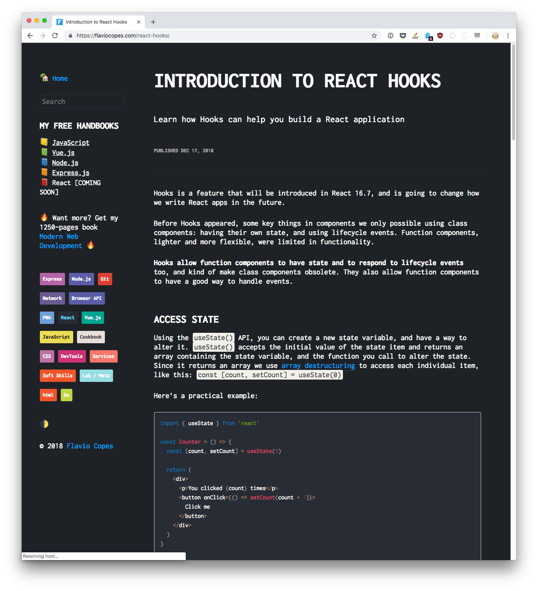

## Update: I now use Media Queries Level 5: `prefers-color-scheme`

The [*Media Queries Level 5* specification](https://drafts.csswg.org/mediaqueries-5/) contains a new [`prefers-color-scheme`](https://drafts.csswg.org/mediaqueries-5/#prefers-color-scheme) media feature.

This is currently supported in all major browsers. Chrome/Edge since release 76, Firefox since 67 and Safari (since version 12.1). Even iOS Safari,

We can use it to tell if the user is browsing the page in dark or light mode:

```css
@media (prefers-color-scheme: dark) {
  body {
    background-color: black;
    color: white;
  }
}
@media (prefers-color-scheme: light) {
  body {
    background-color: white;
    color: black;
  }
}
```

I now use it to show a light version of the site by default, and a dark version if the system is in dark mode.

If the system does not have dark mode built-in (old Windows / macOS, Linux) then my suggestion is to use an extension like [Night Eye](https://nighteye.app/) or similar.

## How I implemented dark mode before `prefers-color-scheme` was available

I recently redesigned my website. Here are 2 pictures of how it looked, for reference:




I designed this website almost 1 year ago, and did many changes along the way, just as we do with any website.

Eventually I grew old of the design: title is too big, too much space lost instead of showing the content right on, and so on.

I sat down yesterday evening and started re-imagining the website, and I finished the redesign this morning:





Much better! Content, the most important thing, is more prominent.

I used a monospaced font (Inconsolata) because as a programming blog it's a nice one, despite the reduced readability and increased page size due to the font use, because I *want* that font on my site. I like it better, and since my site is a big part of my day to day activity, I wanted it to be like I want.

I just missed one thing: **dark mode**. As I was in the process of redesigning, I had the dark mode option in mind.

How did I do it? First, I added Moon Emoji 🌓 in the sidebar, as a way to let people change the mode from light to dark.

Then, I added a JavaScript snippet that runs when it's clicked. I just added it to the `onclick` event handler inline in the HTML, without going fancier:

```html
<p>
  <a href="#" onclick="localStorage.setItem('mode', (localStorage.getItem('mode') || 'dark') === 'dark' ? 'light' : 'dark'); localStorage.getItem('mode') === 'dark' ? document.querySelector('body').classList.add('dark') : document.querySelector('body').classList.remove('dark')" title="Dark/light
</p>
```

This is the JavaScript that runs in the onclick:

```js
localStorage.setItem('mode', (localStorage.getItem('mode') || 'dark') === 'dark' ? 'light' : 'dark'); localStorage.getItem('mode') === 'dark' ? document.querySelector('body').classList.add('dark') : document.querySelector('body').classList.remove('dark')
```

It's a bit convoluted, but basically I check if the `mode` property in the [local storage](/web-storage-api/) is 'dark' (and defaults to dark if it's not set yet, using the `||` operator), and I set the opposite of that in the local storage.

Then I assign the `dark` class to the `body` HTML element, so we can use CSS to style the page in dark mode.

Another script runs as soon as the DOM loads, and checks if the mode is dark. If so, it adds the `dark` class to the `body` HTML element:

```js
document.addEventListener('DOMContentLoaded', (event) => {
  ((localStorage.getItem('mode') || 'dark') === 'dark') ? document.querySelector('body').classList.add('dark') : document.querySelector('body').classList.remove('dark')
})
```

Now if people change mode, their choice will be remembered next time they load the page.

Then I added a lot of CSS instructions to the CSS, all prefixed with `body.dark`. Like these:

```css
body.dark {
  background-color: rgb(30,34,39);
  color: #fff;
}
body.dark code[class*=language-],
body.dark table tbody>tr:nth-child(odd)>td,
body.dark table tbody>tr:nth-child(odd)>th {
  background: #282c34
}
```

Now things should already be working! Here is my site in dark mode:





I added the `dark` class to the `body` element by default, to make dark mode the default:

```html
<body class="dark">
  ...
</body>
```

Why? First, I liked it better. Then, I made a poll on Twitter and people liked it better.


But also for a technical reason, a very simple one actually. I don't store the user choice server-side, so I have no way to know the mode until the local storage is available.

I could do that if the site was generated server-side, but it's a static site, so I always serve the same page to everyone that requests it. Even if I got a cookie, I have no place to process it (on the flip side this means my pages load faster).

So when someone navigates to another page on my site, or loads the page for the first time on a second visit, I don't want to show a bright page while I determine the mode. Maybe the visitor is coding in the middle of the night in a dark room.

I'd rather do that in light mode: show a dark page for a couple milliseconds and then turn it white again.
