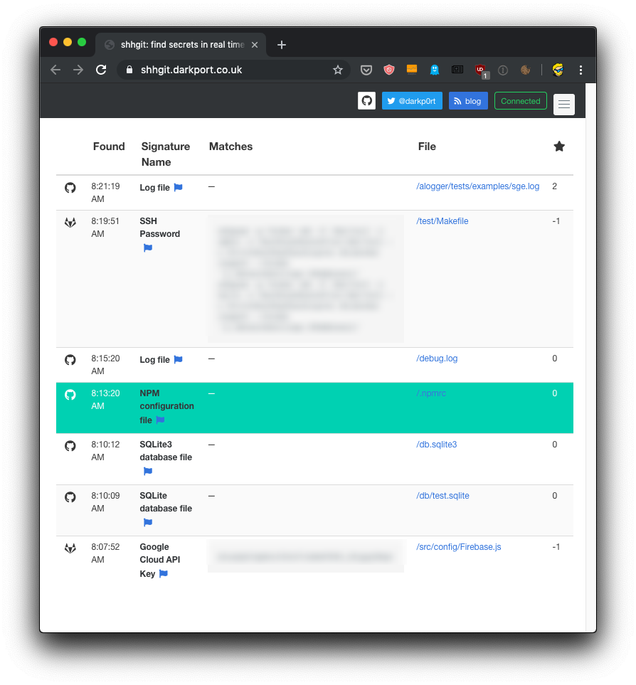

I stumbled on a website that continuously scans [GitHub](/github/), GitLab and BitBucket, the 3 most common places to host source code publicly, and shows you committed SSH passwords, API keys for common services, databases and so on.



It's scary, right?

Raise your hand if it never happened to you. We can make mistakes. And when this happens, there's no other way than quickly invalidating the password or API key that was exposed to the public.

For people new to [Git](/git/): you can't just rollback the commit, because it will still be kept in the history of the repository.

Your reputation, the reputation of your project, the security of your users is at stake.

After you fix the emergency, the issue is: how to prevent the problem? What's the answer? What's the solution that can help us avoid commit secrets to a publicly available Git repository?

The answer is: workflow and tooling.

First, never add your API keys or passwords inside source code. They can hide in there, quietly. Instead, always add them to a `.env` file in the project root folder, and add `.env` to your `.gitignore` file, so it will never be committed. Use a tool like [dotenv](https://www.npmjs.com/package/dotenv) to access them.

Use [`git-secrets`](https://github.com/awslabs/git-secrets), a tool that will help you avoid committing secrets to Git.

In macOS you install it using Homebrew:

```bash
brew install git-secrets
```

then go inside the repository you want to activate it on, and run

```bash
git secrets --install
```

to install the Git pre-commit hook. This will ensure the tool runs before Git makes the commit to the repo.

If you use Amazon Web Services (AWS), run this command to add the set of patterns used by that services credentials:

```bash
git secrets --register-aws
```

You can immediately scan for issues using

```bash
git secrets --scan
```

Ideally the tool should not print anything. But if you have issues, it will give you plenty of details.
