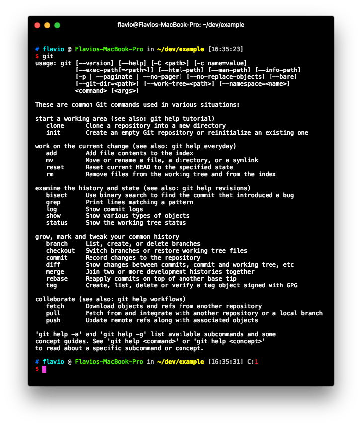
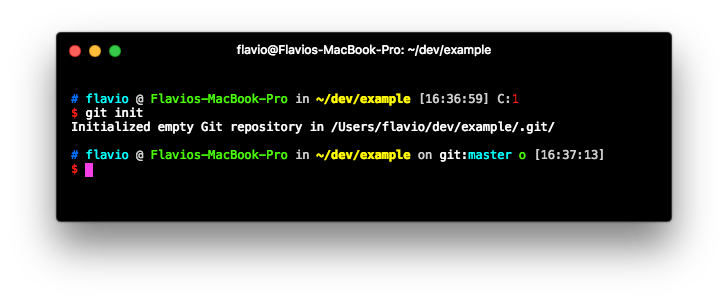
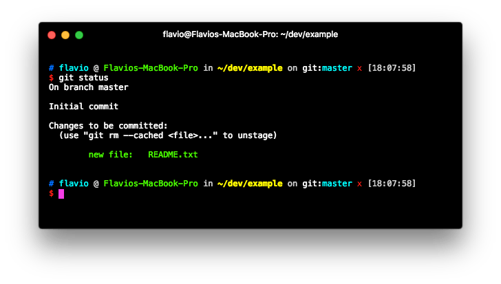
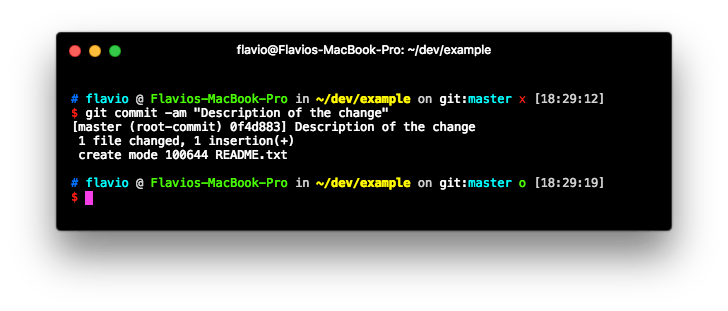
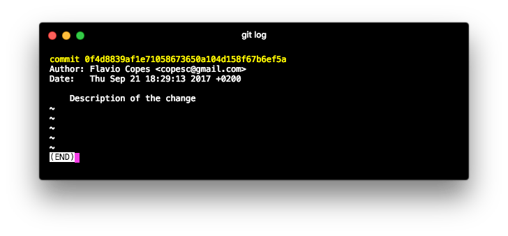

Git is a free and Open Source *version control system* (VCS), a technology used to track older versions of files, providing the ability to roll back and maintain separate different versions at the same time.

Git is a successor of SVN and CVS, two very popular version control systems of the past. First developed by Linus Torvalds (the creator of Linux), today is the go-to system which you can't avoid if you make use of Open Source software.

### Distributed VCS

Git is a distributed system. Many developers can _clone_ a repository from a central location, work independently on some portion of code, and then _commit_ the changes back to the central location where everybody updates.

Git makes it very easy for developers to collaborate on a codebase simultaneously and provides tools they can use to combine all the independent changes they make.

A very popular service that hosts Git repositories is [GitHub](/github), especially for Open Source software, but we can also mention BitBucket, GitLab and many others which are widely used by teams all over the world to host their code publicly and also privately.

## How to install Git

Installing Git is quite easy on all platforms:

### OSX

Using [Homebrew](http://brew.sh/), run:

```bash
brew install git
```

### Windows

Download and install [Git for Windows](https://git-for-windows.github.io/).

### Linux

Use the package manager of your distribution to install Git. E.g.

```
sudo apt-get install git
```

or

```
sudo yum install git
```

## How to initialize a repository

Once Git is installed on your system, you are able to access it using the command line by typing `git`.



Suppose you have a clean folder. You can initialize a Git repository by typing

```
git init
```



What does this command do? It creates a `.git` folder in the folder where you ran it. If you don't see it, it's because it's a hidden folder, so it might not be shown everywhere, unless you set your tools to show hidden folders.


Anything related to Git in your newly created repository will be stored into this `.git` directory, all except the `.gitignore` file, which I'll talk about in the next article.

## How to add files to a repository

Let's see how a file can be added to Git. Type:

```
echo "Test" > README.txt
```

to create a file. The file is now in the directory, but Git was not told to add it to its index, as you can see what `git status` tells us:


### Add the file to the staging area

We need to add the file with

```bash
git add README.txt
```

to make it visible to Git, and be put into the **staging area**:



Once a file is in the staging area, you can remove it by typing:

```
git reset README.txt
```

But usually what you do once you add a file is commit it.

## How to commit changes

Once you have one or more changes to the staging area, you can commit them using

```bash
git commit -am "Description of the change"
```



This cleans the status of the staging area:


and permanently stores the edit you made into a record store, which you can inspect by typing `git log`:



## Branches

When you commit a file to Git, you are committing it into the current branch.

Git allows you to work simultaneously on multiple, separate branches, different lines of development which represent forks of the main branch.

Git is very flexible: you can have an indefinite number of branches active at the same time, and they can be developed independently until you want to merge one of them into another.

Git by default creates a branch called `master`. It's not special in any way other than it's the one created initially.

You can create a new branch called `develop` by typing

```bash
git checkout -b develop
```

The `git branch` command lists the branches that the repository has.

When creating the new branch, that branch points to the latest commit made on the current branch. If you switch to it (using `git checkout develop`) and run `git log`, you'll see the same log as the branch that you were previously.

## Push and pull

In Git you always commit locally. This is a very nice benefit over SVN or CSV where all commits had to be immediately pushed to a server.

You work offline, do as many commits as you want, and once you're ready you **push** them to the server, so your team members, or the community if you are pushing to GitHub, can access your latest and greatest code.

> Push sends your changes.

> Pull downloads remote changes to your working copy.

Before you can play with push and pull, however, you need to add a **remote**!

### Add a remote

A remote is a clone of your repository, positioned on another machine.

I'll do an example with [GitHub](/github). If you have an existing repository, you can publish it on GitHub. The procedure involves creating a repository on the platform, through their web interface, then you add that repository as a remote, and you push your code there.

To add the remote type

```bash
git remote add origin https://github.com/YOU/REPONAME.git
```

> An alternative approach is creating a blank repo on GitHub and cloning it locally, in which case the remote is automatically added for you

### Push

Once you're done, you can push your code to the remote, using the syntax `git push <remote> <branch>`, for example:

```
git push origin master
```

You specify `origin` as the remote, because you can technically have more than one remote. That is the name of the one we added previously, and it's a convention.

### Pull

The same syntax applies to pulling:

```
git pull origin master
```

tells Git to pull the `master` branch from `origin`, and merge it in the current local branch.

### Conflicts

In both push and pull there is a problem to consider: if the remote contains changes incompatible with your set of commits, the operation will fail.

This happens when the remote contains changes subsequent to your latest pull, which affects lines of code you worked on as well.

In the case of push this is usually solved by pulling changes, analyzing the conflicts, and then making a new commit that solves them.

In the case of pull, your working copy will automatically be edited with the conflicting changes, and you need to solve them, and make a new commit so the codebase now includes the problematic changes that were made on the remote.

## Command Line vs Graphical Interface

Up to now I talked about the command line Git application.

This was key to introduce you to how Git actually works, but in the day-to-day operations, you are most likely to use an app that exposes you those commands via a nice UI, although many developers I know like to use  the CLI.

> The CLI (command line) commands will still prove themselves to be useful if you need to setup Git using SSH on a remote server, for instance. It's not useless knowledge at all!

That said, there are many very nice apps that are made to simplify the life of a developer that turn out very useful especially when you dive more into the complexity of a Git repository. The easy steps are easy everywhere, but things could quickly grow to a point where you might find it hard to use the CLI.

Some of the most popular apps are

### GitHub Desktop

<https://desktop.github.com>

Free, at the time of writing only available for Mac and Win

### Tower

<https://www.git-tower.com>

Paid, at the time of writing only available for Mac and Win

### GitKraken

<https://www.gitkraken.com>

Free / Paid depending on the needs, for Mac, Win and Linux

## A good Git workflow

Different developers and teams like to use different strategies to manage Git effectively. Here is a strategy I used on many teams and on widely used open source projects, and I saw used by many big and small projects as well.

The strategy is inspired by the famous [A successful Git branching model](http://nvie.com/posts/a-successful-git-branching-model/) post.

I have only 2 permanent branches: **master** and **develop**.

Those are the rules I follow in my daily routine:

When I take on a new issue, or decide to incorporate a feature, there are 2 main roads:

### The feature is a quick one

The commits I’ll make won’t break the code (or at least I hope so): I can commit on develop, or do a quick feature branch, and then merge it to develop.

### The feature will take more than one commit to finish

Maybe it will take days of commits before the feature is finished and it gets stable again: I do a feature branch, then merge to develop once ready (it might take weeks).

### Hotfix

If something on our production server requires immediate action, like a bugfix I need to get solved ASAP, I do a short hotfix branch, fix the thing, test the branch locally and on a test machine, then merge it to master and develop.

### Develop is unstable. Master is the latest stable release

The develop branch will always be in a state of flux, that’s why it should be put on a ‘freeze’ when preparing a release. The code is tested and every workflow is checked to verify code quality, and it’s prepared for a merge into master.

Every time develop or another hotfix branch is merged into master, I **tag it with a version number**, and if on GitHub I also create a **release**, so it’s easy to move back to a previous state if something goes wrong.
