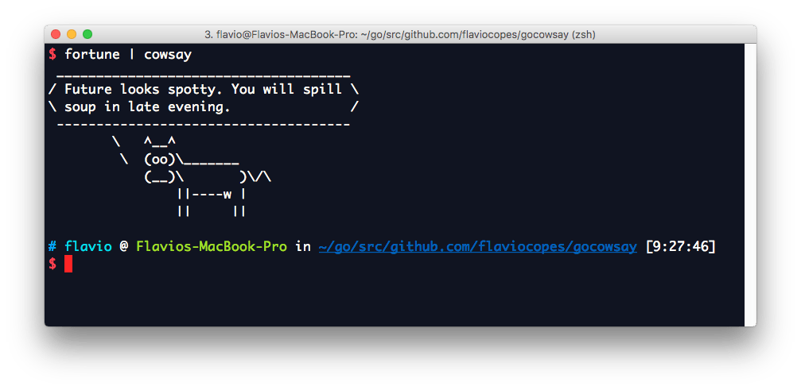
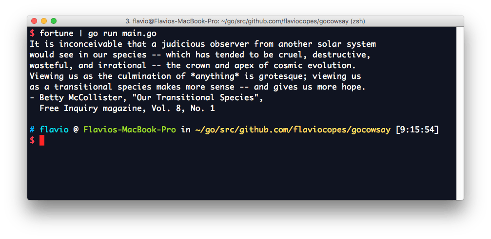
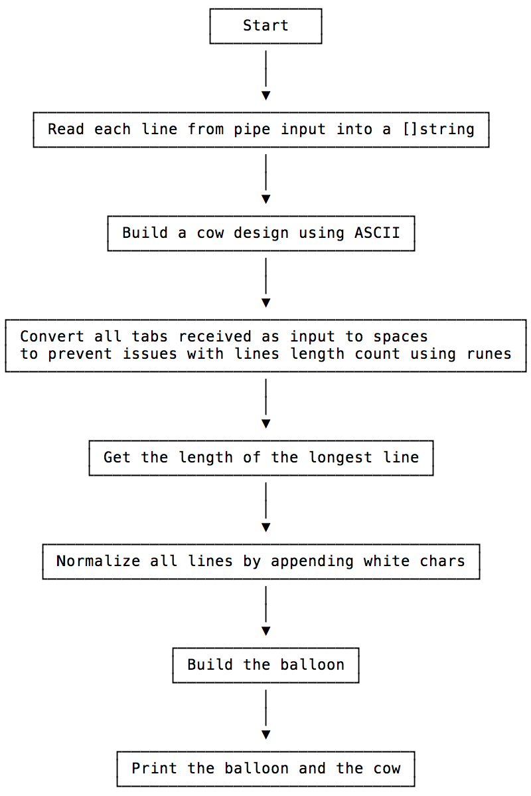
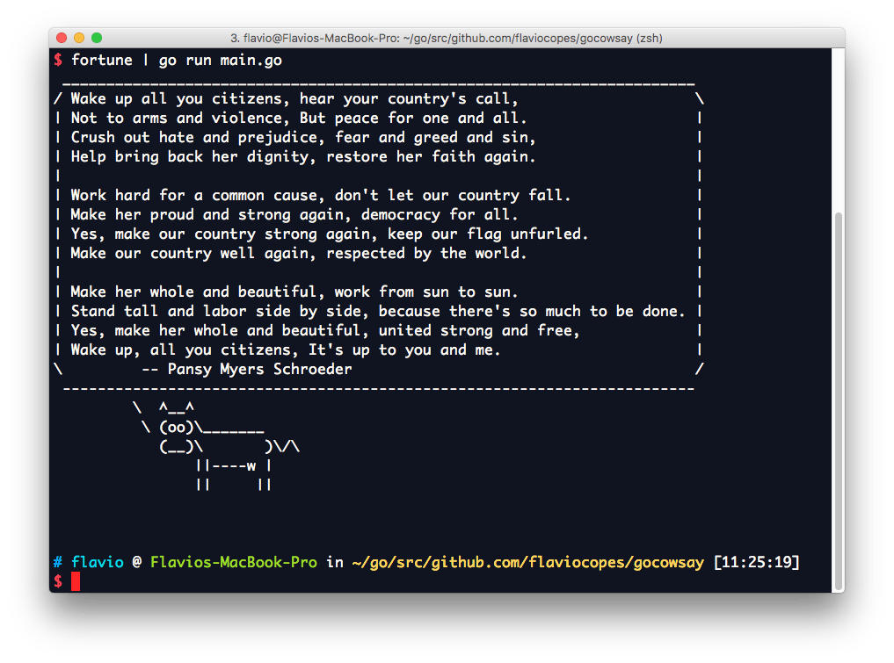
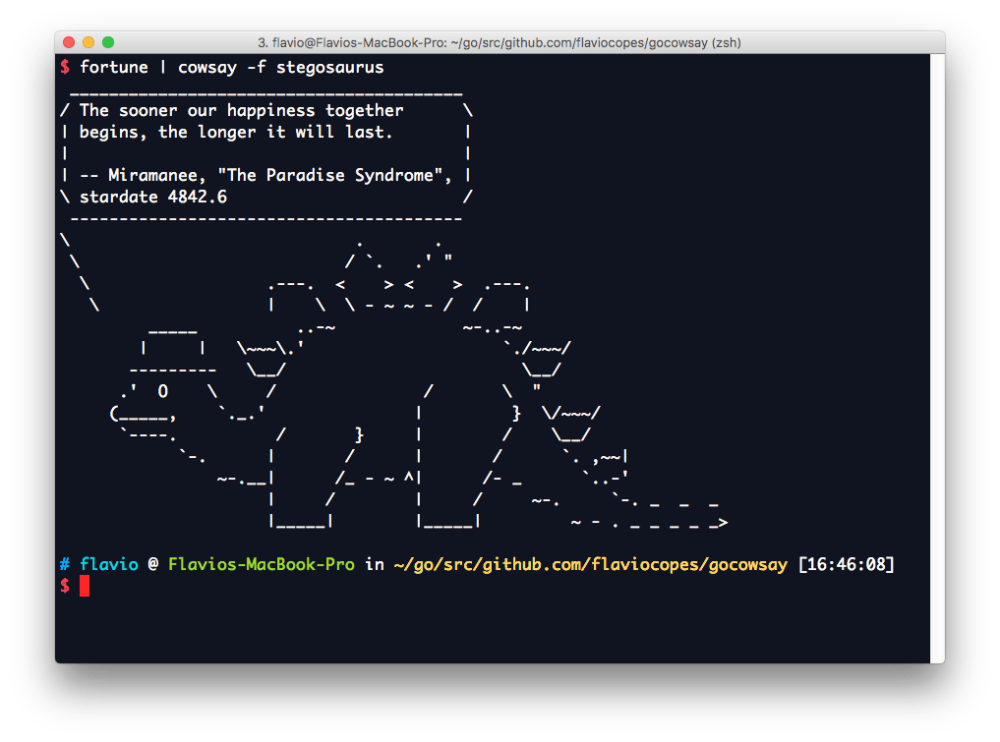
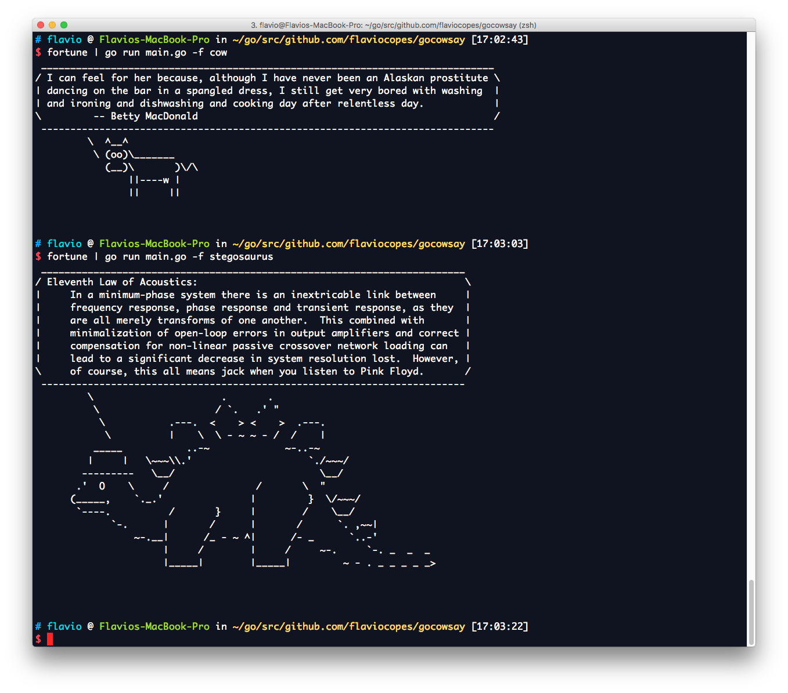
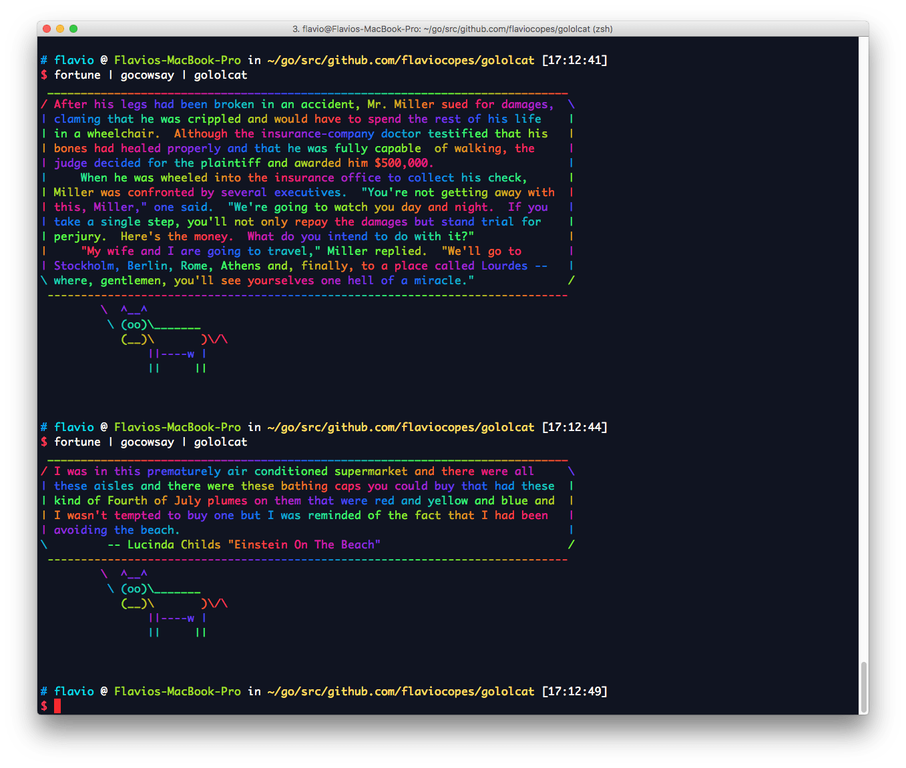

> Like CLI apps? [Don't miss the **lolcat** tutorial as well!](/go-tutorial-lolcat)

[Cowsay](https://en.wikipedia.org/wiki/Cowsay) is one of those apps you can't live without.



It basically generates ASCII pictures of a cow with any message you pass it to, in the above screenshot using `fortune` to generate it. But it's not limited to the cow domain, it can print penguins, mooses and many other animals.

Sounds like a useful app to port to Go!

Also, I like the plain english license attached to it:

```text
==============
cowsay License
==============

cowsay is distributed under the same licensing terms as Perl: the
Artistic License or the GNU General Public License.  If you don't
want to track down these licenses and read them for yourself, use
the parts that I'd prefer:

(0) I wrote it and you didn't.

(1) Give credit where credit is due if you borrow the code for some
other purpose.

(2) If you have any bugfixes or suggestions, please notify me so
that I may incorporate them.

(3) If you try to make money off of cowsay, you suck.
```

Let's start by defining the problem. We want to accept input through a pipe, and have our cow say it.

The first iteration reads the user input from the pipe, and prints it back. Not too much complicated.

```go
package main

import (
	"bufio"
	"fmt"
	"io"
	"os"
)

func main() {
	info, _ := os.Stdin.Stat()

	if info.Mode()&os.ModeCharDevice != 0 {
		fmt.Println("The command is intended to work with pipes.")
		fmt.Println("Usage: fortune | gocowsay")
		return
	}

	reader := bufio.NewReader(os.Stdin)
	var output []rune

	for {
		input, _, err := reader.ReadRune()
		if err != nil && err == io.EOF {
			break
		}
		output = append(output, input)
	}

	for j := 0; j < len(output); j++ {
		fmt.Printf("%c", output[j])
	}
}
```



We're missing the cow, and also we need to wrap the message into a balloon, nicely formatted.



Here is the first iteration of our program:

```go
package main

import (
	"bufio"
	"fmt"
	"io"
	"os"
	"strings"
	"unicode/utf8"
)

// buildBalloon takes a slice of strings of max width maxwidth
// prepends/appends margins on first and last line, and at start/end of each line
// and returns a string with the contents of the balloon
func buildBalloon(lines []string, maxwidth int) string {
	var borders []string
	count := len(lines)
	var ret []string

	borders = []string{"/", "\\", "\\", "/", "|", "<", ">"}

	top := " " + strings.Repeat("_", maxwidth+2)
	bottom := " " + strings.Repeat("-", maxwidth+2)

	ret = append(ret, top)
	if count == 1 {
		s := fmt.Sprintf("%s %s %s", borders[5], lines[0], borders[6])
		ret = append(ret, s)
	} else {
		s := fmt.Sprintf(`%s %s %s`, borders[0], lines[0], borders[1])
		ret = append(ret, s)
		i := 1
		for ; i < count-1; i++ {
			s = fmt.Sprintf(`%s %s %s`, borders[4], lines[i], borders[4])
			ret = append(ret, s)
		}
		s = fmt.Sprintf(`%s %s %s`, borders[2], lines[i], borders[3])
		ret = append(ret, s)
	}

	ret = append(ret, bottom)
	return strings.Join(ret, "\n")
}

// tabsToSpaces converts all tabs found in the strings
// found in the `lines` slice to 4 spaces, to prevent misalignments in
// counting the runes
func tabsToSpaces(lines []string) []string {
	var ret []string
	for _, l := range lines {
		l = strings.Replace(l, "\t", "    ", -1)
		ret = append(ret, l)
	}
	return ret
}

// calculatemaxwidth given a slice of strings returns the length of the
// string with max length
func calculateMaxWidth(lines []string) int {
	w := 0
	for _, l := range lines {
		len := utf8.RuneCountInString(l)
		if len > w {
			w = len
		}
	}

	return w
}

// normalizeStringsLength takes a slice of strings and appends
// to each one a number of spaces needed to have them all the same number
// of runes
func normalizeStringsLength(lines []string, maxwidth int) []string {
	var ret []string
	for _, l := range lines {
		s := l + strings.Repeat(" ", maxwidth-utf8.RuneCountInString(l))
		ret = append(ret, s)
	}
	return ret
}

func main() {
	info, _ := os.Stdin.Stat()

	if info.Mode()&os.ModeCharDevice != 0 {
		fmt.Println("The command is intended to work with pipes.")
		fmt.Println("Usage: fortune | gocowsay")
		return
	}

	var lines []string

	reader := bufio.NewReader(os.Stdin)

	for {
		line, _, err := reader.ReadLine()
		if err != nil && err == io.EOF {
			break
		}
		lines = append(lines, string(line))
	}

	var cow = `         \  ^__^
          \ (oo)\_______
	    (__)\       )\/\
	        ||----w |
	        ||     ||
		`

	lines = tabsToSpaces(lines)
	maxwidth := calculateMaxWidth(lines)
	messages := normalizeStringsLength(lines, maxwidth)
	balloon := buildBalloon(messages, maxwidth)
	fmt.Println(balloon)
	fmt.Println(cow)
	fmt.Println()
}
```



Let's now make the figure configurable, by adding a [**stegosaurus**](https://en.wikipedia.org/wiki/Stegosaurus)



The original application uses the `-f` flag to accept a custom figure. So let's do the same by [processing a command line flag](/go-command-line-flags/).

I briefly change the previous program to introduce `printFigure()`

```go
// printFigure given a figure name prints it.
// Currently accepts `cow` and `stegosaurus`.
func printFigure(name string) {

	var cow = `         \  ^__^
          \ (oo)\_______
	    (__)\       )\/\
	        ||----w |
	        ||     ||
		`

	var stegosaurus = `         \                      .       .
          \                    / ` + "`" + `.   .' "
           \           .---.  <    > <    >  .---.
            \          |    \  \ - ~ ~ - /  /    |
          _____           ..-~             ~-..-~
         |     |   \~~~\\.'                    ` + "`" + `./~~~/
        ---------   \__/                         \__/
       .'  O    \     /               /       \  "
      (_____,    ` + "`" + `._.'               |         }  \/~~~/
       ` + "`" + `----.          /       }     |        /    \__/
             ` + "`" + `-.      |       /      |       /      ` + "`" + `. ,~~|
                 ~-.__|      /_ - ~ ^|      /- _      ` + "`" + `..-'
                      |     /        |     /     ~-.     ` + "`" + `-. _  _  _
                      |_____|        |_____|         ~ - . _ _ _ _ _>

	`

	switch name {
	case "cow":
		fmt.Println(cow)
	case "stegosaurus":
		fmt.Println(stegosaurus)
	default:
		fmt.Println("Unknown figure")
	}
}
```

and changing `main()` to accept a flag and passing it to `printFigure()`:

```go
func main() {
	//...

	var figure string
	flag.StringVar(&figure, "f", "cow", "the figure name. Valid values are `cow` and `stegosaurus`")
	flag.Parse()

	//...
	printFigure(figure)
	fmt.Println()
}
```

[play](https://play.golang.org/p/ZNQiXZctN2)



I think we're at a good point. I just want to make this usable system-wise, without running `go run main.go`, so I'll just type `go build` and `go install`.

I can now spend the day with [**gololcat**](/go-tutorial-lolcat) and gocowsay

