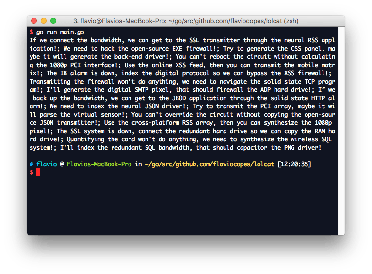
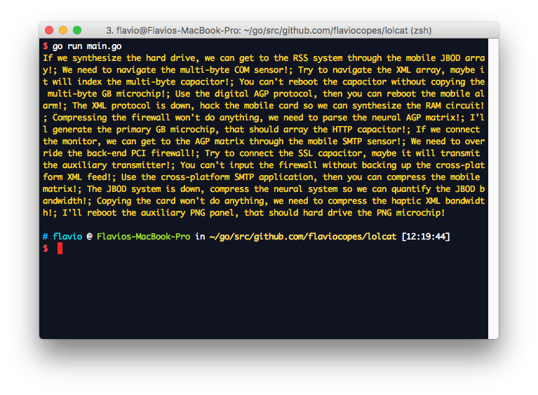
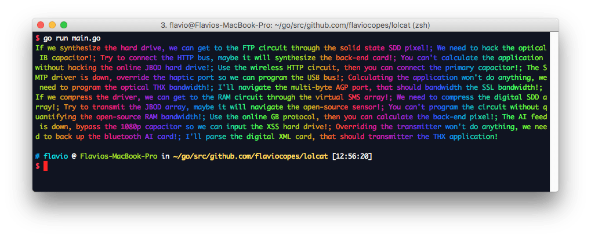
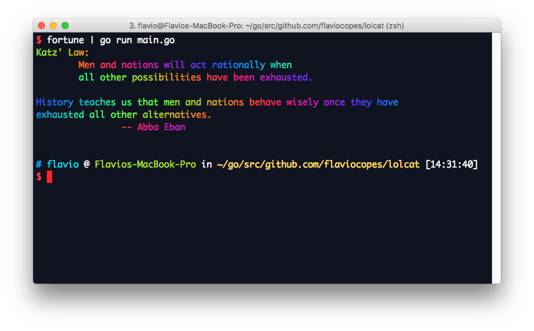
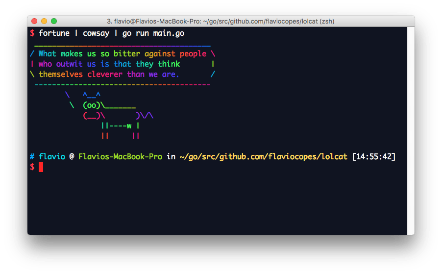
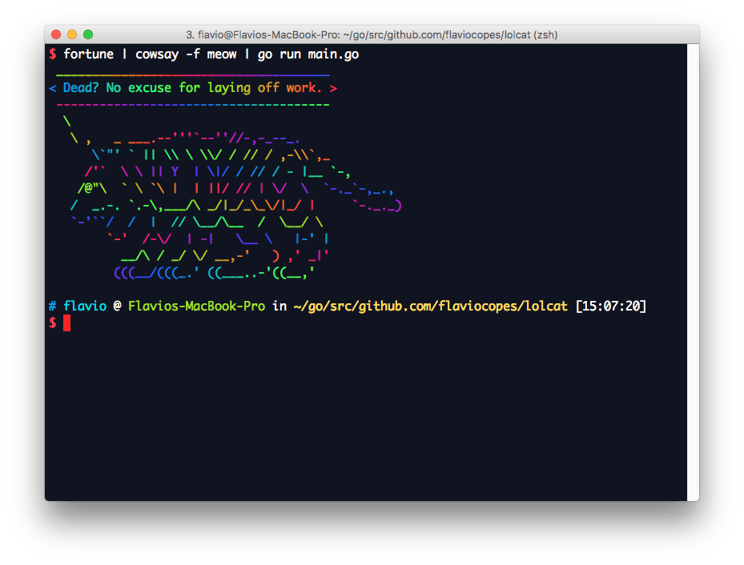

> Like CLI apps? [Don't miss the **cowsay** tutorial as well!](/go-tutorial-lolcat)

I was looking for some terminal applications for inspiration and I stumbled on **lolcat**.

The original is https://github.com/busyloop/lolcat and there are quite a few Go implementations already:

- <https://github.com/cezarsa/glolcat>
- <https://github.com/latotty/lolcat>
- <https://github.com/lalyos/lolcat>
- <https://github.com/vbatts/gogololcat>

Looks like a _completely useless thing_ to build, so let's do it!

Let's start by printing some values on the screen, then we'll move to coloring them, and then we'll look into accepting user input to work as a pipe.

I use <https://github.com/enodata/faker> to generate fake output.

```sh
go get -u github.com/enodata/faker
```

This program outputs a number of phrases:

```go
package main

import (
    "fmt"
    "strings"

    "github.com/enodata/faker"
)

func main() {
    var phrases []string

    for i := 1; i < 3; i++ {
        phrases = append(phrases, faker.Hacker().Phrases()...)
    }

    fmt.Println(strings.Join(phrases[:], "; "))
}
```



Unfortunately, this is all boring B/W. Let's add some color. We can do this by prepending an escape character sequence in `fmt.Printf`. This prints all the strings in the gold color #FFD700, whose [RGB color code](/rgb-color-codes) is (255,215,0):

```go
package main

import (
    "fmt"
    "strings"

    "github.com/enodata/faker"
)

func main() {
    var phrases []string

    for i := 1; i < 3; i++ {
        phrases = append(phrases, faker.Hacker().Phrases()...)
    }

    output := strings.Join(phrases[:], "; ")
    r, g, b := 255, 215, 0 //gold color

    for j := 0; j < len(output); j++ {
        fmt.Printf("\033[38;2;%d;%d;%dm%c\033[0m", r, g, b, output[j])
    }
}
```



Now that we have a string, and the groundwork for making each character colored in a different way, it's time to introduce the rainbow.

```go
package main

import (
    "fmt"
    "math"
    "strings"

    "github.com/enodata/faker"
)

func rgb(i int) (int, int, int) {
    var f = 0.1
    return int(math.Sin(f*float64(i)+0)*127 + 128),
        int(math.Sin(f*float64(i)+2*math.Pi/3)*127 + 128),
        int(math.Sin(f*float64(i)+4*math.Pi/3)*127 + 128)
}

func main() {
    var phrases []string

    for i := 1; i < 3; i++ {
        phrases = append(phrases, faker.Hacker().Phrases()...)
    }

    output := strings.Join(phrases[:], "; ")

    for j := 0; j < len(output); j++ {
        r, g, b := rgb(j)
        fmt.Printf("\033[38;2;%d;%d;%dm%c\033[0m", r, g, b, output[j])
    }
    fmt.Println()
}
```



That's style!

The rainbow color is generated using the `rgb()` function, as implemented in the original Ruby source code in <https://github.com/busyloop/lolcat/blob/master/lib/lolcat/lol.rb>

Let's now edit the program and instead of providing its own output, let it **work as a pipe** for other programs. It will read the content from `os.Stdin` and rainbowize it.

```go
package main

import (
    "bufio"
    "fmt"
    "io"
    "math"
    "os"
)

func rgb(i int) (int, int, int) {
    var f = 0.1
    return int(math.Sin(f*float64(i)+0)*127 + 128),
        int(math.Sin(f*float64(i)+2*math.Pi/3)*127 + 128),
        int(math.Sin(f*float64(i)+4*math.Pi/3)*127 + 128)
}

func print(output []rune) {
    for j := 0; j < len(output); j++ {
        r, g, b := rgb(j)
        fmt.Printf("\033[38;2;%d;%d;%dm%c\033[0m", r, g, b, output[j])
    }
    fmt.Println()
}

func main() {
    info, _ := os.Stdin.Stat()
    var output []rune

    if info.Mode()&os.ModeCharDevice != 0 {
        fmt.Println("The command is intended to work with pipes.")
        fmt.Println("Usage: fortune | gorainbow")
    }

    reader := bufio.NewReader(os.Stdin)
    for {
        input, _, err := reader.ReadRune()
        if err != nil && err == io.EOF {
            break
        }
        output = append(output, input)
    }

    print(output)
}
```



It reads one rune at a time from `os.Stdin` and adds it to the `output` slice of runes.

The output rendering has been extracted to print(), but we could also pipe "just in time" each rune as it's scanned:

```go
package main

import (
    "bufio"
    "fmt"
    "io"
    "math"
    "os"
)

func rgb(i int) (int, int, int) {
    var f = 0.1
    return int(math.Sin(f*float64(i)+0)*127 + 128),
        int(math.Sin(f*float64(i)+2*math.Pi/3)*127 + 128),
        int(math.Sin(f*float64(i)+4*math.Pi/3)*127 + 128)
}

func main() {
    info, _ := os.Stdin.Stat()

    if info.Mode()&os.ModeCharDevice != 0 {
        fmt.Println("The command is intended to work with pipes.")
        fmt.Println("Usage: fortune | gorainbow")
    }

    reader := bufio.NewReader(os.Stdin)
    j := 0
    for {
        input, _, err := reader.ReadRune()
        if err != nil && err == io.EOF {
            break
        }
        r, g, b := rgb(j)
        fmt.Printf("\033[38;2;%d;%d;%dm%c\033[0m", r, g, b, input)
        j++
    }
}
```

This works same as before.

We can now entertain ourselves with fortune and [cowsay](https://en.wikipedia.org/wiki/Cowsay)






Let's make this a system-wide command by running `go build` and `go install`. The command will be run as `gololcat`, since we used that as the folder name.

