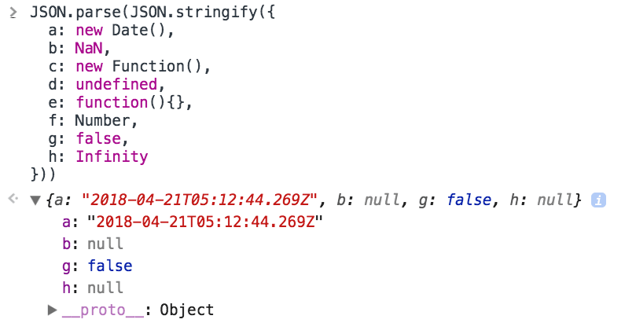

Copying objects in JavaScript can be tricky. Some ways perform a shallow copy, which is the default behavior in most of the cases.

<!-- TOC -->

- [Deep copy vs Shallow copy](#deep-copy-vs-shallow-copy)
- [Easiest option: use Lodash](#easiest-option-use-lodash)
- [Object.assign()](#objectassign)
- [Using the Object Spread operator](#using-the-object-spread-operator)
- [Wrong solutions](#wrong-solutions)
  - [Using Object.create()](#using-objectcreate)
  - [JSON serialization](#json-serialization)

<!-- /TOC -->

## Deep copy vs Shallow copy

A shallow copy successfully copies [primitive types](/javascript-types/#primitive-types) like numbers and strings, but any object reference will not be recursively copied, but instead the new, copied object will reference the same object.

If an object references other objects, when performing a **shallow copy** of the object, you _copy the references_ to the external objects.

When performing a **deep copy**, those _external objects are copied as well_, so the new, cloned object is completely independent from the old one.

Searching how to deep clone an object in JavaScript on the internet, you'll find lots of answers but the answers are **not always correct**.

## Easiest option: use Lodash

My suggestion to perform deep copy is to rely on a library that's well tested, very popular and carefully maintained: Lodash.

Lodash offers the very convenient `clone` and `deepclone` functions to perform shallow and deep cloning.

Lodash has this nice feature: **you can import single functions separately** in your project to reduce a lot the size of the dependency.

In Node.js:

```js
const clone = require('lodash.clone')
const clonedeep = require('lodash.clonedeep')
```

Here is an example that shows those two functions in use:

```js
const clone = require('lodash.clone')
const clonedeep = require('lodash.clonedeep')

const externalObject = {
  color: 'red'
}

const original = {
  a: new Date(),
  b: NaN,
  c: new Function(),
  d: undefined,
  e: function() {},
  f: Number,
  g: false,
  h: Infinity,
  i: externalObject
}

const cloned = clone(original)

externalObject.color = 'blue'

console.info('⬇️ shallow cloning 🌈')
console.info(
  '✏️ Notice the i.color property we changed on original is also changed in the shallow copy'
)
console.log(original)
console.log(cloned)

const deepcloned = clonedeep(original)

externalObject.color = 'yellow'
console.log('')
console.info('⬇️ deep cloning 🌈')
console.info('✏️ Notice the i.color property does not propagate any more')
console.log(original)
console.log(deepcloned)
```

In this simple example we first create a shallow copy, and edit the i.color property, which propagates to the copied object.

In the deep clone, this does not happen.

See this [live in Glitch](https://glitch.com/edit/#!/flavio-lodash-clone-shallow-deep).

<!-- Copy and Paste Me -->
<div class="glitch-embed-wrap" style="height: 892px; width: 100%;">
  <iframe src="https://glitch.com/embed/#!/embed/flavio-lodash-clone-shallow-deep?path=server.js&previewSize=42&previewFirst=true&sidebarCollapsed=true" alt="flavio-lodash-clone-shallow-deep on glitch" style="height: 100%; width: 100%; border: 0;"></iframe>
</div>

## Object.assign()

[`Object.assign()`](/javascript-object-assign/) performs a shallow copy of an object, not a deep clone.

```js
const copied = Object.assign({}, original)
```

Being a shallow copy, values are cloned, and objects references are copied (not the objects themselves), so if you edit an object property in the original object, that's modified also in the copied object, since the referenced inner object is the same:

```js
const original = {
  name: 'Fiesta',
  car: {
    color: 'blue'
  }
}
const copied = Object.assign({}, original)

original.name = 'Focus'
original.car.color = 'yellow'

copied.name //Fiesta
copied.car.color //yellow
```

## Using the Object Spread operator

The [**spread operator**](/javascript-spread-operator/) is a [ES6/ES2015](/es6/) feature that provides a very convenient way to perform a shallow clone, equivalent to what [`Object.assign()`](/javascript-object-assign/) does.

```js
const copied = { ...original }
```

## Wrong solutions

Online you will find many suggestions. Here are some wrong ones:

### Using Object.create()

> Note: not recommended

```js
const copied = Object.create(original)
```

This is wrong, it's not performing any copy.

Instead, the `original` object is being used as the **prototype** of `copied`.

Apparently it works, but under the hoods it's not:

```js
const original = {
  name: 'Fiesta'
}
const copied = Object.create(original)
copied.name //Fiesta

original.hasOwnProperty('name') //true
copied.hasOwnProperty('name') //false
```

> See more on [`Object.create()`](/javascript-object-create/).

### JSON serialization

> Note: not recommended

Some recommend transforming to [JSON](/json/):

```js
const cloned = JSON.parse(JSON.stringify(original))
```

but that has unexpected consequences.

By doing this you will **lose** any Javascript property that has no equivalent type in JSON, like `Function` or `Infinity`. Any property that's assigned to `undefined` will be ignored by `JSON.stringify`, causing them to be missed on the cloned object.

Also, some objects are converted to strings, like Date objects for example (also, not taking into account the timezone and defaulting to UTC), Set, Map and many others:

```js
JSON.parse(
  JSON.stringify({
    a: new Date(),
    b: NaN,
    c: new Function(),
    d: undefined,
    e: function() {},
    f: Number,
    g: false,
    h: Infinity
  })
)
```



This only works if you do not have any inner objects and functions, but just values.
