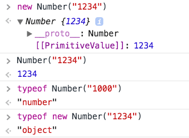
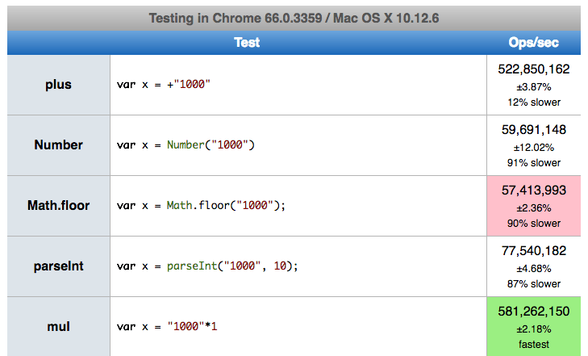

<div class="rwd-video">
<iframe width="560" height="315" src="https://www.youtube.com/embed/W4XIJompwNU" frameborder="0" allow="accelerometer; autoplay; encrypted-media; gyroscope; picture-in-picture" allowfullscreen></iframe>
</div>
<br>

JavaScript provides various ways to convert a string value into a number.

## Best: use the Number object

The best one in my opinion is to use the Number object, in a non-constructor context (without the `new` keyword):

```js
const count = Number('1234') //1234
```

This takes care of the decimals as well.

Number is a _wrapper object_ that can perform many operations. If we use the constructor (`new Number("1234")`) it returns us a Number object instead of a number value, so pay attention.



Watch out for separators between digits:

```js
Number('10,000') //NaN
Number('10.00') //10
Number('10000') //10000
```

In the case you need to parse a string with decimal separators, use [`Intl.NumberFormat`](https://developer.mozilla.org/en-US/docs/Web/JavaScript/Reference/Global_Objects/NumberFormat) instead.

## Other solutions

### Use `parseInt()` and `parseFloat()`

Another good solution for integers is to call the `parseInt()` function:

```js
const count = parseInt('1234', 10) //1234
```

Don't forget the second parameter, which is the radix, always 10 for decimal numbers, or the conversion might try to guess the radix and give unexpected results.

`parseInt()` tries to get a number from a string that does not only contain a number:

```js
parseInt('10 lions', 10) //10
```

but if the string does not start with a number, you'll get `NaN` (Not a Number):

```js
parseInt("I'm 10", 10) //NaN
```

Also, just like Number it's not reliable with separators between the digits:

```js
parseInt('10,000', 10) //10     ❌
parseInt('10.00', 10) //10     ✅ (considered decimals, cut)
parseInt('10.000', 10) //10     ✅ (considered decimals, cut)
parseInt('10.20', 10) //10     ✅ (considered decimals, cut)
parseInt('10.81', 10) //10     ✅ (considered decimals, cut)
parseInt('10000', 10) //10000  ✅
```

If you want to retain the decimal part and not just get the integer part, use `parseFloat()`. Note that unlike
its `parseInt()` sibling, it only takes one argument – the string to convert:

```js
parseFloat('10,000')  //10     ❌
parseFloat('10.00')   //10     ✅ (considered decimals, cut)
parseFloat('10.000')  //10     ✅ (considered decimals, cut)
parseFloat('10.20')   //10.2   ✅ (considered decimals)
parseFloat('10.81')   //10.81  ✅ (considered decimals)
parseFloat('10000')   //10000  ✅
```

### Use `+`

One "trick" is to use the unary operator `+` before the string:

```js
+'10,000'  //NaN ✅
+'10.000'  //10 ✅
+'10.00' //10 ✅
+'10.20'  //10.2 ✅
+'10.81'  //10.81 ✅
+'10000' //10000 ✅
```

See how it returns `NaN` in the first example, which is the correct behavior: it's not a number.

## Use `Math.floor()`

Similar to the `+` unary operator, but returns the integer part, is to use `Math.floor()`:

```js
Math.floor('10,000') //NaN ✅
Math.floor('10.000') //10 ✅
Math.floor('10.00') //10 ✅
Math.floor('10.20') //10 ✅
Math.floor('10.81') //10 ✅
Math.floor('10000') //10000 ✅
```

### Use `* 1`

Generally one of the fastest options, behaves like the `+` unary operator, so it does not perform conversion to an integer if the number is a float.

```js
'10,000' * 1 //NaN ✅
'10.000' * 1 //10 ✅
'10.00' * 1 //10 ✅
'10.20' * 1 //10.2 ✅
'10.81' * 1 //10.81 ✅
'10000' * 1 //10000 ✅
```

## Performance

Every one of these methods has a different performance on different environments, as it all depends on the implementation. In my case, `* 1` is the winner performance-wise 10x faster than other alternatives.

Use [JSPerf](https://jsperf.com) to try yourself:


