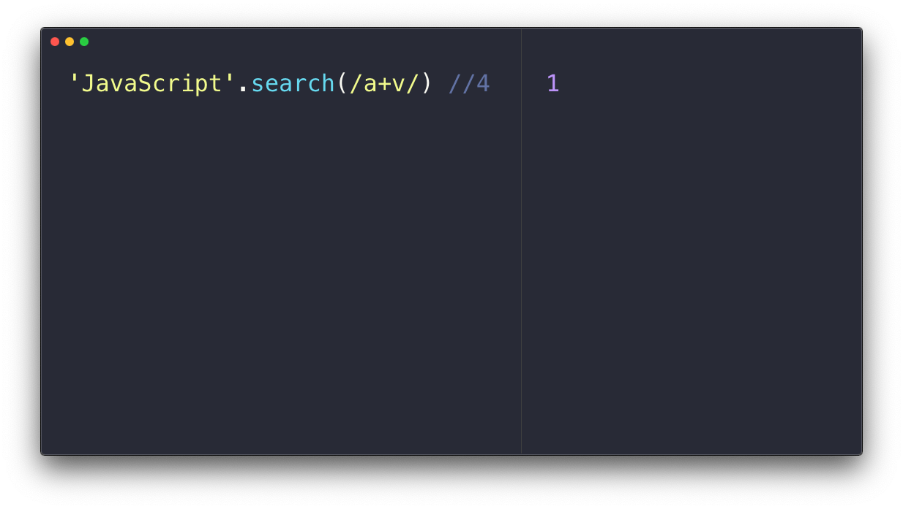

As I learn and try new different things using Javascript, I run little snippets of JavaScript every day.

Sometimes I just open a Chrome or Firefox [DevTools](/browser-dev-tools/) window and type things there. This is perfect to try out a line or two, but it can quickly become a little of a problem if you have to spend some time on the code. For example, if you declare a `const` value, you need to refresh the window to re-run it.

There is a nice [VS Code](/vscode/) extension called [Quokka.js](https://marketplace.visualstudio.com/items?itemName=WallabyJs.quokka-vscode). It's a great way to test JS snippets while working in your editor.

Another tool I use is [RunJS](https://projects.lukehaas.me/runjs/), a little [Electron](/electron/) application.

You can type code on the left, and the app shows the result on the right.

The code evaluates as you type, so you don't have to press "run" or have roadblocks while you try things out.

It can test both browser _and_ [Node.js](/nodejs/) code.

You can import Node modules just by setting a working directory where it can find them in a `node_modules` folder. Or you can just install npm packages from the "Action -> Install NPM packages" menu.

It supports [TypeScript](/typescript/) and Babel.

It's currently macOS-only, but I'm sure there are similar tools for Linux and Windows.

