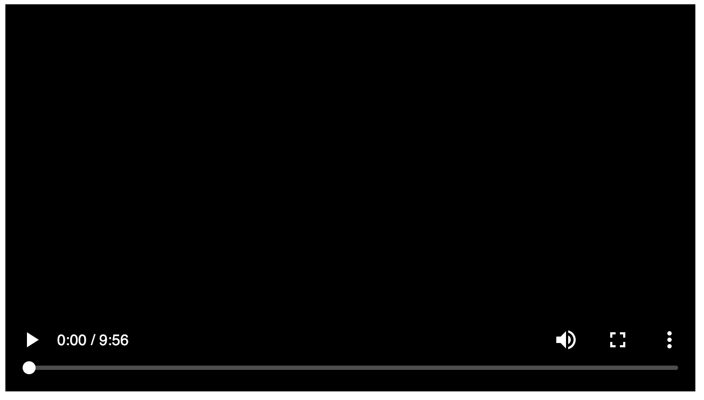

The `video` tag allows you to embed video content in your HTML pages.

This element can stream video, using a webcam via [`getUserMedia()`](/getusermedia/) or **WebRTC**, or it can play a video source which you reference using the `src` attribute:

```html
<video src="file.mp4" />
```

By default the browser does not show any controls for this element, just the video.

Which means the audio will play only if set to autoplay (more on this later) and the user can't see how to stop it, pause it, control the volume or skip at a specific position in the video.

To show the built-in controls, you can add the `controls` attribute:

```html
<video src="file.mp4" controls />
```

This is how it looks in Chrome:



The image initially displayed is the first frame of the video.

You can display another image, which is pretty a common need, using the `poster` attribute:

```html
<video src="video.mp4" poster="image.png" controls />
```

If not present, the browser will display the first frame of the video as soon as it's available.

You can specify the MIME type of the video file using the `type` attribute. If not set, the browser will try to automatically determine it:

```html
<video src="file.mp4" controls type="video/mp4" />
```

A video file by default does not play automatically. Add the `autoplay` attribute to play the audio automatically:

```html
<video src="file.mp4" controls autoplay />
```

Some browsers also require the `muted` attribute to autoplay. The video autoplays only if muted:

```html
<audio src="file.mp3" controls autoplay muted />
```

The `loop` attribute restarts the video playing at 0:00 if set, otherwise if not present the video stops at the end of the file:

```html
<video src="file.mp4" controls autoplay loop />
```

You can set the `width` and `height` attributes to set the space that the element will take, so that the browser can account for it and it does not change the layout when it's finally loaded.
It takes a numeric value, expressed in pixels.

## CORS

Video is subject to [CORS](https://flaviocopes.com/cors/) and unless you allow it on the server side, a video can't be played cross-origin.

Nothing happens if you put this tag in a web page. There is no way to start the video, and it does not play autonomously. To make the video play, you must add the `autoplay` attribute:

```html
<video src="video.mp4" autoplay />
```

## Changing the video display properties

You can set a width and height for the video area, expressed in pixels, using the `width` and `height` attributes:

```html
<video src="video.mp4" poster="image.png" controls
height="600"
width="800" />
```

## Displaying content if `video` is not supported

The `video` tag is [very well supported](https://caniuse.com/#feat=video), up to IE9, so nowadays there should be no need to have a placeholder text, but we have this option. You just add a closing tag, and insert text between the opening and closing tag:

```html
<video src="video.mp4">Video tag not supported</video>
```

## Adding multiple sources

Browsers can implement one video codec but not another. Maybe you want to use a newer standard which cuts file size in half but you still want to support older browsers.

You do so with the `source` tag:

```js
<video controls>
 <source src="video.mp4" type="video/mp4" />
 <source src="video.avi" type="video/avi"/>
</audio>
```

You can style controls using CSS, although this is out of the scope  for this introduction.

## Preloading the video

If you don't set `autoplay`, the spec says that browsers will only download the video metadata (to find out the length, for example) but will not download the video itself.

You can force preloading the video using

```html
<video src="video.mp4" preload="auto" />
```

## Working with video events

We can listen for events on each `video` element using JavaScript, to create interesting projects and interfaces. There is a lot of different events to play with.

The `play` event is fired when the video playback starts:

```js
document.querySelector('video').addEventListener('play', () => {
  alert('Video is playing!!!')
})
```

You can also directly add this event (as the others) using the `on<event>` attribute directly on the HTML element:

```html
<video src="video.mp4" controls onplay="playing()" />
```

```js
const playing = () => {
  alert('Video is playing!!!')
})
```

These are a few events you can listen to:

- `play` video started playing
- `pause` video was paused
- `ended` video playing completed
- `timeupdate` the user interacted with the playback timeline and went forward/backwards
- `volumechange` the user changed the volume

There are a lot more events related to the video loading, and [you can find the full list on MDN](https://developer.mozilla.org/en-US/docs/Web/HTML/Element/video).