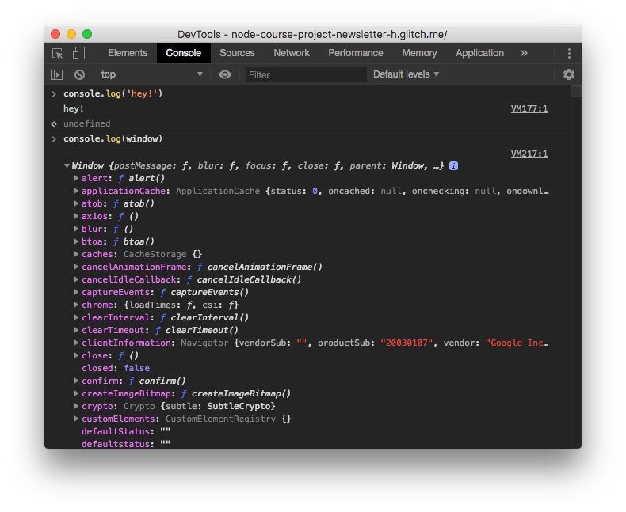
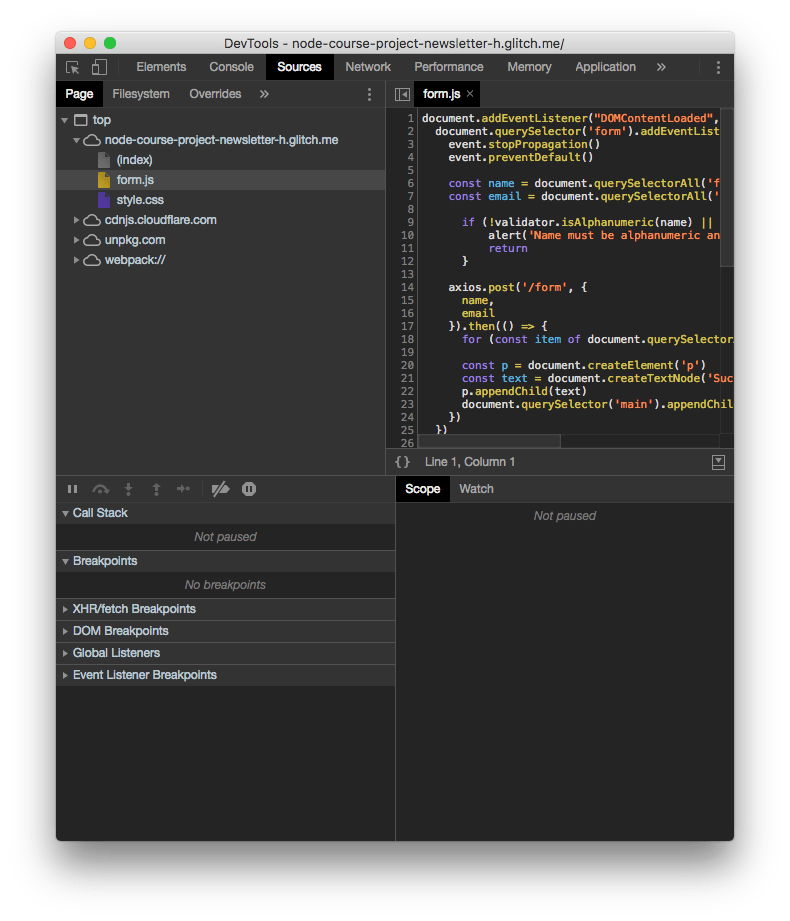
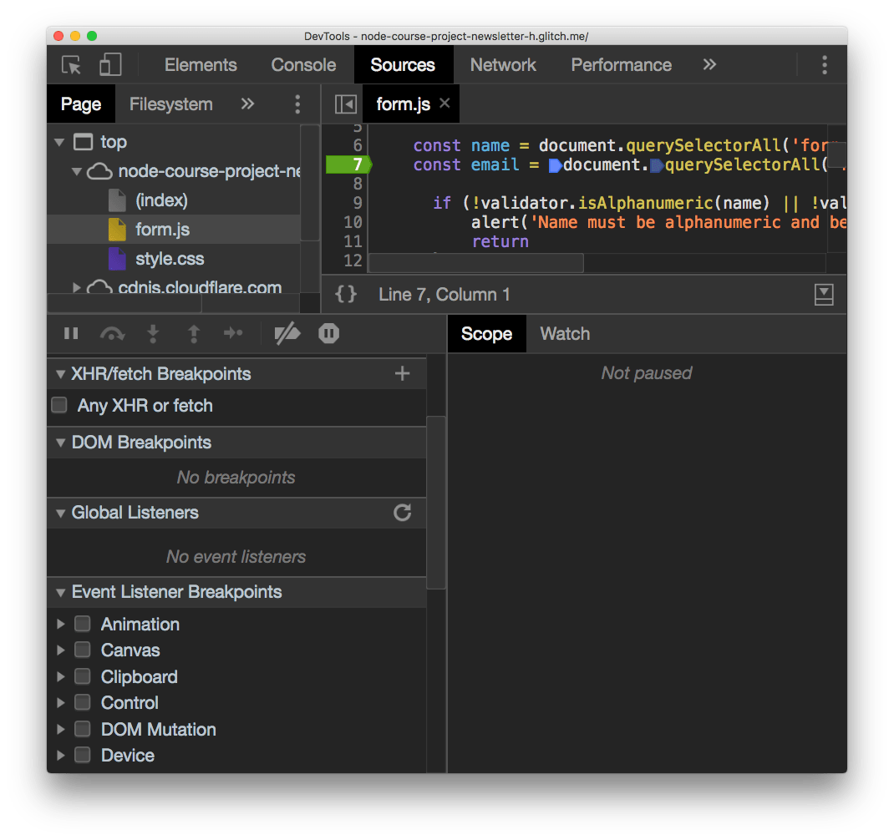
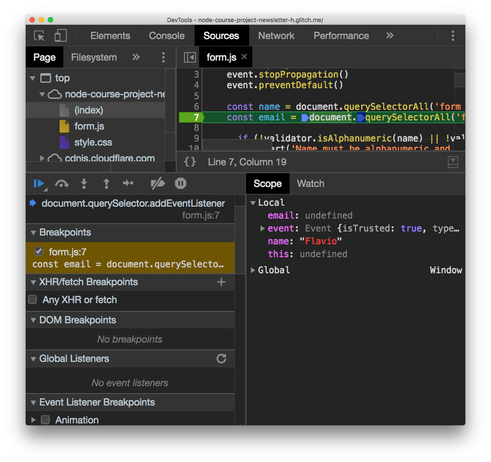
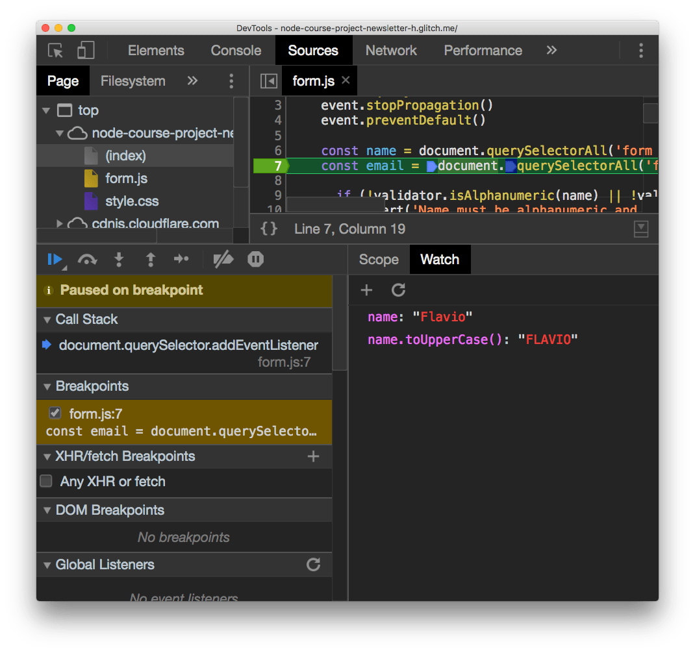
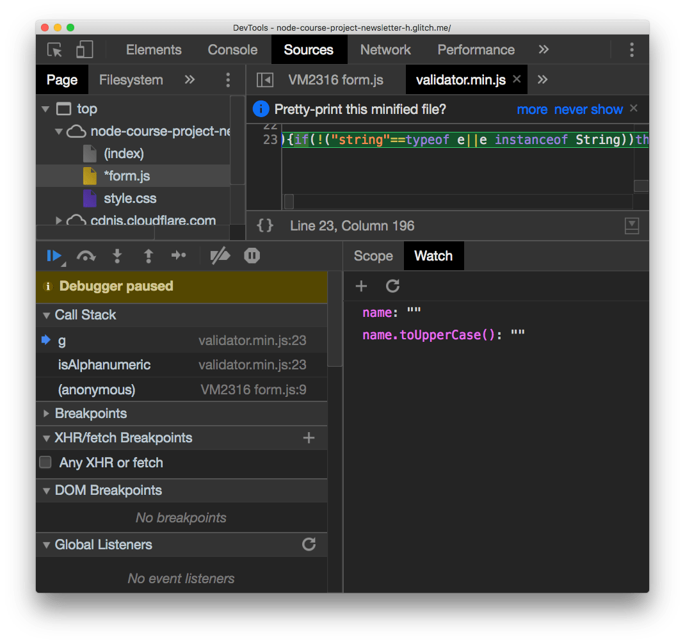
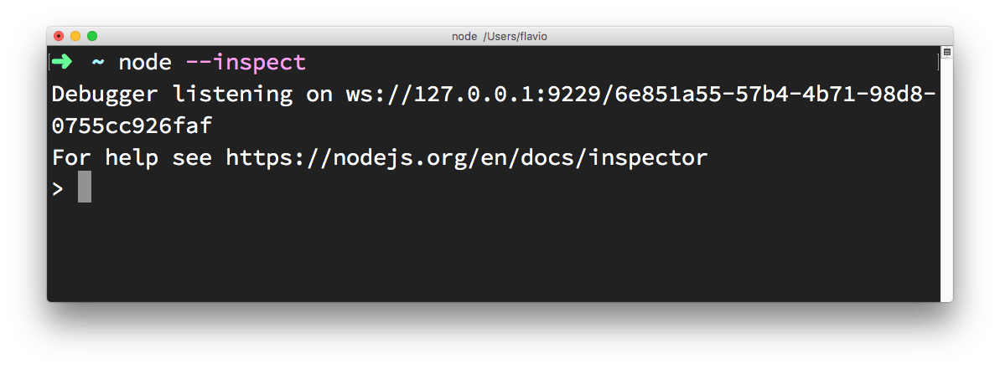
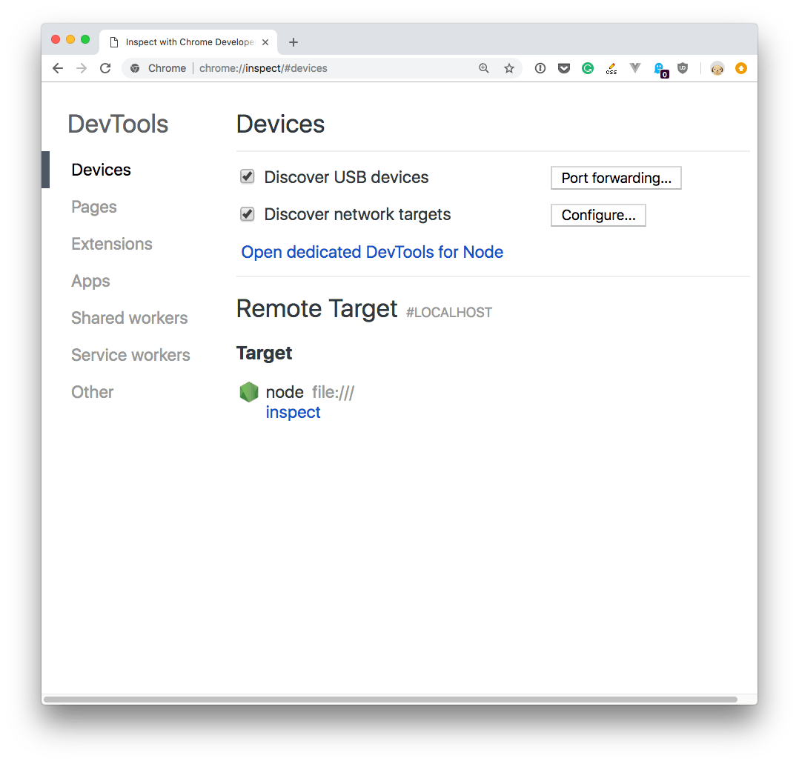
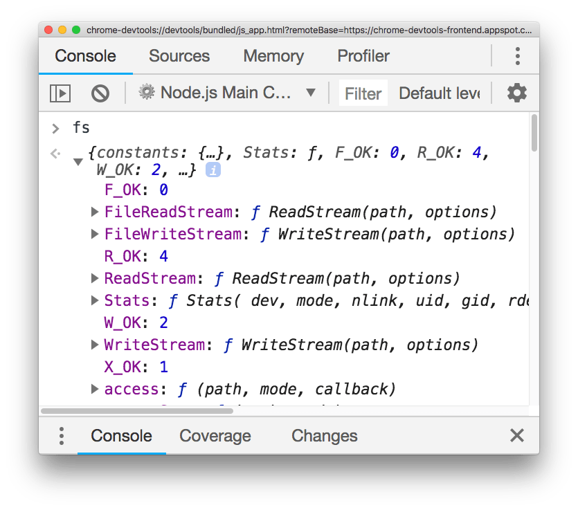

Debugging is one of those skills that's core to the activity of a programmer.

Sometimes we do our best work, yet the program is not working correctly, for example it's crashing, it's just slow or it's printing wrong information.

What do you do when a program you wrote is not behaving like you expect?

You start debugging it.

## Figuring out where the error could be

The first step is always to look at what is happening, and trying to determine where is the problem coming from. Is it a problem in the environment? Is it a problem in the input you gave to the program? Is it a one-time crash due to too much memory usage? Or is it happening every time you run it?

Those are all key information to start going in the right direction when figuring out a problem.

Once you have some sort of idea where the error is coming from, you can start checking that specific part of code.

## Read the code

The simplest way to debug, at least in terms of tooling, is by reading the code you wrote. Aloud. There is some magical thing in hearing from our own voice that does not happen when you read in silence.

Often times I found problems in this way.

## Using the console

If reading the code reveals nothing to you, the next logical step is to start adding a few lines into your code that can shed some light.

In JavaScript frontend code what you'll often do is to use `alert()` and `console.log` (and its cool friends).

Consider this line:

```js
const a = calculateA()
const b = calculateB()
const result = a + b
```

Somehow the result is not correctly calculated, so you can start by adding `alert(a)` and `alert(b)` before calculating the result, and the browser will open two alert panels when it executes the code.

```js
const a = calculateA()
const b = calculateB()
alert(a)
alert(b)
const result = a + b
```

This works fine if what you are passing to `alert()` is a string or a number. As soon as you have an array or an object things start to be too complicated for `alert()`, and you can use the [Console API](/console-api/). Starting with `console.log()`:

```js
const a = calculateA()
const b = calculateB()
console.log(a)
console.log(b)
const result = a + b
```

The value is printed in the JavaScript console of the browser developer tools. For convenience I'm explaining debugging in the Chrome DevTools here, but the general concepts apply to all browsers, with some differences in terms of features supported.

> See the [detailed overview of the Chrome DevTools](/browser-dev-tools/)

## The Chrome Dev Tools

The result of the `console.log()` calls is printed to the JavaScript console. This is a tool that's more or less common to every browser:



The tool is very powerful and lets you print complex objects or arrays and you can inspect every property of them.

In the [Console API](/console-api/) post you can see all the options and details of working with it, so I'm not explaining all the details here.

## The debugger

The debugger is the most powerful tool in the browser developer tools, and it's found in the _Sources_ panel:



The top part of the screen shows the files navigator.

You can select any file and inspect it on the right. This is very important to set breakpoints, as we'll see later.

The bottom part is the actual debugger.

## Breakpoints

When the browser loads a page, the JavaScript code is executed until a breakpoint is met.

At this point the execution is halted and you can inspect all about your running program.

You can check the variables values, and resume the execution of the program one line at a time.

But first, what is a breakpoint? In its simple form, a breakpoint is a `breakpoint` instruction put in your code. When the browser meets it, it stops.

This is a good option while developing. Another option is to open the file in the Sources panel and click the number on the line you want to add a breakpoint:


Clicking again the breakpoint will remove it.

After you add a breakpoint you can reload the page and the code will stop at that execution point when it finds the breakpoint.

As you add the breakpoint you can see in the _Breakpoints_ panel that `form.js` on line `7` has the breakpoint. You can see all your breakpoints there, and disable them temporarily.

There are other types of breakpoints as well:

- **XHR/fetch breakpoints**: triggered when any network request is sent
- **DOM breakpoints**: triggered when a DOM element changes
- **Event listener breakpoints**: triggered when some event happens, like a mouse click



## Scope

In this example I set a breakpoint inside an event listener, so I had to submit a form to trigger the it:



Now all the variables that are in the scope are printed, with their respective values. You can edit those variables by double clicking them.

## Watch variables and expressions

Right to the _Scope_ panel there's the _Watch_ panel.

It has a `+` button which you can use to add any expression. For example adding `name` will print the `name` variable value, in the example `Flavio`. You can add `name.toUpperCase()` and it will print `FLAVIO`:



## Resume the execution

Now the scripts are all halted since the breakpoint stopped the execution.

There is a set of buttons above the "Paused on breakpoint" banner that let you alter this state.

The first is in blue. Clicking it resumes the normal script execution.

The second button is **step over**, and it resumes execution until the next line, and stops again.

The next button perform a **step into** operation: goes into the function being executed, letting you go into the details of it.

**Step out** is the opposite: goes back to the outer function calling this one.

Those are the main ways to control the flow during debugging.

## Edit scripts

From this devtools screen you can edit any script, also while the script is halted in its execution. Just edit the file and press cmd-S on Mac or ctrl-S on Windows/Linux.

Of course the changes are not persisted to disk unless you are working locally and set up workspaces in the devtools, a more advanced topic.

## Inspect the call stack

The **call stack** is great to see how many functions levels you are deep into the JavaScript code. It lets you move up in the stack too by clicking each function name:



## Blackbox scripts

Often times you work with libraries where you don't want to "step into", you trust them and you don't want to see their code in the call stack, for example. Like in the above case for `validator.min.js`, which I use for email validation.

I trust it does a good job, so I can right-click it in the call stack and press **Blackbox script**. From then on, it's impossible to step into this script code, and you happily work on just your own application code.

## Use the browser devtools to debug Node.js

Since Node.js is built on the same engine of Chrome, [v8](/v8/), you can link the 2 and use the Chrome DevTools to inspect the execution of Node.js applications.

Open your [terminal](/macos-terminal/) and run

```bash
node --inspect
```



Then in Chrome type this URL: `about://inspect`.



Click the Open dedicated DevTools for Node link next to the Node target, and you’ll have access to Node.js in the browser DevTools:



Make sure you click that, and not the inspect link down below, as it tool auto-reconnects to the Node.js instance when we restart it - pretty handy!
