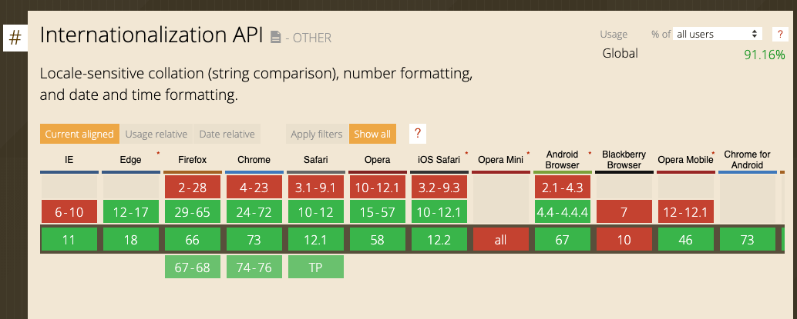
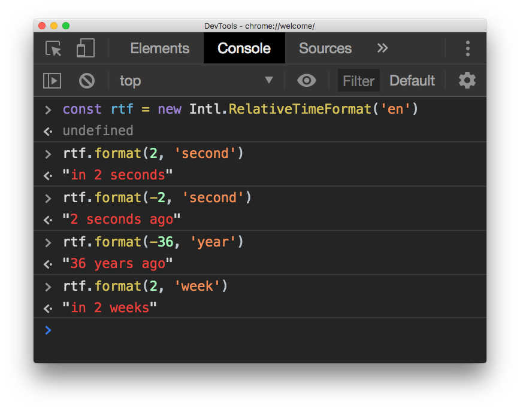
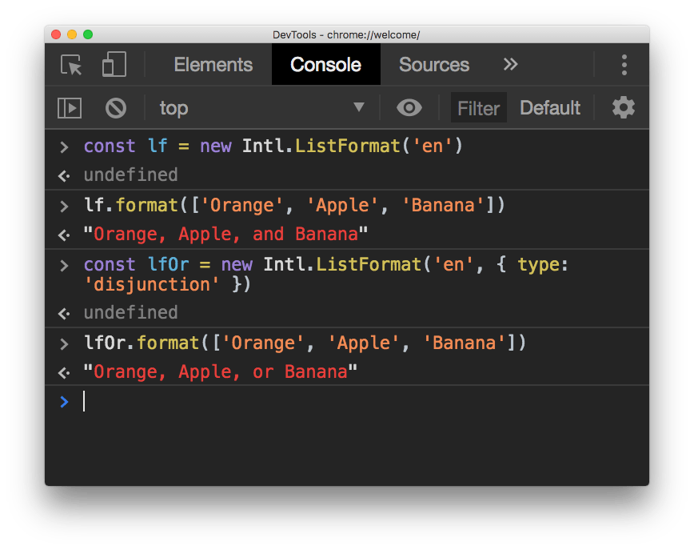

`Intl` is a powerful object that exposes the **JavaScript Internationalization API**.

It exposes the following properties:

- `Intl.Collator`: gives you access to language-sensitive string comparison
- `Intl.DateTimeFormat`: gives you access to language-sensitive date and time formatting
- `Intl.NumberFormat`: gives you access to language-sensitive number formatting
- `Intl.PluralRules`: gives you access to language-sensitive plural formatting and plural language rules
- `Intl.RelativeTimeFormat`: gives you access to language-sensitive relative time formatting

It also provides one method: `Intl.getCanonicalLocales()`.

`Intl.getCanonicalLocales()` lets you check if a locale is valid, and returns the correct formatting for it. It can accept a string, or an array:

```js
Intl.getCanonicalLocales('it-it') //[ 'it-IT' ]
Intl.getCanonicalLocales(['en-us', 'en-gb']) //[ 'en-US', 'en-GB' ]
```

and throws an error if the locale is invalid

```js
Intl.getCanonicalLocales('it_it') //RangeError: Invalid language tag: it_it
```

which you can catch with a try/catch block.

Different types can interface with the Intl API for their specific needs. In particular we can mention:

- `String.prototype.localeCompare()`
- `Number.prototype.toLocaleString()`
- `Date.prototype.toLocaleString()`
- `Date.prototype.toLocaleDateString()`
- `Date.prototype.toLocaleTimeString()`

Let's go and see how to work with the above Intl properties:

## Intl.Collator

This property gives you access to language-sensitive string comparison

You initialize a Collator object using `new Intl.Collator()`, passing it a locale, and you use its `compare()` method which returns a positive value if the first argument comes after the second one. A negative if it's the reverse, and zero if it's the same value:

```js
const collator = new Intl.Collator('it-IT')
collator.compare('a', 'c') //a negative value
collator.compare('c', 'b') //a positive value
```

We can use it to order arrays of characters, for example.

## Intl.DateTimeFormat

This property gives you access to language-sensitive date and time formatting.

You initialize a DateTimeFormat object using `new Intl.DateTimeFormat()`, passing it a locale, and then you pass it a date to format it as that locale prefers:

```js
const date = new Date()
let dateTimeFormatter = new Intl.DateTimeFormat('it-IT')
dateTimeFormatter.format(date) //27/1/2019
dateTimeFormatter = new Intl.DateTimeFormat('en-GB')
dateTimeFormatter.format(date) //27/01/2019
dateTimeFormatter = new Intl.DateTimeFormat('en-US')
dateTimeFormatter.format(date) //1/27/2019
```

The formatToParts() method returns an array with all the date parts:

```js
const date = new Date()
const dateTimeFormatter = new Intl.DateTimeFormat('en-US')
dateTimeFormatter.formatToParts(date)
/*
[ { type: 'month', value: '1' },
  { type: 'literal', value: '/' },
  { type: 'day', value: '27' },
  { type: 'literal', value: '/' },
  { type: 'year', value: '2019' } ]
*/
```

You can print the time as well. Check all the options you can use [on MDN](https://developer.mozilla.org/en-US/docs/Web/JavaScript/Reference/Global_Objects/DateTimeFormat).

## Intl.NumberFormat

This property gives you access to language-sensitive number formatting. You can use it to format a number as a currency value.

Say you have a number like **`10`**, and it represents the price of something.

You want to transform it to **`$10,00`**.

If the number has more than 3 digits however it should be displayed differently, for example, **`1000`** should be displayed as **`$1.000,00`**

This is in USD, however.

**Different countries have different conventions to display values**.

JavaScript makes it very easy for us with the [_ECMAScript Internationalization API_](https://hacks.mozilla.org/2014/12/introducing-the-javascript-internationalization-api/), a relatively recent browser API that provides a lot of internationalization features, like dates and time formatting.

It is very well supported:



```js
const formatter = new Intl.NumberFormat('en-US', {
  style: 'currency',
  currency: 'USD',
  minimumFractionDigits: 2
})

formatter.format(1000) // "$1,000.00"
formatter.format(10) // "$10.00"
formatter.format(123233000) // "$123,233,000.00"
```

The `minimumFractionDigits` property sets the fraction part to be always at least 2 digits. You can check which other parameters you can use in [the NumberFormat MDN page](https://developer.mozilla.org/en-US/docs/Web/JavaScript/Reference/Global_Objects/NumberFormat).

This example creates a number formatter for the Euro currency, for the Italian country:

```js
const formatter = new Intl.NumberFormat('it-IT', {
  style: 'currency',
  currency: 'EUR'
})
```

## Intl.PluralRules

This property gives you access to language-sensitive plural formatting and plural language rules. I found [the example on the Google Developers portal by Mathias Bynens](https://developers.google.com/web/updates/2017/10/intl-pluralrules) the only one I could relate to practical usage: giving a suffix to ordered numbers: 0th, 1st, 2nd, 3rd, 4th, 5th..

```js
const pr = new Intl.PluralRules('en-US', {
    type: 'ordinal'
})
pr.select(0) //other
pr.select(1) //one
pr.select(2) //two
pr.select(3) //few
pr.select(4) //other
pr.select(10) //other
pr.select(22) //two
```

Every time we got `other`, we translate that to `th`. If we have `one`, we use `st`. For `two` we use `nd`. `few` gets `rd`.

We can use an object to create an associative array:

```js
const suffixes = {
  'one': 'st',
  'two': 'nd',
  'few': 'rd',
  'other': 'th'
}
```

and we do a formatting function to reference the value in the object, and we return a string containing the original number, and its suffix:

```js
const format = (number) => `${number}${suffixes[pr.select(number)]}`
```

Now we can use it like this:

```js
format(0) //0th
format(1) //1st
format(2) //2nd
format(3) //3rd
format(4) //4th
format(21) //21st
format(22) //22nd
```

---

Note that there are nice things coming soon to Intl, like [`Intl.RelativeTimeFormat`](https://developers.google.com/web/updates/2018/10/intl-relativetimeformat) and [`Intl.ListFormat`](https://developer.mozilla.org/en-US/docs/Web/JavaScript/Reference/Global_Objects/ListFormat#Specifications), which are at the time of writing only available in Chrome and Opera.




