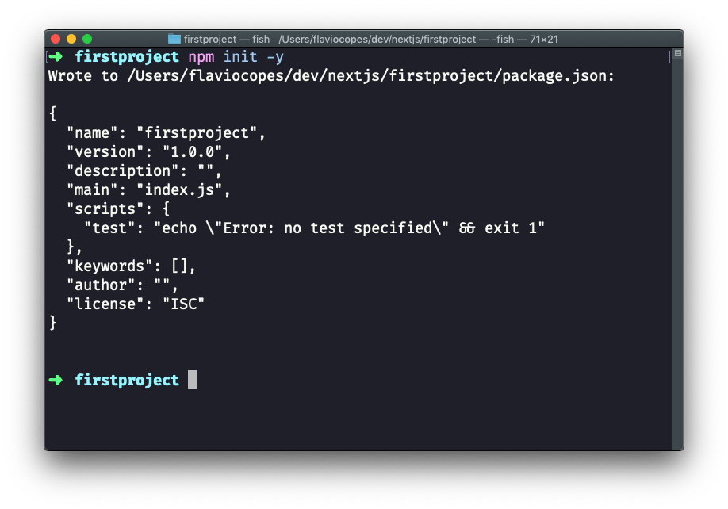
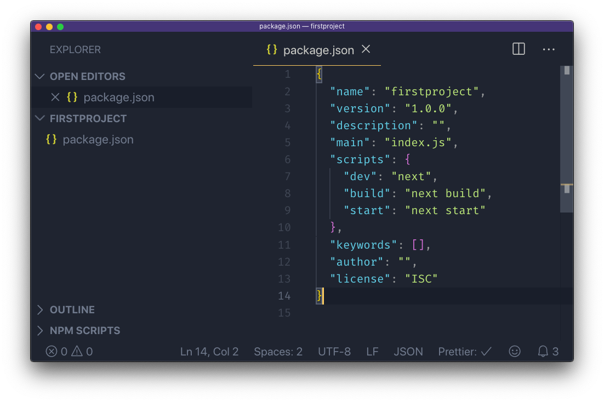
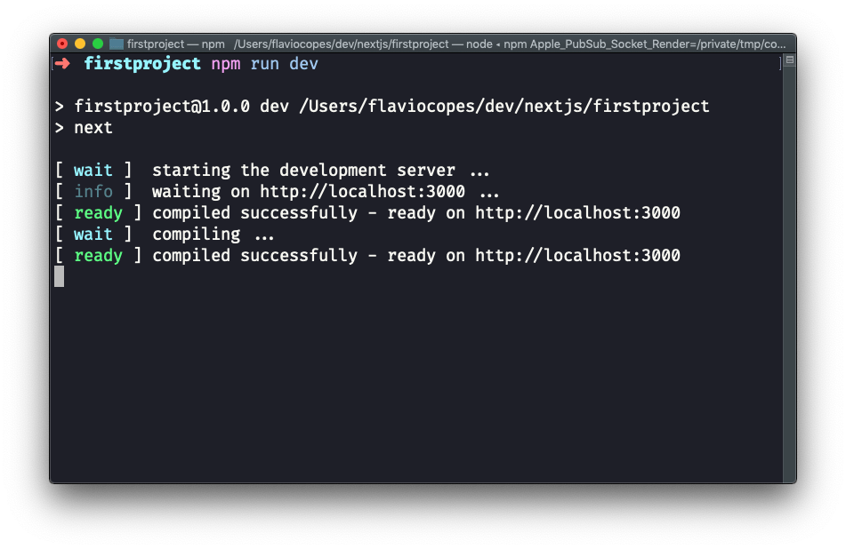
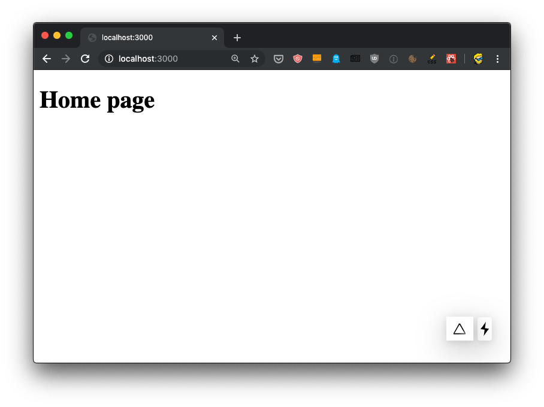

To install Next.js, you need to have [Node.js](/nodejs/) installed.

Make sure that you have the latest version of Node. Check with running `node -v` in your terminal, and compare it to the latest LTS version listed on <https://nodejs.org/>.

After you install Node.js, you will have the `npm` command available into your command line.

If you have any trouble at this stage, I recommend the following tutorials I wrote for you:

- [how to install Node.js](https://flaviocopes.com/node-installation/)
- [how to update Node.js](https://flaviocopes.com/how-to-update-node/)
- [An introduction to the npm package manager](https://flaviocopes.com/npm/)
- [Unix Shells Tutorial](https://flaviocopes.com/shells/)
- [How to use the macOS terminal](https://flaviocopes.com/macos-terminal/)
- [The Bash Shell](https://flaviocopes.com/bash/)

Now that you have Node updated to the latest version and `npm`, create an empty folder anywhere you like, for example in your home folder, and go into it:

```sh
mkdir nextjs
cd nextjs
```

and create your first Next project

```sh
mkdir firstproject
cd firstproject
```

Now use the `npm` command to initialize it as a Node project:

```sh
npm init -y
```

The `-y` option tells `npm` to use the default settings for a project, populating a sample `package.json` file.



Now install Next and React:

```sh
npm install next react react-dom
```

Your project folder should now have 2 files:

- `package.json` ([see my tutorial on it](https://flaviocopes.com/package-json/))
- `package-lock.json` ([see my tutorial on package-lock](https://flaviocopes.com/package-lock-json/))

and the `node_modules` folder.

Open the project folder using your favorite editor. My favorite editor is [VS Code](https://flaviocopes.com/vscode/). If you have that installed, you can run `code .` in your terminal to open the current folder in the editor (if the command does not work for you, see [this](https://code.visualstudio.com/docs/setup/mac#_launching-from-the-command-line))

Open `package.json`, which now has this content:

```json
{
  "name": "airbnbclone",
  "version": "1.0.0",
  "description": "",
  "main": "index.js",
  "scripts": {
    "test": "echo \"Error: no test specified\" && exit 1"
  },
  "keywords": [],
  "author": "",
  "license": "ISC",
  "dependencies":  {
    "next": "^9.1.2",
    "react": "^16.11.0",
    "react-dom": "^16.11.0"
  }
}
```

and replace the `scripts` section with:

```json
"scripts": {
  "dev": "next",
  "build": "next build",
  "start": "next start"
}
```

to add the Next.js build commands, which we're going to use soon.



Now create a `pages` folder, and add an `index.js` file.

In this file, let's create our first React component.

We're going to use it as the default export:

```js
const Index = () => (
  <div>
    <h1>Home page</h1>
  </div>
)

export default Index
```

Now using the terminal, run `npm run dev` to start the Next development server.

This will make the app available on port 3000, on localhost.



Open <http://localhost:3000> in your browser to see it.


