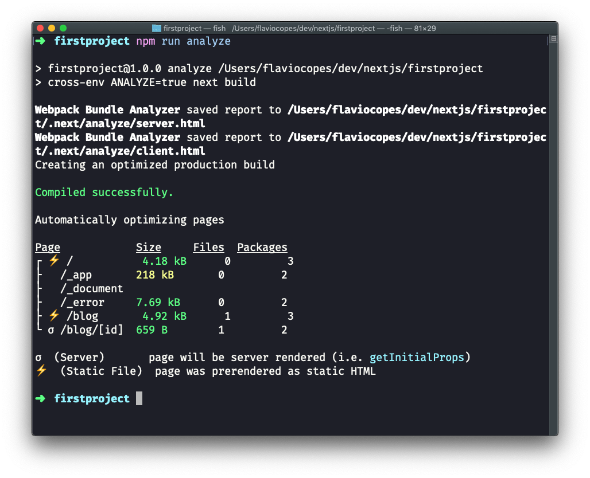
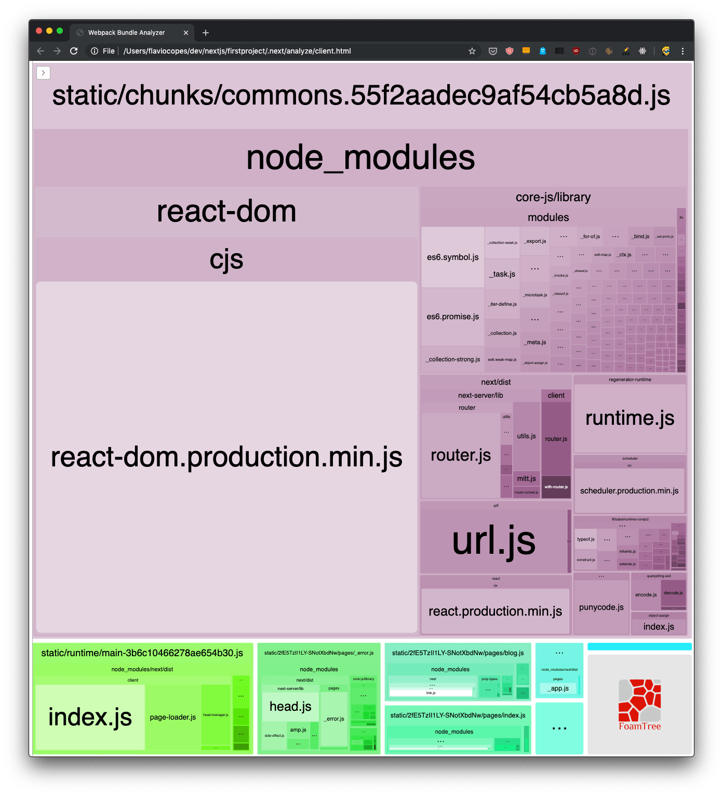
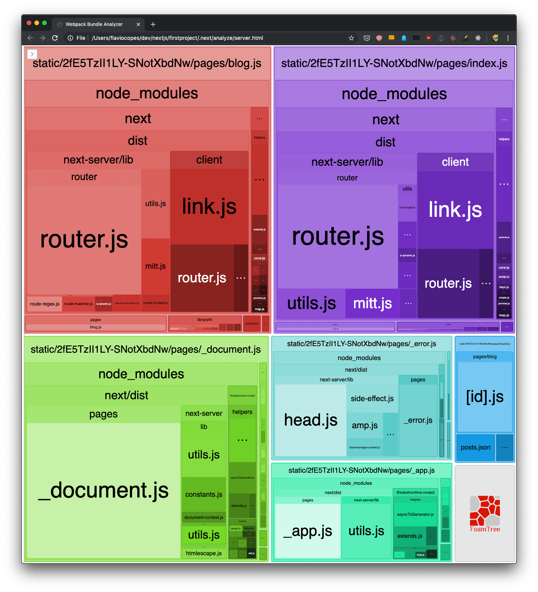
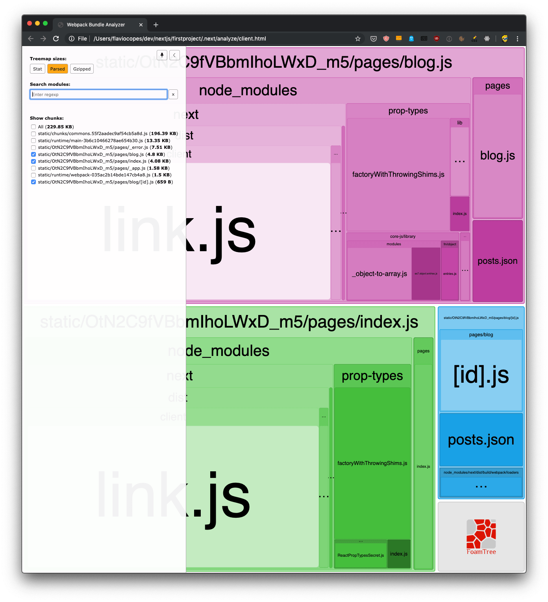

Next provides us a way to analyze the code bundles that are generated.

Open the package.json file of the app and in the scripts section add those 3 new commands:

```json
"analyze": "cross-env ANALYZE=true next build",
"analyze:server": "cross-env BUNDLE_ANALYZE=server next build",
"analyze:browser": "cross-env BUNDLE_ANALYZE=browser next build"
```

Like this:

```json
{
  "name": "firstproject",
  "version": "1.0.0",
  "description": "",
  "main": "index.js",
  "scripts": {
    "dev": "next",
    "build": "next build",
    "start": "next start",
    "analyze": "cross-env ANALYZE=true next build",
    "analyze:server": "cross-env BUNDLE_ANALYZE=server next build",
    "analyze:browser": "cross-env BUNDLE_ANALYZE=browser next build"
  },
  "keywords": [],
  "author": "",
  "license": "ISC",
  "dependencies": {
    "next": "^9.1.2",
    "react": "^16.11.0",
    "react-dom": "^16.11.0"
  }
}
```

then install those 2 packages:

```bash
npm install --dev cross-env @next/bundle-analyzer
```

Create a `next.config.js` file in the project root, with this content:

```js
const withBundleAnalyzer = require('@next/bundle-analyzer')({
  enabled: process.env.ANALYZE === 'true'
})

module.exports = withBundleAnalyzer({})
```

Now run the command

```bash
npm run analyze
```



This should open 2 pages in the browser. One for the client bundles, and one for the server bundles:






This is incredibly useful. You can inspect what's taking the most space in the bundles, and you can also use the sidebar to exclude bundles, for an easier visualization of the smaller ones:

