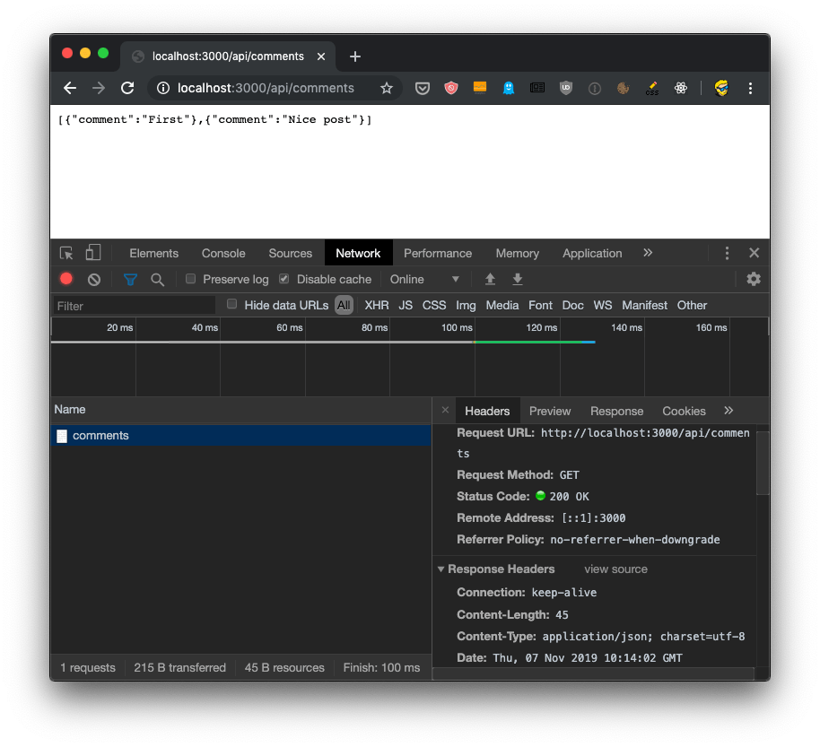
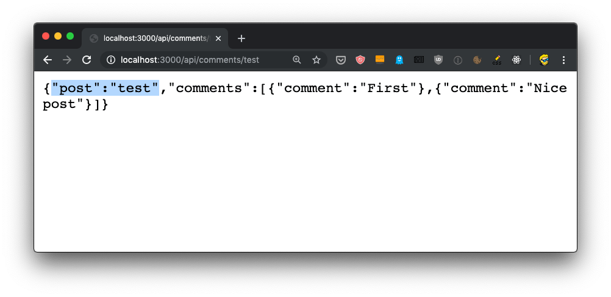

In addition to creating **page routes**, which means pages are served to the browser as Web pages, Next.js can create **API routes**.

This is a very interesting feature because it means that Next.js can be used to create a frontend for data that is stored and retrieved by Next.js itself, transferring JSON via fetch requests.

API routes live under the `/pages/api/` folder and are mapped to the `/api` endpoint.

This feature is _very_ useful when creating applications.

In those routes, we write Node.js code (rather than React code). It's a paradigm shift, you move from the frontend to the backend, but very seamlessly.

Say you have a `/pages/api/comments.js` file, whose goal is to return the comments of a blog post as JSON.

Say you have a list of comments stored in a `comments.json` file:

```json
[
  {
    "comment": "First"
  },
  {
    "comment": "Nice post"
  }
]
```

Here's a sample code, which returns to the client the list of comments:

```js
import comments from './comments.json'

export default (req, res) => {
  res.status(200).json(feeds)
}
```

It will listen on the `/api/commments` URL for GET requests, and you can try calling it using your browser:



API routes can also use **dynamic routing** like pages, use the `[]` syntax to create a dynamic API route, like `/pages/api/comments/[id].js` which will retrieve the comments specific to a post id.

Inside the `[id].js` you can retrieve the `id` value by looking it up inside the `req.query` object:

```js
import comments from '../comments.json'

export default (req, res) => {
  res.status(200).json({ post: req.query.id, comments })
}
```

Heres you can see the above code in action:



In dynamic pages, you'd need to import `useRouter` from `next/router`, then get the router object using `const router = useRouter()`, and then we'd be able to get the `id` value using `router.query.id`.

In the server-side it's all easier, as the query is attached to the request object.

If you do a POST request, all works in the same way - it all goes through that default export.

To separate POST from GET and other HTTP methods (PUT, DELETE), lookup the `req.method` value:

```js
export default (req, res) => {
  switch (req.method) {
    case 'GET':
      //...
      break
    case 'POST':
      //...
      break
    default:
      res.status(405).end() //Method Not Allowed
      break
  }
}
```

In addition to `req.query` and `req.method` we already saw, we have access to cookies by referencing `req.cookies`, the request body in `req.body`.

Under the hoods, this is all powered by [Micro](https://github.com/zeit/micro), a library that powers asynchronous HTTP microservices, made by the same team that built Next.js.

You can make use of any Micro middleware in our API routes to add more functionality.