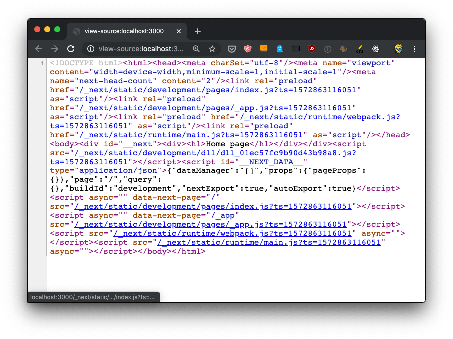

When we viewed the page source, we saw a bunch of JavaScript files being loaded:



Let's start by putting the code in an [HTML formatter](https://htmlformatter.com/) to get it formatted better, so we humans can get a better chance at understanding it:

```html
<!DOCTYPE html>
<html>

<head>
    <meta charSet="utf-8" />
    <meta name="viewport" content="width=device-width,minimum-scale=1,initial-scale=1" />
    <meta name="next-head-count" content="2" />
    <link rel="preload" href="/_next/static/development/pages/index.js?ts=1572863116051" as="script" />
    <link rel="preload" href="/_next/static/development/pages/_app.js?ts=1572863116051" as="script" />
    <link rel="preload" href="/_next/static/runtime/webpack.js?ts=1572863116051" as="script" />
    <link rel="preload" href="/_next/static/runtime/main.js?ts=1572863116051" as="script" />
</head>

<body>
    <div id="__next">
        <div>
            <h1>Home page</h1></div>
    </div>
    <script src="/_next/static/development/dll/dll_01ec57fc9b90d43b98a8.js?ts=1572863116051"></script>
    <script id="__NEXT_DATA__" type="application/json">{"dataManager":"[]","props":{"pageProps":{}},"page":"/","query":{},"buildId":"development","nextExport":true,"autoExport":true}</script>
    <script async="" data-next-page="/" src="/_next/static/development/pages/index.js?ts=1572863116051"></script>
    <script async="" data-next-page="/_app" src="/_next/static/development/pages/_app.js?ts=1572863116051"></script>
    <script src="/_next/static/runtime/webpack.js?ts=1572863116051" async=""></script>
    <script src="/_next/static/runtime/main.js?ts=1572863116051" async=""></script>
</body>

</html>
```

We have 4 JavaScript files being declared to be preloaded in the `head`, using `rel="preload" as="script"`:

- `/_next/static/development/pages/index.js` (96 LOC)
- `/_next/static/development/pages/_app.js` (5900 LOC)
- `/_next/static/runtime/webpack.js` (939 LOC)
- `/_next/static/runtime/main.js` (12k LOC)

This tells the browser to start loading those files as soon as possible, before the normal rendering flow starts. Without those, scripts would be loaded with an additional delay and this improves the page loading performance.

Then those 4 files are loaded at the end of the `body`, along with `/_next/static/development/dll/dll_01ec57fc9b90d43b98a8.js` (31k LOC), and a JSON snippet that sets some defaults for the page data:

```html
<script id="__NEXT_DATA__" type="application/json">
{
  "dataManager": "[]",
  "props": {
    "pageProps":  {}
  },
  "page": "/",
  "query": {},
  "buildId": "development",
  "nextExport": true,
  "autoExport": true
}
</script>
```

The 4 bundle files loaded are already implementing one feature called **code splitting**. The `index.js` file provides the code needed for the `index` component, which serves the `/` route, and if we had more pages we'd have more bundles for each page, which will then only be loaded if needed - to provide a more performant load time for the page.