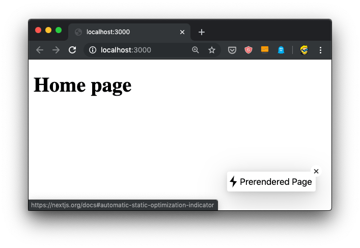

Did you see that little icon at the bottom right of the page, which looks like a lightning?

If you hover it, it's going to say "Prerendered page":

This icon, which is _only visible in development mode_ of course, tells you the page qualifies for automatic static optimization, which basically means that it does not depend on data that needs to be fetched at invokation time, and it can be prerendered and built as a static HTML file at build time (when we run `npm run build`).

Next can determine this by the absence of the `getInitialProps()` method attached to the page component.

When this is the case, our page can be even faster because it will be served statically as an HTML file rather than going through the Node.js server that generates the HTML output.

Another useful icon that might appear next to it, or instead of it on non-prerended pages, is a little animated triangle:

This is a compilation indicator, and appears when you save a page and Next.js is compiling the application before hot code reloading kicks in to reload the code in the application automatically.

It's a really nice way to immediately determine if the app has already been compiled and you can test a part of it you're working on.