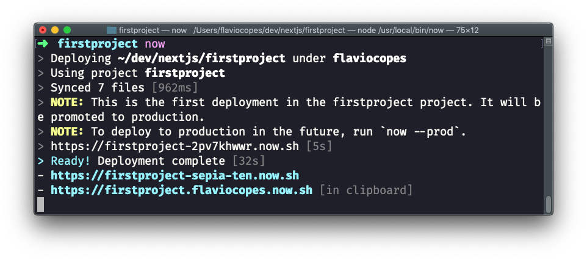
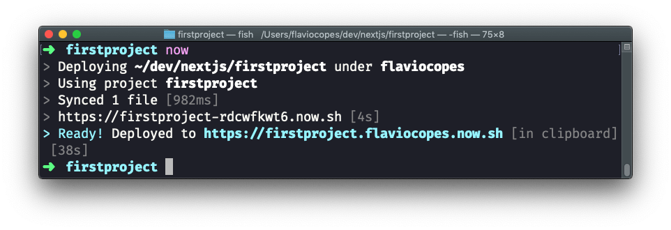
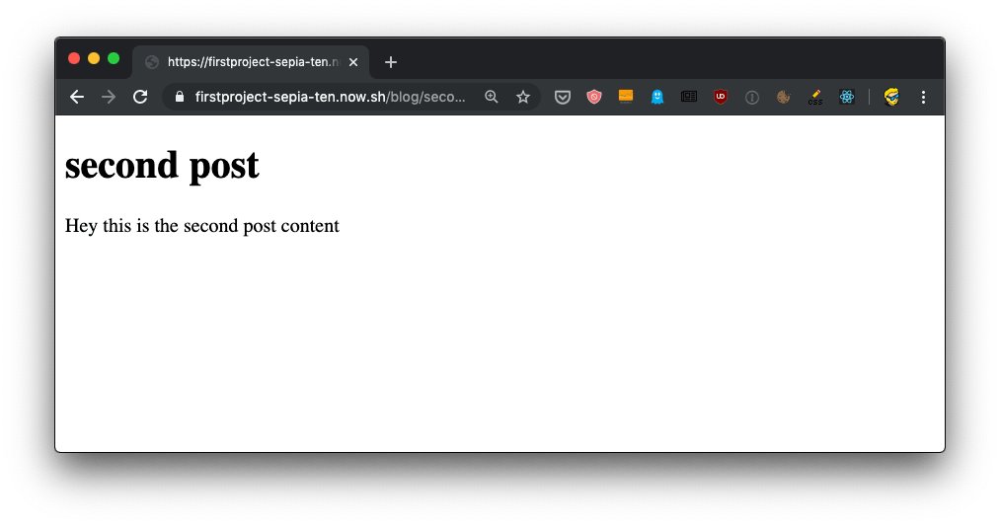

How do we deploy a Next.js app to a real web server, so other people can access it?

One of the most simple ways to deploy a Next application is through the [**Now**](/zeit-now/) platform created by [Zeit](https://zeit.co),  the same company that created the Open Source project Next.js. You can use Now to deploy Node.js apps, Static Websites, and much more.

Now makes the deployment and distribution step of an app very, very simple and fast, and in addition to Node.js apps, they also support deploying Go, PHP, Python and other languages.

You can think of it as the "cloud", as you don't really know where your app will be deployed, but you know that you will have a URL where you can reach it.

Now is free to start using, with generous free plan that currently includes 100GB of hosting, 1000 [serverless](/serverless/) functions invocations per day, 1000 builds per month, 100GB of bandwidth per month, and one [CDN](/cdn/) location. The [pricing page](https://zeit.co/pricing) helps get an idea of the costs if you need more.

## Installation

The best way to start using Now is by using the official Now CLI:

```bash
npm install -g now
```

Once the command is available, run

```bash
now login
```

and the app will ask you for your email.

If you haven't registered already, create an account on <https://zeit.co/signup> before continuing, then add your email to the CLI client.

Once this is done, from the Next.js project root folder run

```bash
now
```

and the app will be instantly deployed to the Now cloud, and you'll be given the unique app URL:



Once you run the `now` program, the app is deployed to a random URL under the `now.sh` domain.

We can see 3 different URLs in the output given in the image:

- https://firstproject-2pv7khwwr.now.sh
- https://firstproject-sepia-ten.now.sh
- https://firstproject.flaviocopes.now.sh

Why so many?

The first is the URL identifying the deploy. Every time we deploy the app, this URL will change.

You can test immediately by changing something in the project code, and running `now` again:



The other 2 URLs will not change. The first is a random one, the second is your project name (which defaults to the current project folder, your account name and then `now.sh`).

If you visit the URL, you will see the app deployed to production.



You can configure Now to serve the site to your own custom domain or subdomain, but I will not dive into that right now.

The `now.sh` subdomain is enough for our testing purposes.