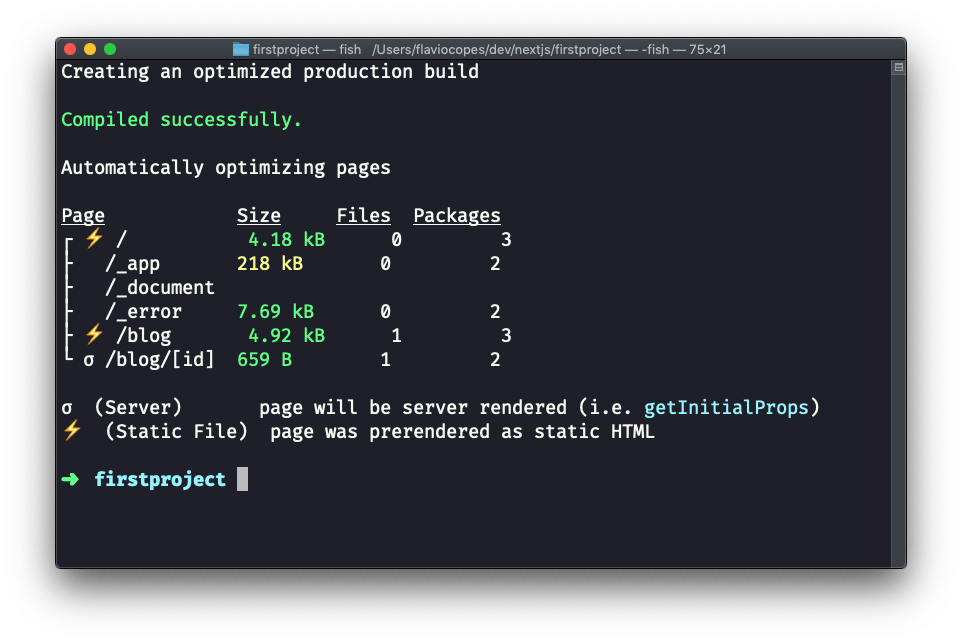
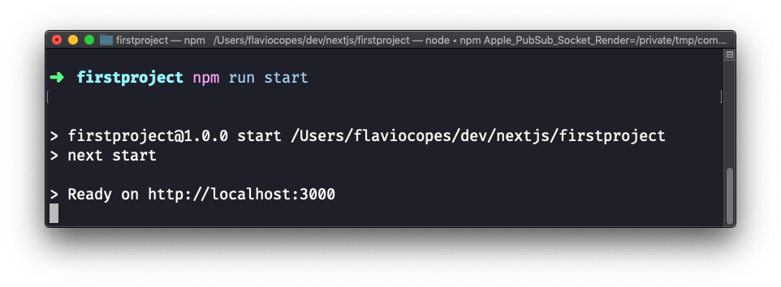

Deploying an app made using Next.js in production is easy. Add those 3 lines to the `package.json` `script` section:

```json
"scripts": {
  "dev": "next",
  "build": "next build",
  "start": "next start"
}
```

We used `npm run dev` up to now, to call the `next` command installed locally in `node_modules/next/dist/bin/next`. This started the development server, which provided us **source maps** and **hot code reloading**, two very useful features while debugging.

The same command can be invoked to build the website passing the `build` flag, by running `npm run build`. Then, the same command can be used to start the production app passing the `start` flag, by running `npm run start`.

Those 2 commands are the ones we must invoke to successfully deploy the production version of our site locally. The production version is highly optimized and does not come with source maps and other things like hot code reloading that would not be beneficial to our end users.

So, let's create a production deploy of our app. Build it using:

```bash
npm run build
```



The output of the command tells us that some routes (`/` and `/blog` are now prerendered as static HTML, while `/blog/[id]` will be served by the Node.js backend.

Then you can run `npm run start` to start the production server locally:

```bash
npm run start
```



Visiting <http://localhost:3000> will show us the production version of the app, locally.