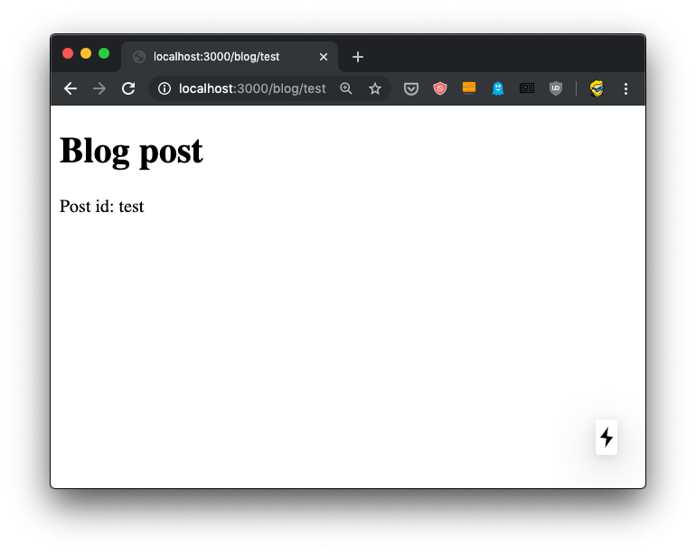
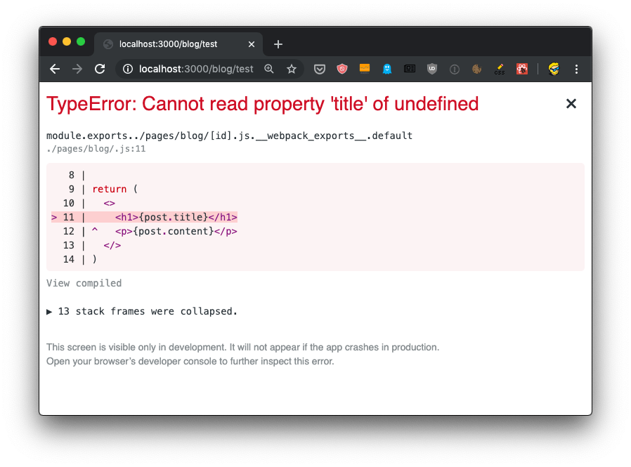
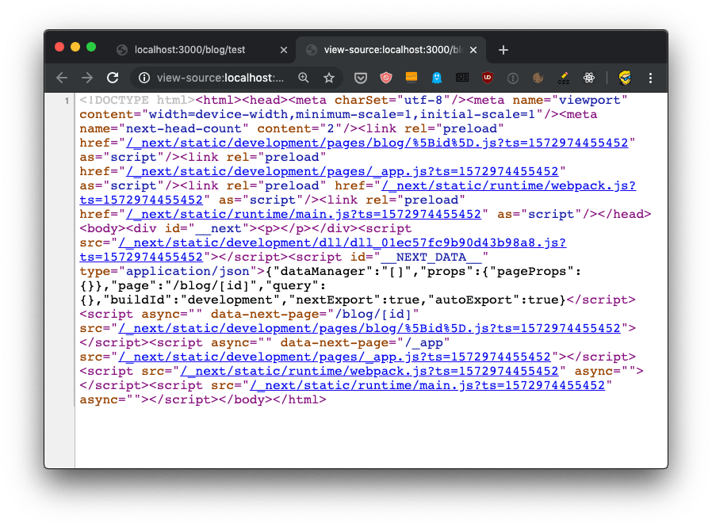

In the [previous post](/link-two-pages-nextjs/) we saw how to link the home to the blog page.

A blog is a great use case for Next.js, one we'll continue to explore in this chapter by adding **blog posts**.

Blog posts have a dynamic URL. For example a post titled "Hello World" might have the URL `/blog/hello-world`. A post titled "My second post" might have the URL `/blog/my-second-post`.

This content is dynamic, and might be taken from a database, markdown files or more.

Next.js can serve dynamic content based on a **dynamic URL**.

We create a dynamic URL by creating a dynamic page with the `[]` syntax.

How? We add a `pages/blog/[id].js` file. This file will handle all the dynamic URLs under the `/blog/` route, like the ones we mentioned above: `/blog/hello-world`, `/blog/my-second-post` and more.

In the file name, `[id]` inside the square brackets means that anything that's dynamic will be put inside the `id` parameter of the **query property** of the **router**.

Ok, that's a bit too many things at once.

What's the **router**?

The router is a library provided by Next.js.

We import it from `next/router`:

```js
import { useRouter } from 'next/router'
```

and once we have `useRouter`, we instantiate the router object using:

```js
const router = useRouter()
```

Once we have this router object, we can extract information from it.

In particular we can get the dynamic part of the URL in the `[id].js` file by accessing `router.query.id`.

> The dynamic part can also just be a portion of the URL, like `post-[id].js`.

So let's go on and apply all those things in practice.

Create the file `pages/blog/[id].js`:

```js
import { useRouter } from 'next/router'

export default () => {
  const router = useRouter()

  return (
    <>
      <h1>Blog post</h1>
      <p>Post id: {router.query.id}</p>
    </>
  )
}
```

Now if you go to the `http://localhost:3000/blog/test` router, you should see this:



We can use this `id` parameter to gather the post from a list of posts. From a database, for example. To keep things simple we'll add a `posts.json` file in the project root folder:

```js
{
  "test": {
    "title": "test post",
    "content": "Hey some post content"
  },
  "second": {
    "title": "second post",
    "content": "Hey this is the second post content"
  }
}
```

Now we can import it and lookup the post from the `id` key:

```js
import { useRouter } from 'next/router'
import posts from '../../posts.json'

export default () => {
  const router = useRouter()

  const post = posts[router.query.id]

  return (
    <>
      <h1>{post.title}</h1>
      <p>{post.content}</p>
    </>
  )
}
```

Reloading the page should show us this result:


But it's not! Instead, we get an error in the console, and an error in the browser, too:



Why? Because.. during rendering, when the component is initialized, the data is not there yet. We'll see how to provide the data to the component with getInitialProps in the next lesson.

For now, add a little `if (!post) return <p></p>` check before returning the JSX:

```js
import { useRouter } from 'next/router'
import posts from '../../posts.json'

export default () => {
  const router = useRouter()

  const post = posts[router.query.id]
  if (!post) return <p></p>

  return (
    <>
      <h1>{post.title}</h1>
      <p>{post.content}</p>
    </>
  )
}
```

Now things should work. Initially the component is rendered without the dynamic `router.query.id` information. After rendering, Next.js triggers an update with the query value and the page displays the correct information.

And if you view source, there is that empty `<p>` tag in the HTML:



We'll soon fix this issue that fails to implement SSR and this harms both loading times for our users, SEO and social sharing as we already discussed.

We can complete the blog example by listing those posts in `pages/blog.js`:

```js
import posts from '../posts.json'

const Blog = () => (
  <div>
    <h1>Blog</h1>

    <ul>
      {Object.entries(posts).map((value, index) => {
        return <li key={index}>{value[1].title}</li>
      })}
    </ul>
  </div>
)

export default Blog
```

And we can link them to the individual post pages, by importing `Link` from `next/link` and using it inside the posts loop:

```js
import Link from 'next/link'
import posts from '../posts.json'

const Blog = () => (
  <div>
    <h1>Blog</h1>

    <ul>
      {Object.entries(posts).map((value, index) => {
        return (
          <li key={index}>
            <Link href='/blog/[id]' as={'/blog/' + value[0]}>
              <a>{value[1].title}</a>
            </Link>
          </li>
        )
      })}
    </ul>
  </div>
)

export default Blog
```
