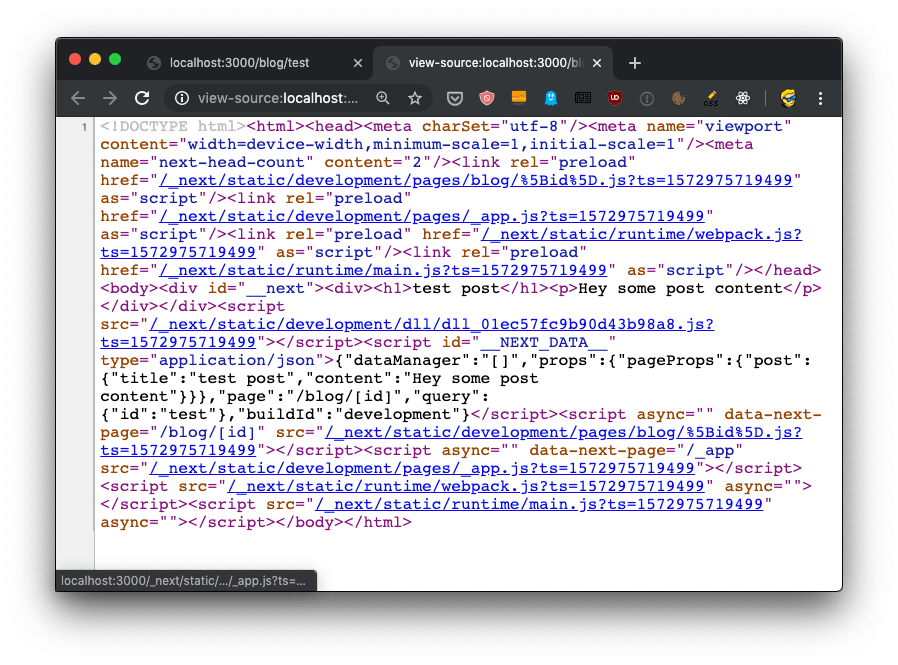

When I talked about [adding dynamic content to Next.js](/nextjs-dynamic-content/) we had an issue with dynamically generating the post page, because the component required some data up front, and when we tried to get the data from the JSON file:

```js
import { useRouter } from 'next/router'
import posts from '../../posts.json'

export default () => {
  const router = useRouter()

  const post = posts[router.query.id]

  return (
    <>
      <h1>{post.title}</h1>
      <p>{post.content}</p>
    </>
  )
}
```

we got this error:


How do we solve this? And how do we make SSR work for dynamic routes?

We must provide the component with props, using a special function called `getInitialProps()` which is attached to the component.

To do so, first we name the component:

```js
const Post = () => {
  //...
}

export default Post
```

then we add the function to it:

```js
const Post = () => {
  //...
}

Post.getInitialProps = () => {
  //...
}

export default Post
```

This function gets an object as its argument, which contains several properties. In particular, the thing we are interested into now is that we get the `query` object, the one we used previously to get the post id.

So we can get it using the _object destructuring_ syntax:

```js
Post.getInitialProps = ({ query }) => {
  //...
}
```

Now we can return the post from this function:

```js
Post.getInitialProps = ({ query }) => {
  return {
    post: posts[query.id]
  }
}
```

And we can also remove the import of `useRouter`, and we get the post from the `props` property passed to the `Post` component:

```js
import posts from '../../posts.json'

const Post = props => {
  return (
    <div>
      <h1>{props.post.title}</h1>
      <p>{props.post.content}</p>
    </div>
  )
}

Post.getInitialProps = ({ query }) => {
  return {
    post: posts[query.id]
  }
}

export default Post
```

Now there will be no error, and SSR will be working as expected, as you can see checking view source:



The `getInitialProps` function will be executed on the server side, but also on the client side, when we navigate to a new page using the `Link` component as we did.

It's important to note that `getInitialProps` gets, in the context object it receives, in addition to the `query` object these other properties:

* `pathname`: the `path` section of URL
* `asPath` - String of the actual path (including the query) shows in the browser

which in the case of calling `http://localhost:3000/blog/test` will respectively result to:

- `/blog/[id]`
- `/blog/test`

And in the case of server side rendering, it will also receive:

* `req`: the HTTP request object
* `res`: the HTTP response object
* `err`: an error object

`req` and `res` will be familiar to you if you've done any Node.js coding.