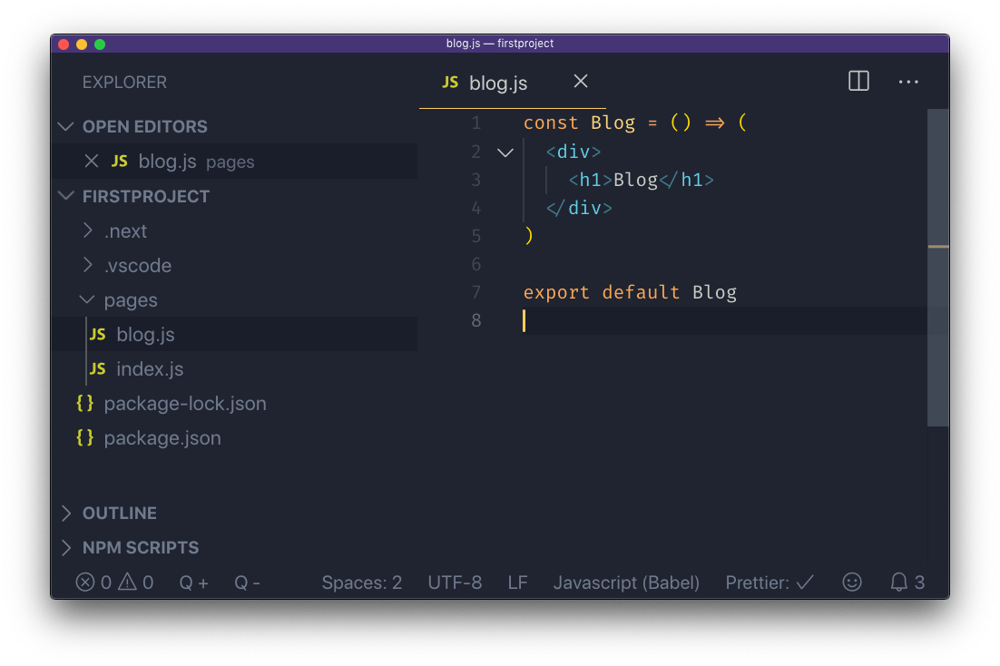
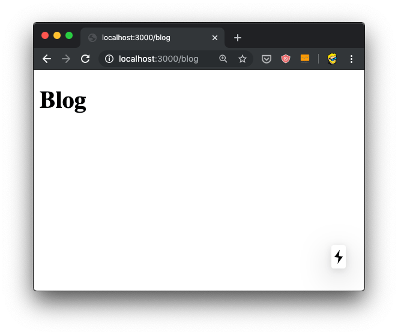
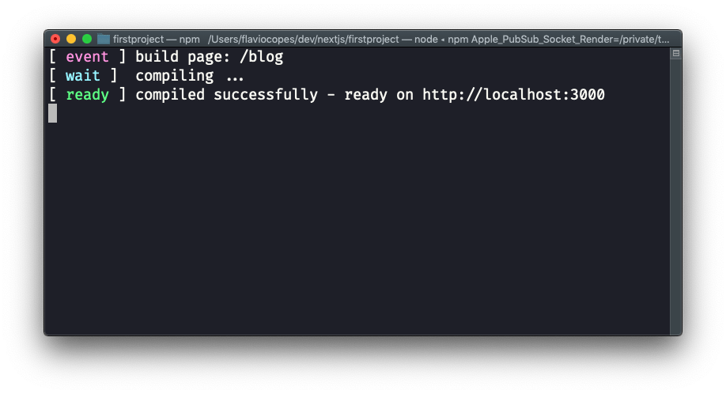
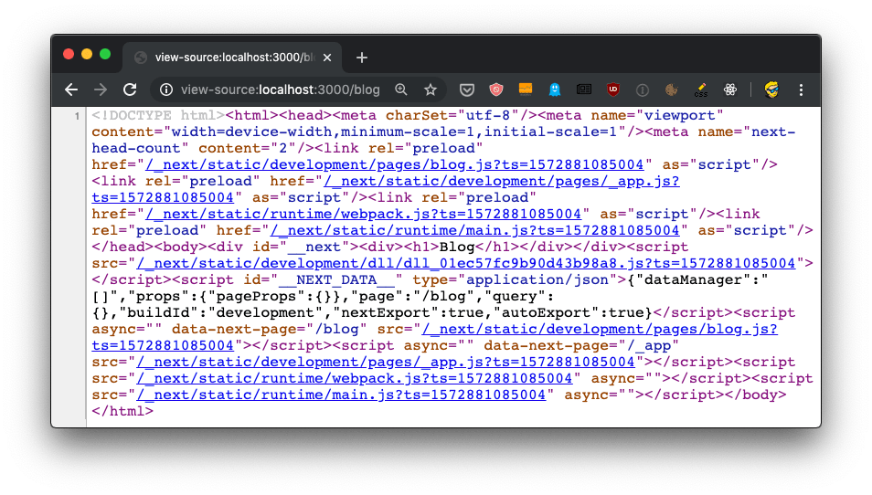
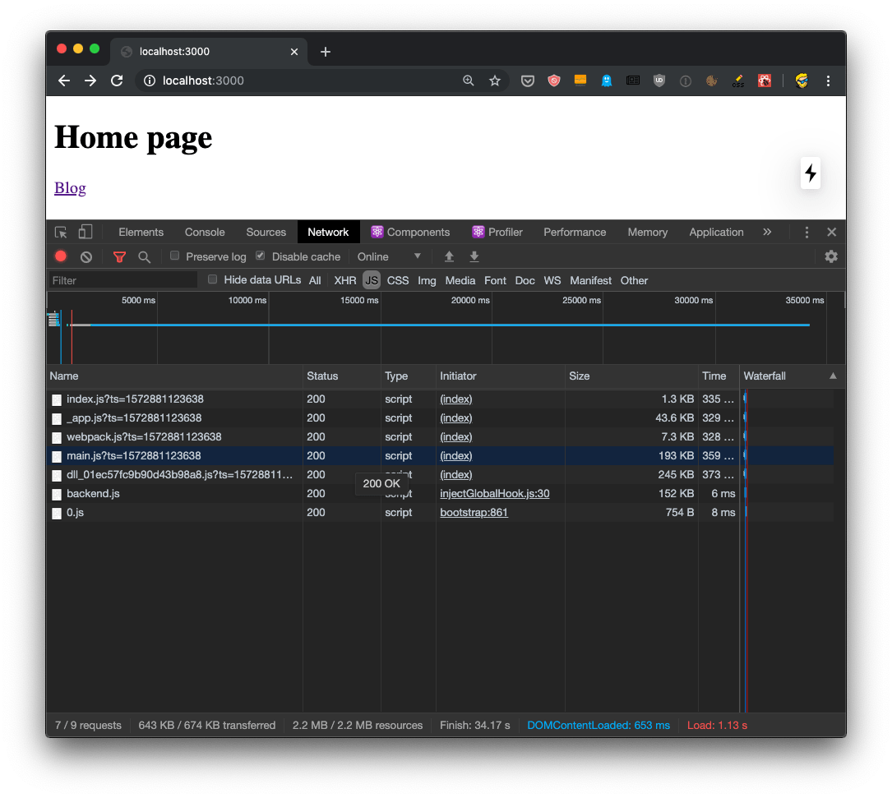
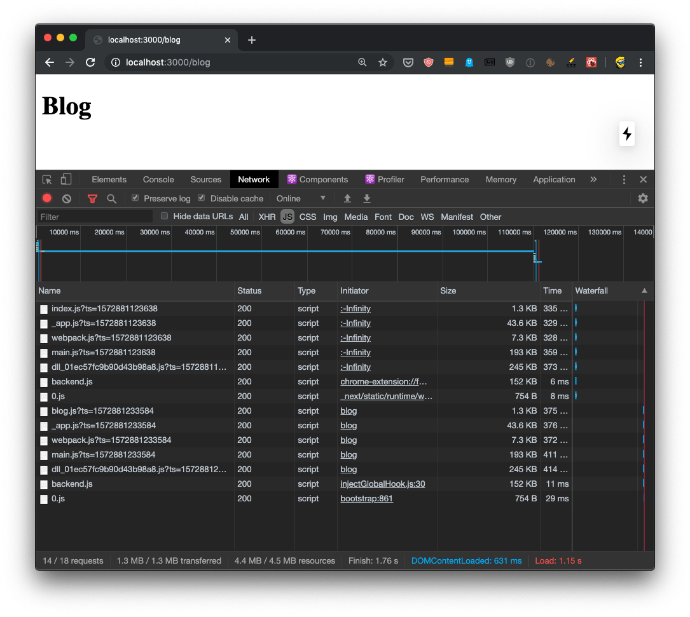
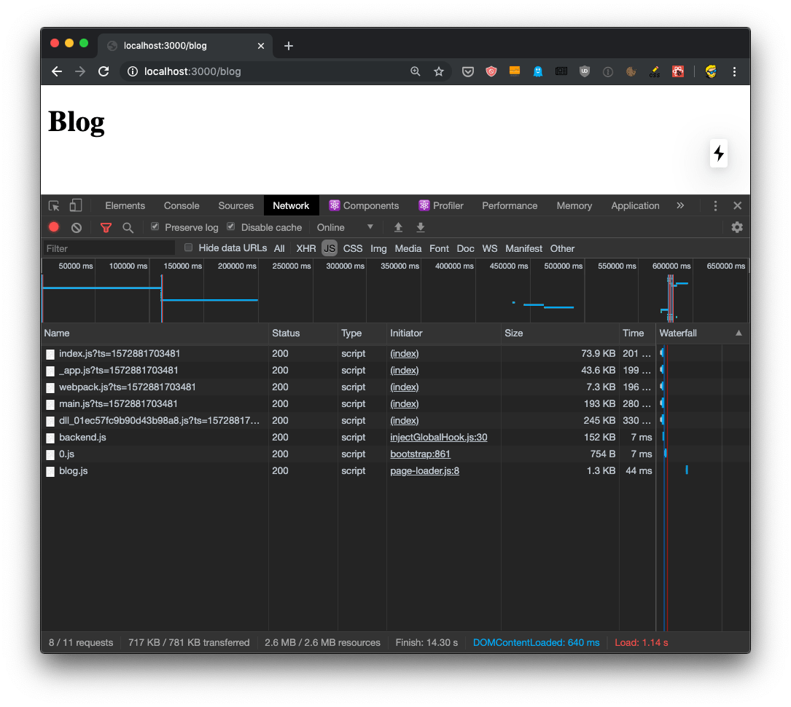

This tutorial starts where the [first Next.js tutorial](/how-to-install-nextjs/) left off. We built a site with one page:


I want to add a second page to this website, a blog posts list. It's going to be served into `/blog`, and for the time being it will just contain a simple static page, just like our first `index.js` component:



After saving the new file, the `npm run dev` process already running is already capable of rendering the page, without the need to restart it.

When we hit the URL http://localhost:3000/blog we have the new page:



and here's what the terminal told us:



Now the fact that the URL is `/blog` depends on just the filename, and its position under the `pages` folder.

You can create a `pages/hey/ho` page, and that page will show up on the URL http://localhost:3000/hey/ho.

What does not matter, for the URL purposes, is the component name inside the file.

Try going and viewing the source of the page, when loaded from the server it will list `/_next/static/development/pages/blog.js` as one of the bundles loaded, and not `/_next/static/development/pages/index.js` like in the home page. This is because thanks to automatic code splitting we don't need the bundle that serves the home page. Just the bundle that serves the blog page.



We can also just export an anonymous function from `blog.js`:

```js
export default () => (
  <div>
    <h1>Blog</h1>
  </div>
)
```

or if you prefer the non-arrow function syntax:

```js
export default function() {
  return (
    <div>
      <h1>Blog</h1>
    </div>
  )
}
```

Now that we have 2 pages, defined by `index.js` and `blog.js`, we can introduce links.

Normal HTML links within pages are done using the `a` tag:

```html
<a href="/blog">Blog</a>
```

We can't do do that in Next.js.

Why? We technically _can_, of course, because this is the Web and *on the Web things never break* (that's why we can still use the `<marquee>` tag. But one of the main benefits of using Next is that once a page is loaded, transitions to other page are very fast thanks to client-side rendering.

If you use a plain `a` link:

```js
const Index = () => (
  <div>
    <h1>Home page</h1>
    <a href='/blog'>Blog</a>
  </div>
)

export default Index
```

Now open the **DevTools**, and the **Network panel** in particular. The first time we load `http://localhost:3000/` we get all the page bundles loaded:



Now if you click the "Preserve log" button (to avoid clearing the Network panel), and click the "Blog" link, this is what happens:



We got all that JavaScript from the server, again! But.. we don't need all that JavaScript if we already got it. We'd just need the `blog.js` page bundle, the only one that's new to the page.

To fix this problem, we use a component provided by Next, called Link.

We import it:

```js
import Link from 'next/link'
```

and then we use it to wrap our link, like this:

```js
import Link from 'next/link'

const Index = () => (
  <div>
    <h1>Home page</h1>
    <Link href='/blog'>
      <a>Blog</a>
    </Link>
  </div>
)

export default Index
```

Now if you retry the thing we did previously, you'll be able to see that only the `blog.js` bundle is loaded when we move to the blog page:



and the page loaded so faster than before, the browser usual spinner on the tab didn't even appear. Yet the URL changed, as you can see. This is working seamlessly with the browser [History API](https://flaviocopes.com/history-api/).

This is client-side rendering in action.

What if you now press the back button? Nothing is being loaded, because the browser still has the old `index.js` bundle in place, ready to load the `/index` route. It's all automatic!

This is not the only way to handle linking in Next.js, but I think it's the simplest one.