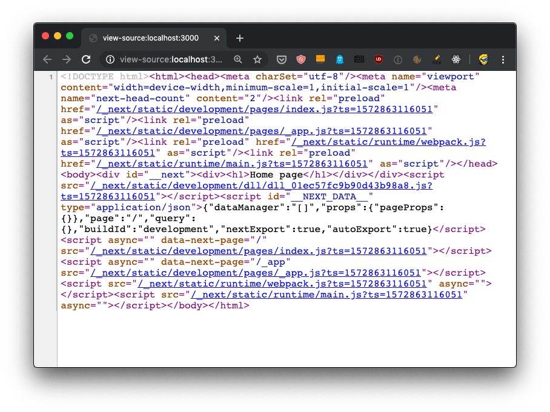

Do you have set up your new Next.js application? Great!

Let's now check the application is working as we expect it to work. It's a Next.js app, so it should be **server side rendered**.

It's one of the main selling points of Next.js: if we create a site using Next.js, the site pages are rendered on the server, which delivers HTML to the browser.

This has 3 major benefits:

- The client does not need to instantiate React to render, which makes the site faster to your users.
- Search engines will index the pages without needing to run the client-side JavaScript. Something Google started doing, but openly admitted to be a slower process (and you should help Google as much as possible, if you want to rank well.
- You can have social media meta tags, useful to add preview images, customize title and description for any of your pages shared on Facebook, Twitter and so on.

Let's view the source of the app.
Using Chrome you can right-click anywhere in the page, and press **View Page Source**.

If you view the source of the page, you'll see the `
<h1>Airbnb clone</h1>
` snippet in the HTML `body`, along with a bunch of JavaScript files - the app bundles.

We don't need to set up anything, SSR (server-side rendering) is already working for us.

The React app will be launched on the client, and will be the one powering interactions like clicking a link, using client-side rendering. But reloading a page will re-load it from the server. And using Next.js there should be no difference in the result inside the browser - a server-rendered page should look exactly like a client-rendered page.
