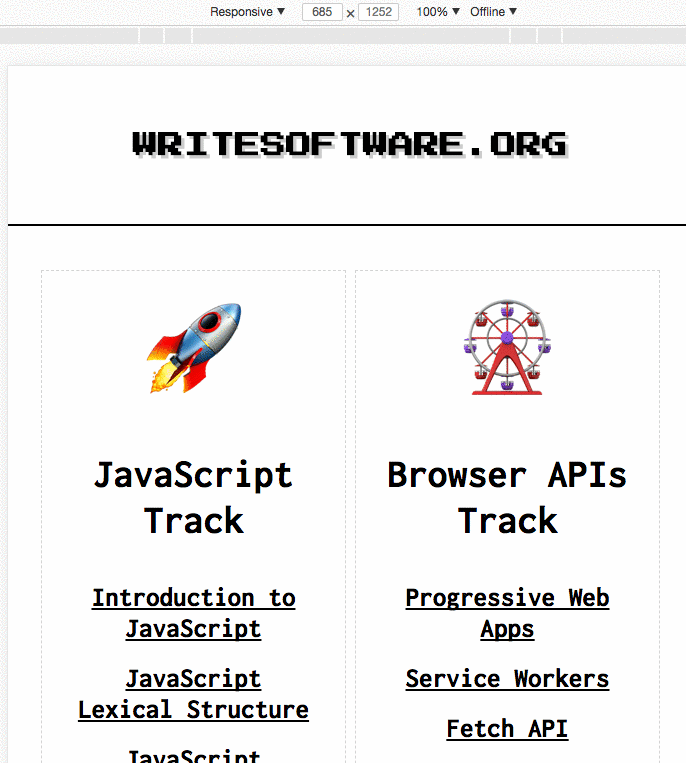
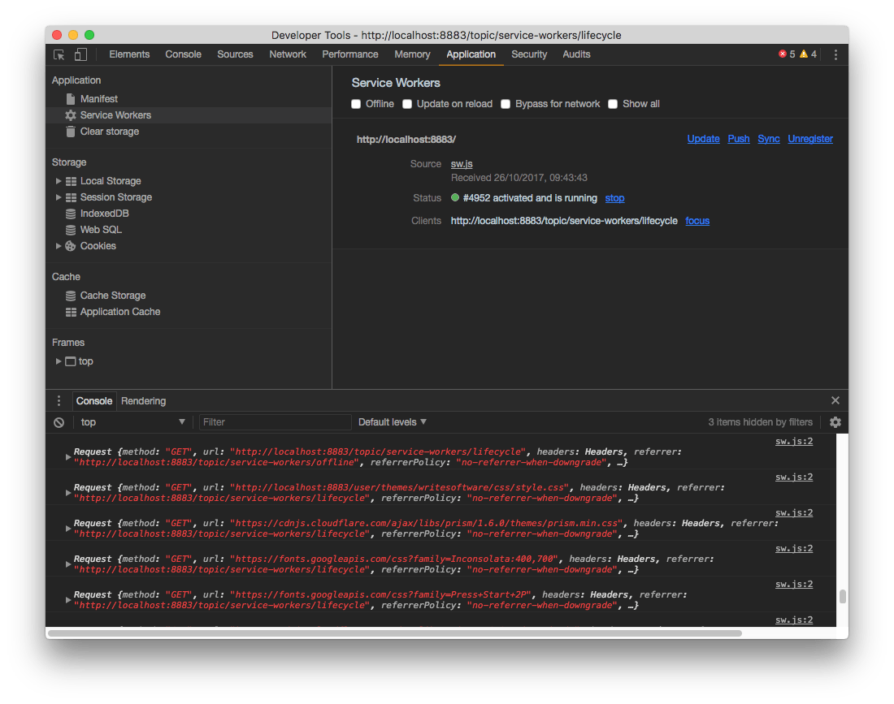
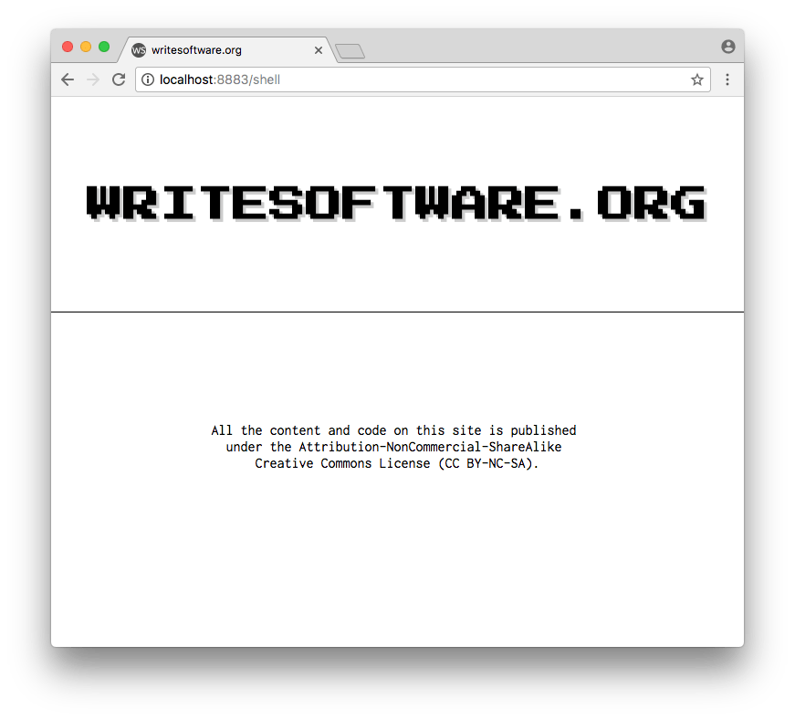
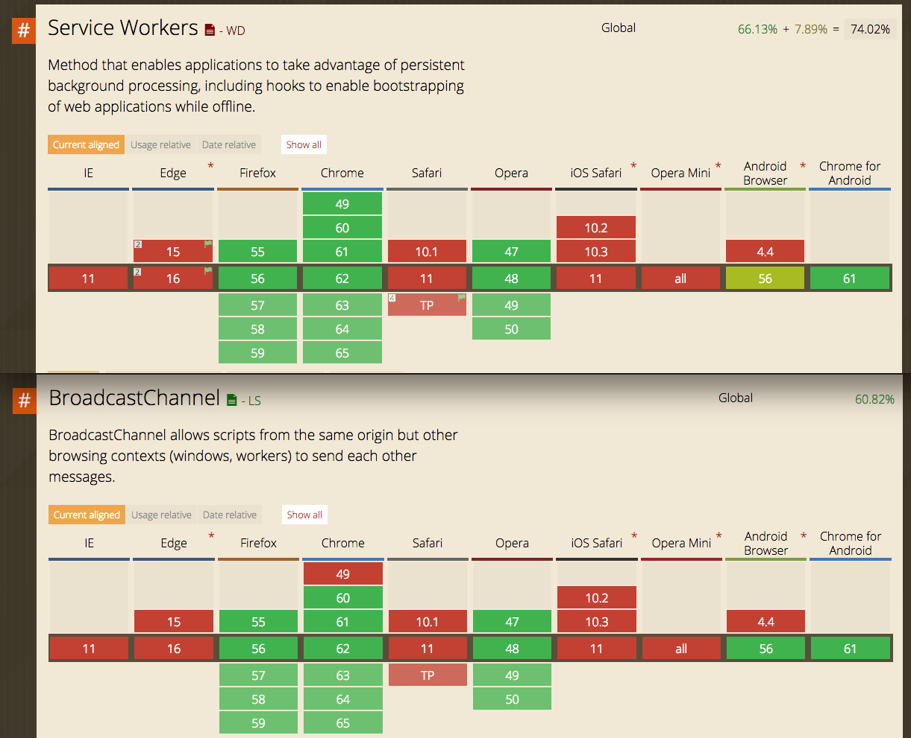

<!-- TOC -->

- [First approach: cache-first](#first-approach-cache-first)
  - [Introducing a service worker](#introducing-a-service-worker)
  - [Fix URL, title and back button with the History API](#fix-url-title-and-back-button-with-the-history-api)
  - [Fix Google Analytics](#fix-google-analytics)
- [Second approach: network-first, drop the app shell](#second-approach-network-first-drop-the-app-shell)
- [Going simpler: no partials](#going-simpler-no-partials)

<!-- /TOC -->

This case study explains how I added the capability of working offline to the [writesoftware.org](https://writesoftware.org) website, which is based on Grav, a great [PHP-based CMS for developers](https://getgrav.org), by introducing a set of technologies grouped under the name of Progressive Web Apps (in particular [Service Workers](/service-workers/) and the [Cache API](/cache-api/)).

When we're finished, we'll be able to use our site on a mobile device or on a desktop, even if offline, like shown here below (notice the "Offline" option in the network throttling settings)



## First approach: cache-first

I first approached the task by using a cache-first approach. In short, when we intercept a [fetch](/fetch-api/) request in the Service Worker, we first check if we have it cached already. If not, we fetch it from the network.
This has the advantage of making the site blazing fast when loading pages already cached, even when online - in particular with slow networks and [lie-fi](https://developers.google.com/web/fundamentals/performance/poor-connectivity/#what_is_lie-fi) - but also introduces some complexity in managing updating the cache when I ship new content.

This will not be the final solution I adopt, but it's worth going through it for demonstration purposes.

I'll go through a couple phases:

1. I introduce a service worker and load it as part of the website JS scripts
2. when installing the service worker, I cache the site **skeleton**
3. I intercept requests going to additional links, caching it

### Introducing a service worker

I add the service worker in a `sw.js` file in the site root. This allows it to work on all the site subfolders, and on the site home as well. The SW at the moment is pretty basic, it just logs any network request:

```js
self.addEventListener('fetch', (event) => {
  console.log(event.request)
})
```

I need to register the service worker, and I do this from a script that I include in every page:

```js
window.addEventListener('load', () => {
  if (!navigator.serviceWorker) {
    return
  }

  navigator.serviceWorker.register('/sw.js', {
    scope: '/'
  }).then(() => {
    //...ok
  }).catch((err) => {
    console.log('registration failed', err)
  })
})
```

If service workers are available, we register the `sw.js` file and the next time I refresh the page it should be working fine:



At this point I need to do some heavy lifting on the site. First of all, I need to come up with a way to serve only the **App Shell**: a basic set of HTML + CSS and JS that will be always available and shown to the users, even when offline.

It's basically a stripped down version of the website, with a `<div class="wrapper row" id="content-wrapper"></div>` empty element, which we'll fill with content later, available under the `/shell` route:



So the first time the user loads the site, the normal version will be shown (full-HTML version), and the service worker is installed.

Now any other page that is clicked is intercepted by our Service Worker. Whenever a page is loaded, we load the shell first, and then we load a stripped-down version of the page, without the shell: just the content.

How?

We listen for the `install` event, which fires when the Service Worker is installed or updated, and when this happens we initialize the cache with the content of our shell: the basic HTML layout, plus some CSS, JS and some external assets:

```js
const cacheName = 'writesoftware-v1'

self.addEventListener('install', (event) => {
  event.waitUntil(caches.open(cacheName).then(cache => cache.addAll([
    '/shell',
    'user/themes/writesoftware/favicon.ico',
    'user/themes/writesoftware/css/style.css',
    'user/themes/writesoftware/js/script.js',
    'https://fonts.googleapis.com/css?family=Press+Start+2P',
    'https://fonts.googleapis.com/css?family=Inconsolata:400,700',
    'https://cdnjs.cloudflare.com/ajax/libs/prism/1.6.0/themes/prism.min.css',
    'https://cdnjs.cloudflare.com/ajax/libs/prism/1.6.0/prism.min.js',
    'https://cdn.jsdelivr.net/prism/1.6.0/components/prism-jsx.min.js'
  ])))
})
```

Then when we perform a fetch, we intercept requests to our pages, and fetch the shell from the Cache instead of going to the network.

If the URL belongs to Google Analytics or ConvertKit I avoid using the local cache, and I fetch them without using [CORS](/cors/), since they deny accessing them through this method.

Then, if I'm requesting a local partial (just the content of a page, not the full page) I just issue a fetch request to get it.

If it's not a partial, we return the shell, which is already cached when the Service Worker is first installed.

Once the fetch is done, I cache it.

```js
self.addEventListener('fetch', (event) => {
  const requestUrl = new URL(event.request.url)

  if (requestUrl.href.startsWith('https://www.googletagmanager.com') ||
      requestUrl.href.startsWith('https://www.google-analytics.com') ||
      requestUrl.href.startsWith('https://assets.convertkit.com')) {
    // don't cache, and no cors
    event.respondWith(fetch(event.request.url, { mode: 'no-cors' }))
    return
  }

  event.respondWith(caches.match(event.request)
    .then((response) => {
      if (response) { return response }
      if (requestUrl.origin === location.origin) {
        if (requestUrl.pathname.endsWith('?partial=true')) {
          return fetch(requestUrl.pathname)
        } else {
          return caches.match('/shell')
        }

        return fetch(`${event.request.url}?partial=true`)
      }
      return fetch(event.request.url)
    })
    .then(response => caches.open(cacheName).then((cache) => {
      cache.put(event.request.url, response.clone())
      return response
    }))
    .catch((error) => {
      console.error(error)
    }))
})
```

Now, I edit the `script.js` file to introduce an important feature: whenever a link is clicked on my pages, I intercept it and I issue a message to a Broadcast Channel.

Since Service Workers are currently only supported in Chrome, Firefox and Opera, I can safely rely on the [BroadcastChannel API](https://developers.google.com/web/updates/2016/09/broadcastchannel) for this.



First, I connect to the `ws_navigation` channel and I attach a `onmessage` event handler on it. Whenever I receive an event, it's a communication from the Service Worker with new content to show inside the App Shell, so I just lookup the element with id `content-wrapper` and I put the partial page content into it, effectively changing the page the user is seeing.

As soon as the Service Worker is registered I issue a message to this channel, with a `fetchPartial` task and a partial page URL to fetch. This is the content of the initial page load.

The shell is loaded immediately, since it's always cached and soon after, the actual content is looked up, which might be cached as well.

```js
window.addEventListener('load', () => {
  if (!navigator.serviceWorker) { return }
  const channel = new BroadcastChannel('ws_navigation')

  channel.onmessage = (event) => {
    if (document.getElementById('content-wrapper')) {
      document.getElementById('content-wrapper').innerHTML = event.data.content
    }
  }

  navigator.serviceWorker.register('/sw.js', {
    scope: '/'
  }).then(() => {
    channel.postMessage({
      task: 'fetchPartial',
      url: `${window.location.pathname}?partial=true`
    })
  }).catch((err) => {
    console.log('SW registration failed', err)
  })
})
```

The missing bit is handing a click on the page. When a link is clicked, I intercept the event, halt it and I send a message to the Service Worker to fetch the partial with that URL.

When fetching a partial, I attach a `?partial=true` query to tell my backend to only serve the content, not the shell.

```js
window.addEventListener('load', () => {

  //...

  window.onclick = (e) => {
    let node = e.target
    while (node !== undefined && node !== null && node.localName !== 'a') {
      node = node.parentNode
    }
    if (node !== undefined && node !== null) {
      channel.postMessage({
        task: 'fetchPartial',
        url: `${node.href}?partial=true`
      })
      return false
    }
    return true
  }
})
```

Now we just miss to handle this event. On the Service Worker side, I connect to the `ws_navigation` channel and listen for an event. I listen for the `fetchPartial` message task name, although I could avoid this condition check as this is the only event that's being sent here (messages in the Broadcast Channel API are not dispatched to the same page that's originating them - only between a page and a web worker).

I check if the url is cached. If so, I just send it as a response message on the channel, and return.

If it's not cached, I fetch it, send it back as a message to the page, and then cache it for the next time it might be visited.

```js
const channel = new BroadcastChannel('ws_navigation')
channel.onmessage = (event) => {
  if (event.data.task === 'fetchPartial') {
    caches
      .match(event.data.url)
      .then((response) => {
        if (response) {
          response.text().then((body) => {
            channel.postMessage({ url: event.data.url, content: body })
          })
          return
        }

        fetch(event.data.url).then((fetchResponse) => {
          const fetchResponseClone = fetchResponse.clone()
          fetchResponse.text().then((body) => {
            channel.postMessage({ url: event.data.url, content: body })
          })

          caches.open(cacheName).then((cache) => {
            cache.put(event.data.url, fetchResponseClone)
          })
        })
      })
      .catch((error) => {
        console.error(error)
      })
  }
}
```

We're almost done.

Now the Service Worker is installed on the site as soon as a user visits, and subsequent page loads are handled dynamically through the [Fetch API](/fetch-api), not requiring a full page load. After the first visit, pages are cached and load incredibly fast, and - more importantly - then even load when offline!

And - all this is a progressive enhancement. Older browsers, and browsers that don't support service workers, work as normal.

Now, hijacking the browser navigation poses us a few problems:

1. the URL must change when a new page is shown. The back button should work normally, and the browser history as well
2. the page title must change to reflect the new page title
3. we need to notify the Google Analytics API that a new page has been loaded, to avoid missing an important metric such as the page views per visitor.
4. the code snippets are not highlighted any more when loading new content dynamically

Let's solve those challenges.

### Fix URL, title and back button with the History API

In the message handler in script.js in addition to injecting the HTML of the partial, we trigger the `history.pushState()` method of the [History API](/history-api/):

```js
channel.onmessage = (event) => {
  if (document.getElementById('content-wrapper')) {
    document.getElementById('content-wrapper').innerHTML = event.data.content
    const url = event.data.url.replace('?partial=true', '')
    history.pushState(null, null, url)
  }
}
```

This is working but the page title does not change in the browser UI. We need to fetch it somehow from the page. I decided to put in the page content partial a hidden span that keeps the page title, so we can fetch it from the page using the [DOM](/dom/) API, and set the `document.title` property:

```js
channel.onmessage = (event) => {
  if (document.getElementById('content-wrapper')) {
    document.getElementById('content-wrapper').innerHTML = event.data.content
    const url = event.data.url.replace('?partial=true', '')
    if (document.getElementById('browser-page-title')) {
      document.title = document.getElementById('browser-page-title').innerHTML
    }
    history.pushState(null, null, url)
  }
}
```


### Fix Google Analytics

Google Analytics works fine out of the box, but when loading a page dynamically, it can't do miracles. We must use the API it provides to inform it of a new page load. Since I'm using the Global Site Tag (`gtag.js`) tracking, I need to call:

```js
gtag('config', 'UA-XXXXXX-XX', {'page_path': '/the-url'})
```

into the code above that handles changing page:

```js
channel.onmessage = (event) => {
  if (document.getElementById('content-wrapper')) {
    document.getElementById('content-wrapper').innerHTML = event.data.content
    const url = event.data.url.replace('?partial=true', '')
    if (document.getElementById('browser-page-title')) {
      document.title = document.getElementById('browser-page-title').innerHTML
    }
    history.pushState(null, null, url)
    gtag('config', 'UA-XXXXXX-XX', {'page_path': url})
  }
}
```

The last thing I need to fix on my page is the code snippets login their highlighing. I use the Prism syntax highlighter and they make it very easy, I just need to add a call `Prism.highlightAll()` in my onmessage handler:

```js
channel.onmessage = (event) => {
  if (document.getElementById('content-wrapper')) {
    document.getElementById('content-wrapper').innerHTML = event.data.content
    const url = event.data.url.replace('?partial=true', '')
    if (document.getElementById('browser-page-title')) {
      document.title = document.getElementById('browser-page-title').innerHTML
    }
    history.pushState(null, null, url)
    gtag('config', 'UA-XXXXXX-XX', {'page_path': url})
    Prism.highlightAll()
  }
}
```

The full code of `script.js` is:

```js
window.addEventListener('load', () => {
  if (!navigator.serviceWorker) { return }
  const channel = new BroadcastChannel('ws_navigation')

  channel.onmessage = (event) => {
    if (document.getElementById('content-wrapper')) {
      document.getElementById('content-wrapper').innerHTML = event.data.content
      const url = event.data.url.replace('?partial=true', '')
      if (document.getElementById('browser-page-title')) {
        document.title = document.getElementById('browser-page-title').innerHTML
      }
      history.pushState(null, null, url)
      gtag('config', 'UA-1739509-49', {'page_path': url})
      Prism.highlightAll()
    }
  }

  navigator.serviceWorker.register('/sw.js', {
    scope: '/'
  }).then(() => {
    channel.postMessage({
      task: 'fetchPartial',
      url: `${window.location.pathname}?partial=true`
    })
  }).catch((err) => {
    console.log('SW registration failed', err)
  })

  window.onclick = (e) => {
    let node = e.target
    while (node !== undefined && node !== null && node.localName !== 'a') {
      node = node.parentNode
    }
    if (node !== undefined && node !== null) {
      channel.postMessage({
        task: 'fetchPartial',
        url: `${node.href}?partial=true`
      })
      return false
    }
    return true
  }
})

```

and `sw.js`:

```js
const cacheName = 'writesoftware-v1'

self.addEventListener('install', (event) => {
  event.waitUntil(caches.open(cacheName).then(cache => cache.addAll([
    '/shell',
    'user/themes/writesoftware/favicon.ico',
    'user/themes/writesoftware/css/style.css',
    'user/themes/writesoftware/js/script.js',
    'user/themes/writesoftware/img/offline.gif',
    'https://fonts.googleapis.com/css?family=Press+Start+2P',
    'https://fonts.googleapis.com/css?family=Inconsolata:400,700',
    'https://cdnjs.cloudflare.com/ajax/libs/prism/1.6.0/themes/prism.min.css',
    'https://cdnjs.cloudflare.com/ajax/libs/prism/1.6.0/prism.min.js',
    'https://cdn.jsdelivr.net/prism/1.6.0/components/prism-jsx.min.js'
  ])))
})

self.addEventListener('fetch', (event) => {
  const requestUrl = new URL(event.request.url)

  if (requestUrl.href.startsWith('https://www.googletagmanager.com') ||
      requestUrl.href.startsWith('https://www.google-analytics.com') ||
      requestUrl.href.startsWith('https://assets.convertkit.com')) {
    // don't cache, and no cors
    event.respondWith(fetch(event.request.url, { mode: 'no-cors' }))
    return
  }

  event.respondWith(caches.match(event.request)
    .then((response) => {
      if (response) { return response }
      if (requestUrl.origin === location.origin) {
        if (requestUrl.pathname.endsWith('?partial=true')) {
          return fetch(requestUrl.pathname)
        } else {
          return caches.match('/shell')
        }

        return fetch(`${event.request.url}?partial=true`)
      }
      return fetch(event.request.url)
    })
    .then(response => caches.open(cacheName).then((cache) => {
      if (response) {
        cache.put(event.request.url, response.clone())
      }
      return response
    }))
    .catch((error) => {
      console.error(error)
    }))
})

const channel = new BroadcastChannel('ws_navigation')
channel.onmessage = (event) => {
  if (event.data.task === 'fetchPartial') {
    caches
      .match(event.data.url)
      .then((response) => {
        if (response) {
          response.text().then((body) => {
            channel.postMessage({ url: event.data.url, content: body })
          })
          return
        }

        fetch(event.data.url).then((fetchResponse) => {
          const fetchResponseClone = fetchResponse.clone()
          fetchResponse.text().then((body) => {
            channel.postMessage({ url: event.data.url, content: body })
          })

          caches.open(cacheName).then((cache) => {
            cache.put(event.data.url, fetchResponseClone)
          })
        })
      })
      .catch((error) => {
        console.error(error)
      })
  }
}

```

## Second approach: network-first, drop the app shell

While the first approach gave us a fully working app, I was a bit skeptical and worried about having a copy of a page cached for too long on the client, so I decided for a network-first approach: when a user loads a page it is fetched from the network first.
If the network call fails for some reason, I lookup the page in the cache to see if we got it cached, otherwise I show the user a GIF if it's totally offline, or another GIF if the page does not exist (I can reach it but I got a 404 error).

As soon as we get a page we cache it (not checking if we cached it previously or not, we just store the latest version).

As an experiment I also got rid of the app shell altogether, because in my case I had no intentions of creating an installable app yet, as without an up-to-date Android device I could not really test-drive it and I preferred to avoid throwing out stuff without proper testing.

To do this I just stripped the app shell from the `install` Service Worker event and I relied on Service Workers and the Cache API to just deliver the plain pages of the site, without managing partial updates. I also dropped the `/shell` fetch hijacking when loading a full page, so on the first page load there is no delay, but we still load partials when navigating to other pages later.

I still use `script.js` and `sw.js` to host the code, with `script.js` being the file that initializes the Service Worker, and also intercepts click on the client-side.

Here's `script.js`:

```js
const OFFLINE_GIF = '/user/themes/writesoftware/img/offline.gif'

const fetchPartial = (url) => {
  fetch(`${url}?partial=true`)
  .then((response) => {
    response.text().then((body) => {
      if (document.getElementById('content-wrapper')) {
        document.getElementById('content-wrapper').innerHTML = body
        if (document.getElementById('browser-page-title')) {
          document.title = document.getElementById('browser-page-title').innerHTML
        }
        history.pushState(null, null, url)
        gtag('config', 'UA-XXXXXX-XX', { page_path: url })
        Prism.highlightAll()
      }
    })
  })
  .catch(() => {
    if (document.getElementById('content-wrapper')) {
    document.getElementById('content-wrapper').innerHTML = `<center><h2>Offline</h2></center>`
    }
  })
}

window.addEventListener('load', () => {
  if (!navigator.serviceWorker) { return }

  navigator.serviceWorker.register('/sw.js', {
    scope: '/'
  }).then(() => {
    fetchPartial(window.location.pathname)
  }).catch((err) => {
    console.log('SW registration failed', err)
  })

  window.onclick = (e) => {
    let node = e.target
    while (node !== undefined && node !== null && node.localName !== 'a') {
      node = node.parentNode
    }
    if (node !== undefined && node !== null) {
      fetchPartial(node.href)
      return false
    }
    return true
  }
})
```

and here's `sw.js`:

```js
const CACHE_NAME = 'writesoftware-v1'
const OFFLINE_GIF = '/user/themes/writesoftware/img/offline.gif'
const PAGENOTFOUND_GIF = '/user/themes/writesoftware/img/pagenotfound.gif'

self.addEventListener('install', (event) => {
  event.waitUntil(caches.open(CACHE_NAME).then(cache => cache.addAll([
    '/user/themes/writesoftware/favicon.ico',
    '/user/themes/writesoftware/css/style.css',
    '/user/themes/writesoftware/js/script.js',
    '/user/themes/writesoftware/img/offline.gif',
    '/user/themes/writesoftware/img/pagenotfound.gif',
    'https://fonts.googleapis.com/css?family=Press+Start+2P',
    'https://fonts.googleapis.com/css?family=Inconsolata:400,700',
    'https://cdnjs.cloudflare.com/ajax/libs/prism/1.6.0/themes/prism.min.css',
    'https://cdnjs.cloudflare.com/ajax/libs/prism/1.6.0/prism.min.js',
    'https://cdn.jsdelivr.net/prism/1.6.0/components/prism-jsx.min.js'
  ])))
})

self.addEventListener('fetch', (event) => {
  if (event.request.method !== 'GET') return
  if (event.request.headers.get('accept').indexOf('text/html') === -1) return

  const requestUrl = new URL(event.request.url)
  let options = {}

  if (requestUrl.href.startsWith('https://www.googletagmanager.com') ||
      requestUrl.href.startsWith('https://www.google-analytics.com') ||
      requestUrl.href.startsWith('https://assets.convertkit.com')) {
    // no cors
    options = { mode: 'no-cors' }
  }

  event.respondWith(fetch(event.request, options)
    .then((response) => {
      if (response.status === 404) {
        return fetch(PAGENOTFOUND_GIF)
      }
      const resClone = response.clone()
      return caches.open(CACHE_NAME).then((cache) => {
        cache.put(event.request.url, response)
        return resClone
      })
    })
    .catch(() => caches.open(CACHE_NAME).then(cache => cache.match(event.request.url)
      .then((response) => {
        if (response) {
          return response
        }
        return fetch(OFFLINE_GIF)
      })
      .catch(() => fetch(OFFLINE_GIF)))))
})
```

## Going simpler: no partials

As an experiment I dropped the click interceptor that fetches partials, and I relied on Service Workers and the Cache API to just deliver the plain pages of the site, without managing partial updates:

`script.js`:

```js
window.addEventListener('load', () => {
  if (!navigator.serviceWorker) { return }
  navigator.serviceWorker.register('/sw.js', {
    scope: '/'
  }).catch((err) => {
    console.log('SW registration failed', err)
  })
})
```

`sw.js`:

```js
const CACHE_NAME = 'writesoftware-v1'
const OFFLINE_GIF = '/user/themes/writesoftware/img/offline.gif'
const PAGENOTFOUND_GIF = '/user/themes/writesoftware/img/pagenotfound.gif'

self.addEventListener('install', (event) => {
  event.waitUntil(caches.open(CACHE_NAME).then(cache => cache.addAll([
    '/user/themes/writesoftware/favicon.ico',
    '/user/themes/writesoftware/css/style.css',
    '/user/themes/writesoftware/js/script.js',
    '/user/themes/writesoftware/img/offline.gif',
    '/user/themes/writesoftware/img/pagenotfound.gif',
    'https://fonts.googleapis.com/css?family=Press+Start+2P',
    'https://fonts.googleapis.com/css?family=Inconsolata:400,700',
    'https://cdnjs.cloudflare.com/ajax/libs/prism/1.6.0/themes/prism.min.css',
    'https://cdnjs.cloudflare.com/ajax/libs/prism/1.6.0/prism.min.js',
    'https://cdn.jsdelivr.net/prism/1.6.0/components/prism-jsx.min.js'
  ])))
})

self.addEventListener('fetch', (event) => {
  if (event.request.method !== 'GET') return
  if (event.request.headers.get('accept').indexOf('text/html') === -1) return

  const requestUrl = new URL(event.request.url)
  let options = {}

  if (requestUrl.href.startsWith('https://www.googletagmanager.com') ||
      requestUrl.href.startsWith('https://www.google-analytics.com') ||
      requestUrl.href.startsWith('https://assets.convertkit.com')) {
    // no cors
    options = { mode: 'no-cors' }
  }

  event.respondWith(fetch(event.request, options)
    .then((response) => {
      if (response.status === 404) {
        return fetch(PAGENOTFOUND_GIF)
      }
      const resClone = response.clone()
      return caches.open(CACHE_NAME).then((cache) => {
        cache.put(event.request.url, response)
        return resClone
      })
    })
    .catch(() => caches.open(CACHE_NAME).then(cache => cache.match(event.request.url)
      .then((response) => {
        return response || fetch(OFFLINE_GIF)
      })
      .catch(() => fetch(OFFLINE_GIF)))))
})
```

I think this is the bare bones example of adding offline capabilities to a website, still keeping things simple. Any kind of website can add such Service Worker without too much complexity.

In the end for me this approach was not enough to be viable, and I ended up implementing the version with fetch partial updates.