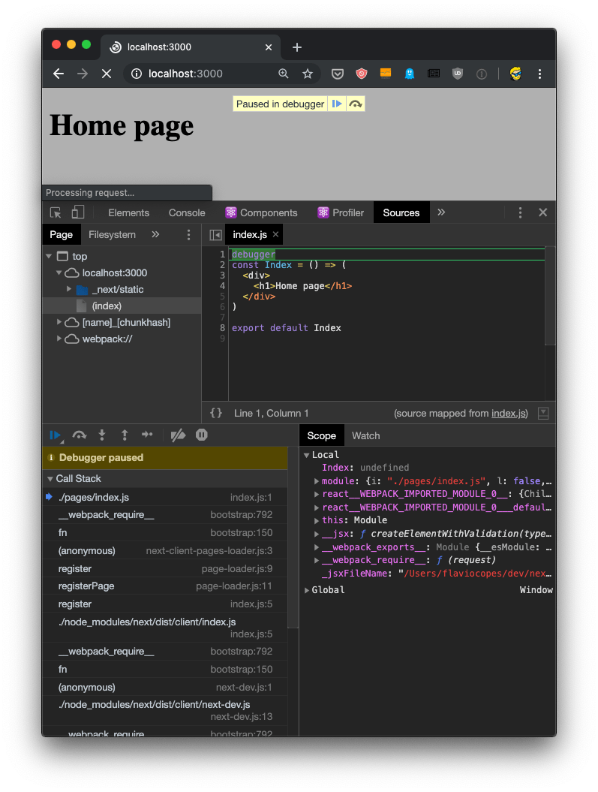

The best tool you can use to debug a React application is to make use of the **React Developer Tools**. It's a browser extensions that makes inspecting and analyzing React apps a breeze.

I wrote a blog post entirely dedicated to them, check it out: [React Developer Tools](/react-developer-tools/).

In addition to the React Developer Tools, which are essential to building a Next.js application, I want to emphasize 2 ways to debug Next.js apps.

The first is obviously `console.log()` and all the [other Console API](/console-api/) tools. The way Next apps work will make a log statement work in the browser console OR in the terminal where you started Next using `npm run dev`.

In particular, if the page loads from the server, when you point the URL to it, or you hit the refresh button (cmd/ctrl-R), any console logging happens in the terminal.

Subsequent page transitions that happen by clicking the mouse will make all console logging happen inside the browser.

Just remember if you are surprised by missing logging.

Another tool that is essential is the `debugger` statement. Adding this statement to a component will pause the browser rendering the page:

My best advice to learn how to use those tools is contained in my [definitive guide to debugging JavaScript](/javascript-debugging/).

Really awesome because now you can use the browser debugger to inspect values and run your app one line at a time.

If you are using Next.js, you can also use the VS Code debugger to debug server-side code. I mention this technique and [this tutorial](https://github.com/Microsoft/vscode-recipes/tree/master/Next-js) to set this up.