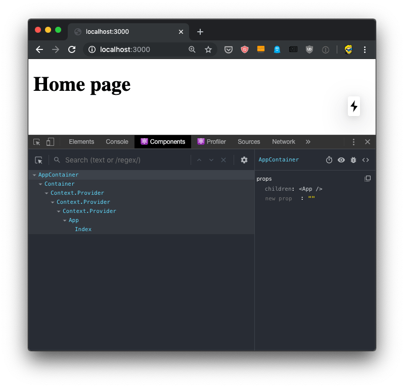
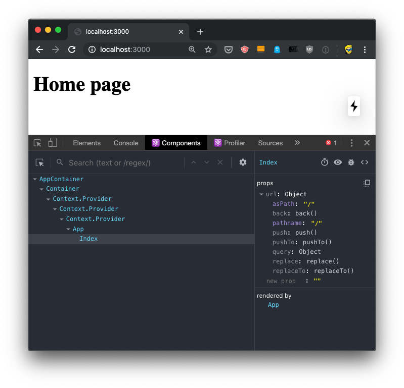
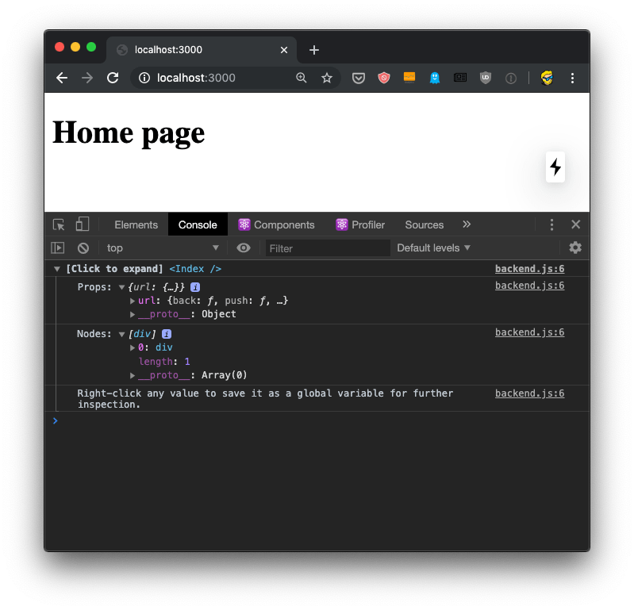
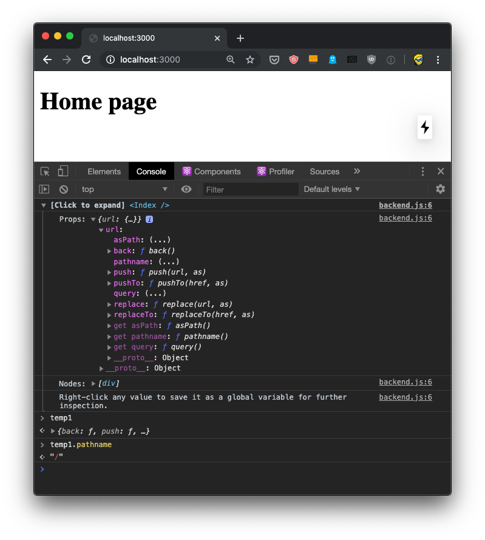
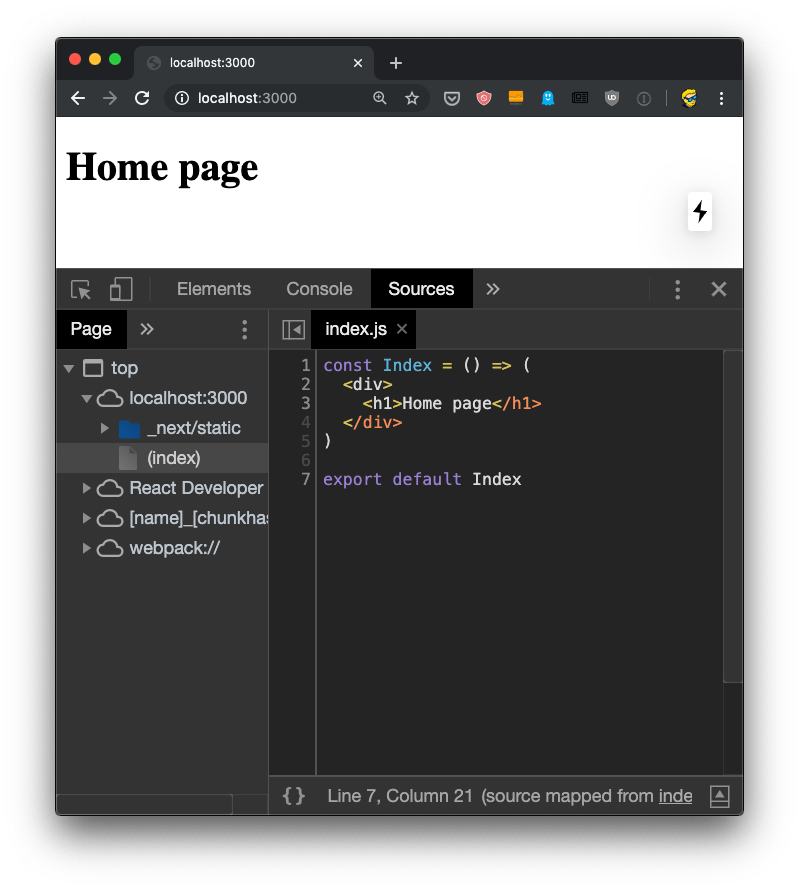
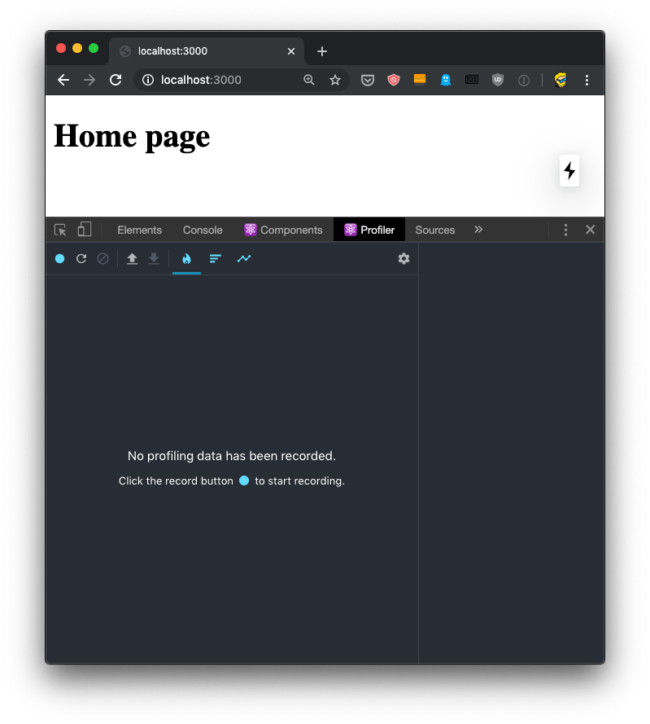
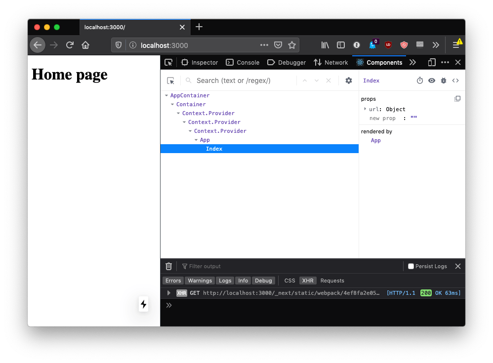

One very useful tool we absolutely need to install when building a React application, like a Next.js application for example, is the React Developer Tools.

Available for both [Chrome](https://chrome.google.com/webstore/detail/react-developer-tools/fmkadmapgofadopljbjfkapdkoienihi?hl=en) and [Firefox](https://addons.mozilla.org/en-US/firefox/addon/react-devtools/), the React Developer Tools are an essential instrument you can use to inspect a React application.

They provide an inspector that reveals the React components tree that builds your page, and for each component you can go and check the props, the state, hooks, and lots more.

Once you have installed the React Developer Tools, you can open the regular browser devtools (in Chrome, it's right-click in the page, then click `Inspect`) and you'll find 2 new panels: **Components** and **Profiler**.

If you move the mouse over the components, you'll see that in the page, the browser will select the parts that are rendered by that component.

If you select any component in the tree, the right panel will show you a reference to **the parent component**, and the props passed to it:

You can easily navigate by clicking around the component names.

You can click the eye icon in the Developer Tools toolbar   to inspect the DOM element, and also if you use the first icon, the one with the mouse icon (which conveniently sits under the similar regular DevTools icon), you can hover an element in the browser UI to directly select the React component that renders it.

You can use the `bug` icon to log a component data to the console.

This is pretty awesome because once you have the data printed there, you can right-click any element and press "Store as a global variable". For example here I did it with the `url` prop, and I was able to inspect it in the console using the temporary variable assigned to it, `temp1`:

Using **Source Maps**, which are loaded by Next.js automatically in development mode, from the Components panel we can click the `<>` code and the DevTools will switch to the Source panel, showing us the component source code:

The **Profiler** tab is even more awesome, if possible. It allows us to **record an interaction** in the app, and see what happens. I cannot show an example yet, because it needs at least 2 components to create an interaction, and we have just one now. I'll talk about this later.

I showed all screenshots using Chrome, but the React Developer Tools works in the same way in Firefox:

