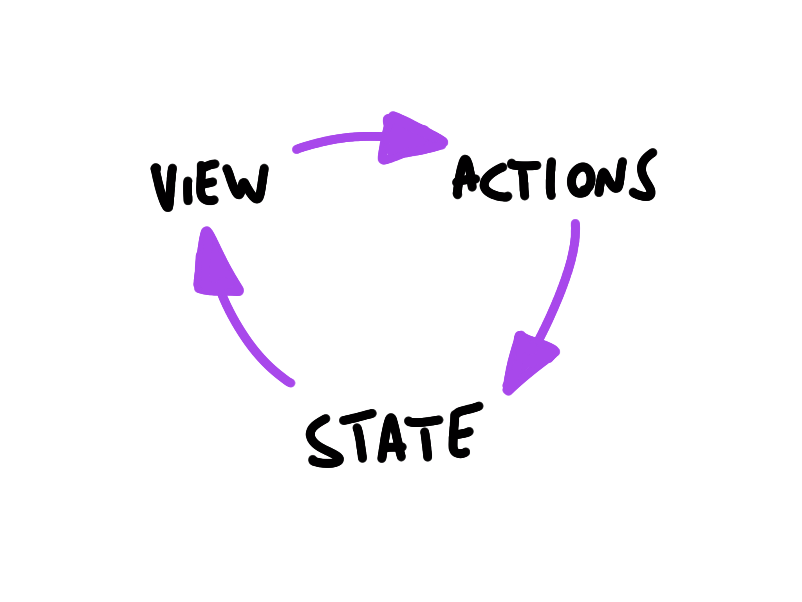

Unidirectional Data Flow is not a concept unique to React, but as a JavaScript developer this might be the first time you hear it.

In general this concept means that data has one, and only one, way to be transferred to other parts of the application.

In React this means that:

- state is passed to the view and to child components
- actions are triggered by the view
- actions can update the state
- the state change is passed to the view and to child components

The view is a result of the application state. State can only change when actions happen. When actions happen, the state is updated.

Thanks to one-way bindings, data cannot flow in the opposite way (as would happen with two-way bindings, for example), and this has some key advantages:

- it's less error prone, as you have more control over your data
- it's easier to debug, as you know _what_ is coming from _where_
- it's more efficient, as the library already knows what the boundaries are of each part of the system

A state is always owned by one Component. Any data that's affected by this state can only affect Components below it: its children.

Changing state on a Component will never affect its parent, or its siblings, or any other Component in the application: just its children.

This is the reason that the state is often moved up in the Component tree, so that it can be shared between components that need to access it.
