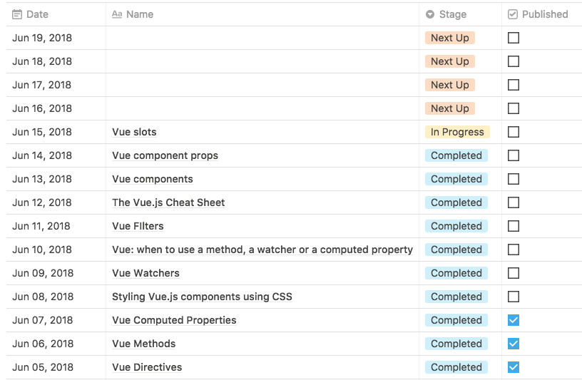
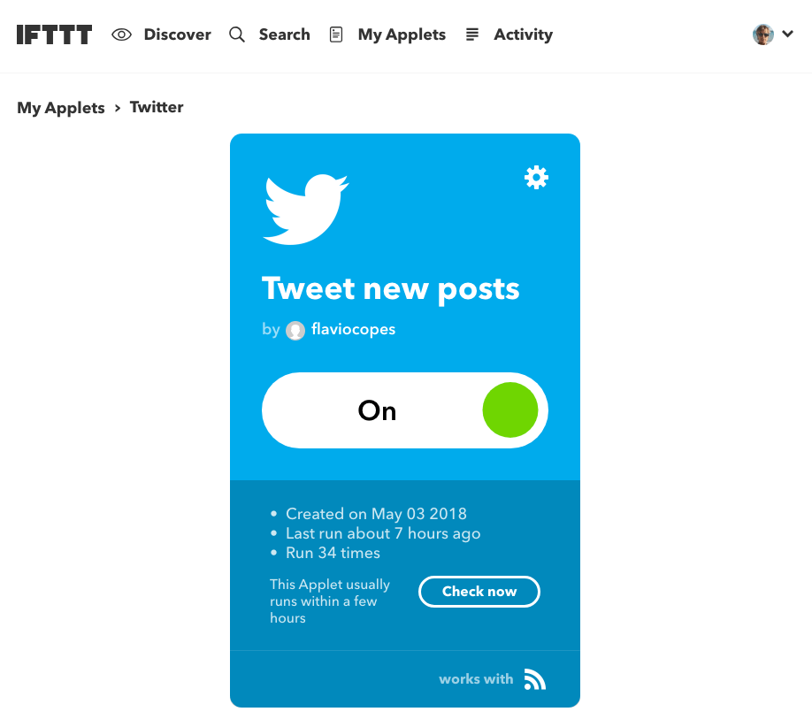

<!-- TOC -->

- [The site platform](#the-site-platform)
- [The theme](#the-theme)
- [Where do I host the site](#where-do-i-host-the-site)
- [The posts](#the-posts)
- [My workflow for posting an article](#my-workflow-for-posting-an-article)
- [Post images](#post-images)
- [The newsletter](#the-newsletter)
- [Twitter](#twitter)

<!-- /TOC -->

## The site platform

This site is a static site built using [Hugo](https://gohugo.io), the popular static site generator built using the Go programming language.

I want my site to be as _dumb_ as possible, which means less points of failure. A static site satisfies this requirement, and provides many nice advantages as well.

The reason I chose Hugo are:

- generates plain HTML files, which make it faster than having to process every request server-side
- a static site is more flexible in terms of deployment and hosting
- it's really fast, my local live reloading is instant and I don't have to wait 10 seconds to recompile (not every platform can do this on my 2010 Macbook Pro)

## The theme

I originally used the [Ghostwriter theme](https://themes.gohugo.io/ghostwriter/), slightly optimized and tweaked to serve my needs. I changed it so much over time that it's now unrecognizable, but it was a great way to start.

## Where do I host the site

I use [Netlify](https://www.netlify.com/). I used to run on Firebase Hosting, but I moved to Netlify during an outage of Firebase and I never looked back - it's made exclusively for static sites, and it's really awesome. I wrote a blog post about Netlify, [check it out](/netlify/). I also wrote a post where I describe [how I automatically deploy my posts and schedule them](/netlify-auto-deploy/).

Find out [why you should focus on your own platform](/build-your-platform/).

## The posts

I write the posts using Markdown, which make it a great format because it's very portable - I could move to any other static site generator in a minute if I want, since using Markdown there's no lock-in, but I'm very happy with Hugo.

## What do I do to promote the posts

I post them on Twitter and add them in the email newsletter which I send every week. That's basically it. Sometimes if I think a post can be a good one, I post it on Hacker News or Reddit, but it mostly does nothing.

Posts are automatically picked up by Google. Find out my [SEO tips](/seo-for-developers/).

## My workflow for posting an article

When I write a blog post, I set the published date in the future.

I have a bad memory, so I write down everything. I have a list of scheduled posts in the Apple Notes app and I try to keep more than two weeks of content in front of me, so I don't have anxiety about not knowing what I am going to publish or write about. This is key: there is nothing that can get in the way of daily publishing.

I push all my content to a private GitHub repository, which is synchronized to Netlify thanks to their Git integration.

Every time I push to GitHub, Netlify deploys an updated copy of the site.

I just run an [IFTTT](https://ifttt.com) webhook every morning at 08:00 CET to automatically trigger a new deploy on Netlify, which will publish the blog post of the day (I date every post at 7:00 AM, just to be sure).

I might be sleeping or walking the dog at 8 AM, yet the post is published.

It's nice to have this piece of the infrastructure out of my mind. I just know a post is going to be published.

It's also going to be posted on Twitter automatically, thanks to another IFTTT applet which is linked to my RSS feed.

## Post images

I make sure all the post images are optimized using [ImageOptim](https://imageoptim.com), to avoid useless bandwidth usage and a faster page speed.

Sometimes I use an app to generate a banner image for the post, which is also used in the Twitter card.

I used to create an ASCII-text image, using [TAAG](http://patorjk.com/software/taag/).

More recently I started adding images I draw using the iPad and an Apple Pencil. I use the [Sketches app](http://tayasui.com/sketches/), it's great. I am not gifted at all for drawing, I just like doing something kind of funny. It's my own blog, so I can publish crappy artwork if I like.

## The newsletter

I have one main newsletter. I send an email every week, with the list of the posts I wrote during the week, plus any new resource I create.

It runs on [ConvertKit](https://convertkit.com), highly recommended to create and grow a mailing list.

Find out [why you should create an email list](/why-email-list/).

## Twitter

Twitter is a great platform for me. I have more than 2000 followers, although I don't really know how that works and I think lots of those never see what I post.

Even though I joined Twitter in 2007, I never really used it effectively. I only started a few months ago to get any kind of interaction with the people out there 🙃

It's pretty cool. I also follow some hashtags where newbies hang out, and I try to help sometimes with their questions.

I also have a cool script that runs on [Glitch](https://glitch.com/) and it's triggered 2 times a day by IFTTT. I explain it [here](/tutorial-repurpose-posts-twitter/). Basically I have a list of posts on Airtable that I posted in the past and I want to repurpose on Twitter.

It's sad to write a post, share it once and never post it again, but doing it manually it's 1) tedious 2) not something I can do consistently 3) had to track which posts I shared already.

It's a job perfect for a machine, that posts them while I am sleeping, 2 times every day.

## That's it!

I might update this post in the future, right now this is all I use and do to run this blog.
