<!-- TOC -->

- [Introduction](#introduction)
- [Should I switch to VS Code? And why?](#should-i-switch-to-vs-code-and-why)
- [Getting started](#getting-started)
- [Explorer](#explorer)
- [Search](#search)
- [Source Control](#source-control)
- [Debugger](#debugger)
- [Extensions](#extensions)
- [The Terminal](#the-terminal)
- [The Command Palette](#the-command-palette)
- [Themes](#themes)
- [Customization](#customization)
- [Nice configuration options](#nice-configuration-options)
- [The best font for coding](#the-best-font-for-coding)
- [Workspaces](#workspaces)
- [Editing](#editing)
  - [IntelliSense](#intellisense)
  - [Code Formatting](#code-formatting)
  - [Errors and warnings](#errors-and-warnings)
  - [Keyboard shortcuts](#keyboard-shortcuts)
  - [Keymaps](#keymaps)
- [Code snippets](#code-snippets)
- [Extensions showcase](#extensions-showcase)
- [The VS Code CLI command](#the-vs-code-cli-command)
- [Solving high usage CPU issues](#solving-high-usage-cpu-issues)

<!-- /TOC -->

## Introduction

Since the beginning, editors are a strange beast. Some people defend their editor choice strenuously. In the Unix world you have those `Emacs` vs `vi` "wars", and I kind of imagine _why_ so much time is spend debating the advantages of one versus another.

I used tons of editors and IDEs in the past few years. I can remember TextMate, TextWrangler, Espresso, BBEdit, XCode, Coda, Brackets, Sublime Text, Atom, vim, PHPStorm. The difference between an IDE and an editor is mostly in the feature set, and complexity.

I largely prefer an editor over an IDE, as it's faster and gets less in the way.

In the last 12 months I've been using VS Code, the Open Source editor from Microsoft, and it's quickly become my favorite editor ever.

## Should I switch to VS Code? And why?

If you're looking for suggestions for whether to use it or not, let me say **yes**, you should switch to it from whatever other editor you are using now.

This editor builds on top of decades of editor experience from Microsoft.

The code of the editor is completely Open Source, and there's no payment required to use it.

It uses [Electron](https://electronjs.org/) as its base, which enables it to be cross platform and work on Mac, Windows and Linux. It's built using Node.js, and you can extend it using JavaScript (which makes it a win for all us JavaScript developers).

It's **fast**, easily the fastest editor I've used after Sublime Text.

It has won the enthusiasm of the community: there are thousands of **extensions**, some official, and some made by the community, and it's [winning surveys](https://insights.stackoverflow.com/survey/2018/).

Microsoft releases an update every month. Frequent updates foster innovation and Microsoft is listening to its users, while keeping the platform as stable as possible (I should say I never had an issue with VS Code in 1 year of using it every day almost all day).

## Getting started

The home page of Visual Studio Code on the internet is <https://code.visualstudio.com/>.

Go to that site to download the latest stable release of the editor.

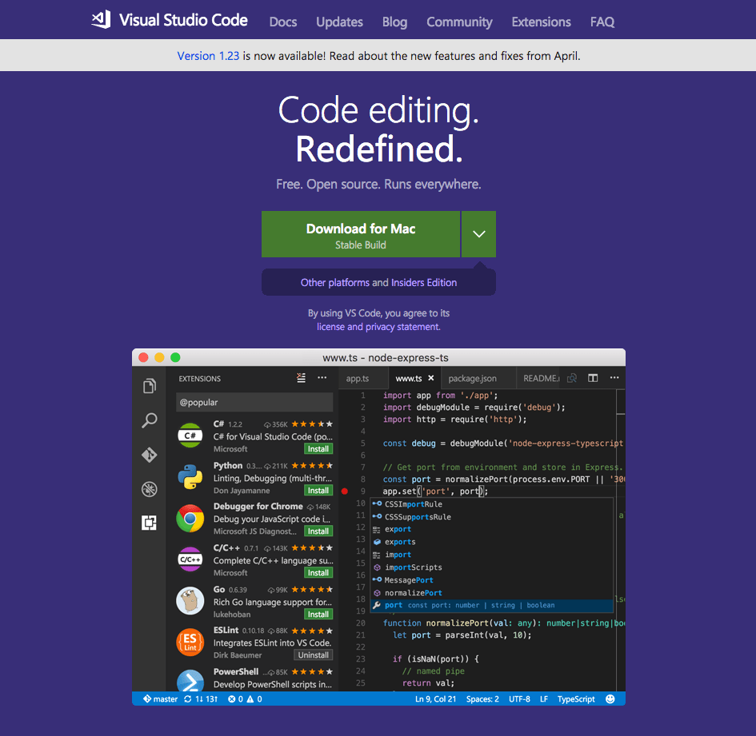

The installation process depends on the platform, and you should be used to it.

When you start the editor for the first time you will see the welcome screen:

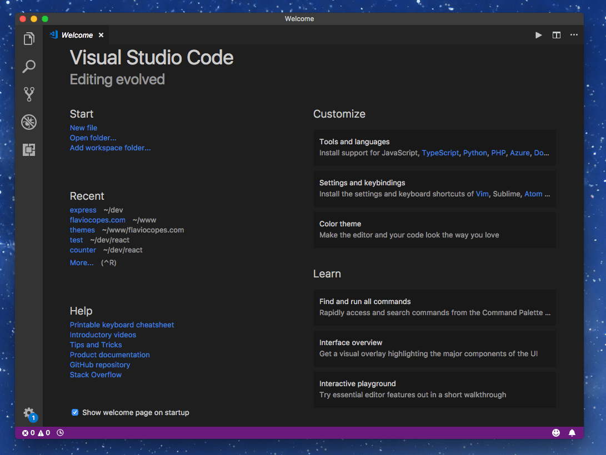

There is a toolbar on the left with 5 icons. That gives access to:

- The File Explorer
- Search
- Source Control
- The Debugger
- The Extensions

## Explorer

Let's start the exploration with the explorer (pun intended).

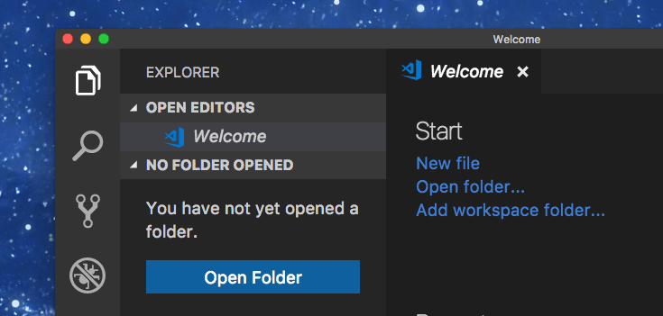

Press the "Open Folder" button in the sidebar, or the `Open folder...` link in the Welcome page. Both will trigger the file picker view.

Choose one folder where you have source code, or even just text files, and open it.

VS Code will show that folder content in your view:

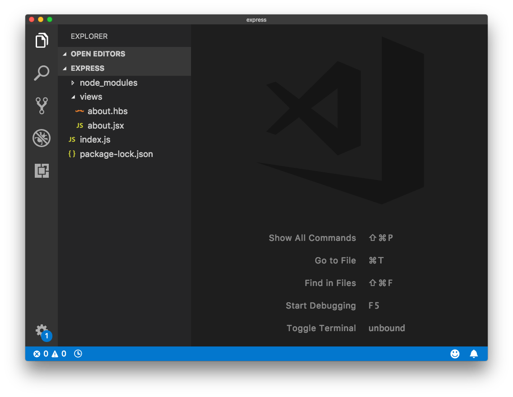

On the right, the empty view shows some commands to perform some quick operations, and their keyboard shortcut.

If you select a file on the left, that file will open on the main panel:

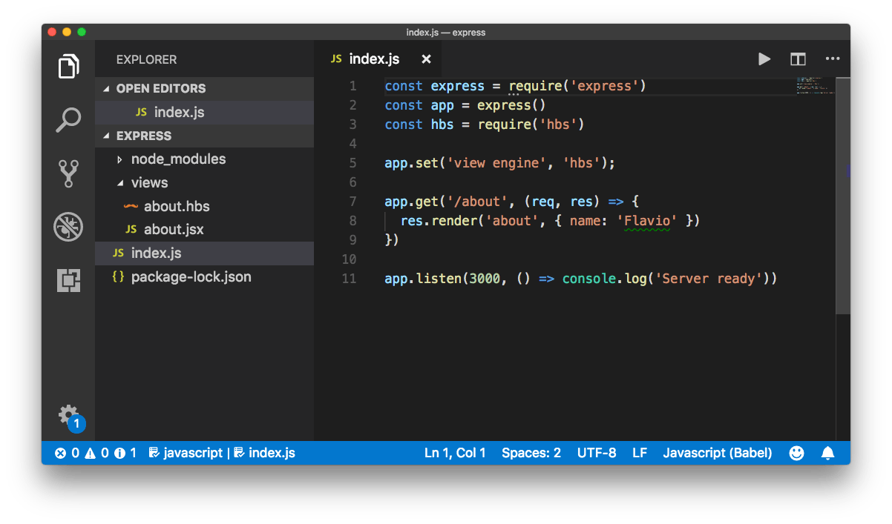

and if you start editing it, notice a dot will appear next to the file name in the tab, and in the sidebar as well:

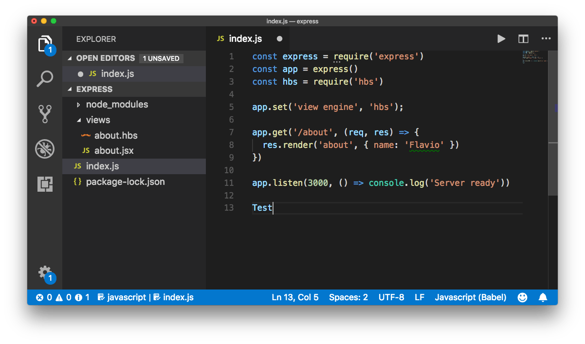

Pressing `CMD+P` will show you a quick file picker to easily move in files on large projects:

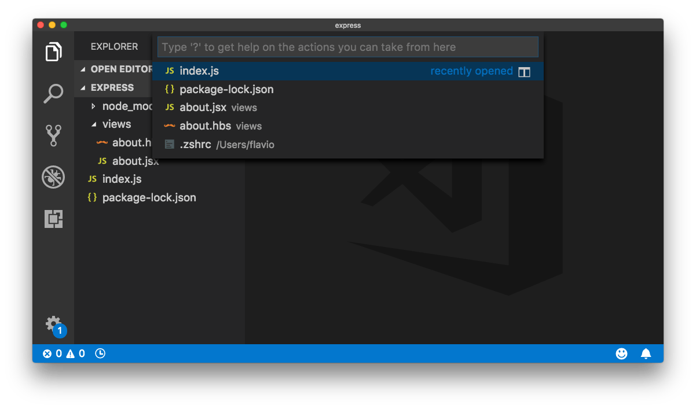

You can hide the sidebar that hosts the file using the shortcut `CMD+B`.

> Note: I'm using the Mac keyboard shortcuts. Most of the times, on Windows and Linux you just change CMT to CTRL and it works, but not always. Print your [keyboard shortcuts reference](https://code.visualstudio.com/docs/getstarted/keybindings#_keyboard-shortcuts-reference).

## Search

The second icon in the toolbar is "Search". Clicking it shows the search interface:

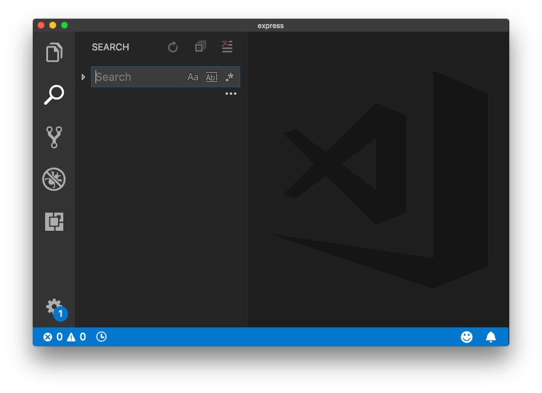

You can click the icons to make the search case sensitive, to match whole words (not substrings), and to use a regular expression for the search string.

To perform the search, press `enter`.

Clicking the ▷ symbol on the left enables the search and replace tool.

Clicking the 3 dots shows a panel that lets you just include some specific kind of files, and exclude other files:


## Source Control

The Source Control tab is enabled by clicking the third icon in the toolbar.

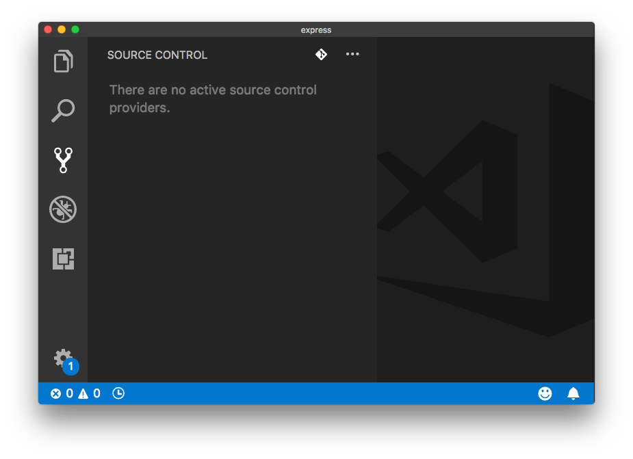

VS Code comes with Git support out of the box. In this case the folder we opened does not have source control initialized.

Clicking the first icon on top, with the Git logo, allows us to initialize the Git repository:

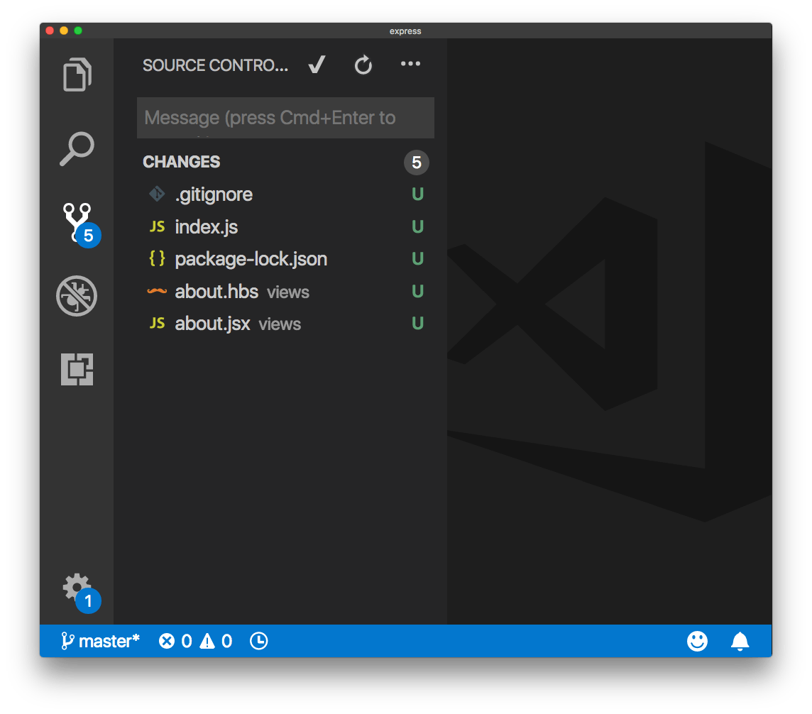

The `U` beside each file means that it's been updated since the last commit (since we never did a commit in the first place, all files are updated).

Create the first commit by writing a text message and pressing `Cmd-Enter`, or clicking the ✔︎ icon on top.

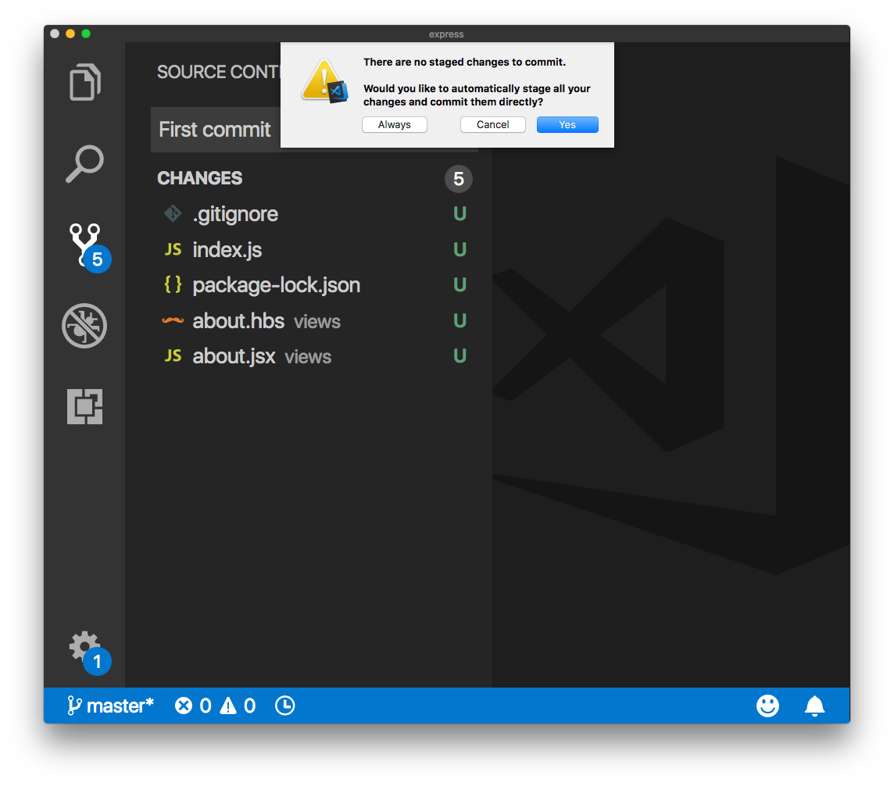

I usually set this to automatically stage the changes when I commit them.

The 3 dots icon, when clicked, offers lots of options for interacting with Git:


## Debugger

The fourth icon in the toolbar opens the JavaScript debugger. This deserves an article on its own. In the meantime check out [the official docs](https://code.visualstudio.com/docs/editor/debugging).

## Extensions

The fifth icon brings us to extensions.

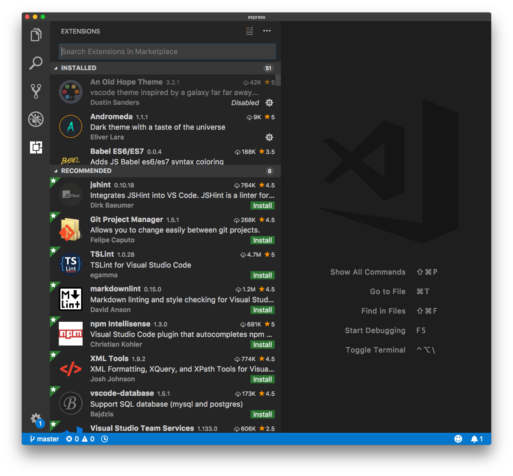

Extensions are one killer feature of VS Code.

They can provide so much value that you'll surely end up using tons of them.

I have lots of extensions installed.

One thing to remember is that every extension you install is going to impact (more or less) the performance of your editor.

You can disable an extension you install, and enable only when you need it.

You can also disable an extension for a specific workspace (we'll talk about work workspaces later). For example, you don't want to enable the JavaScript extensions in a Go project.

There is a list of recommended extensions, which include all the most popular tools.

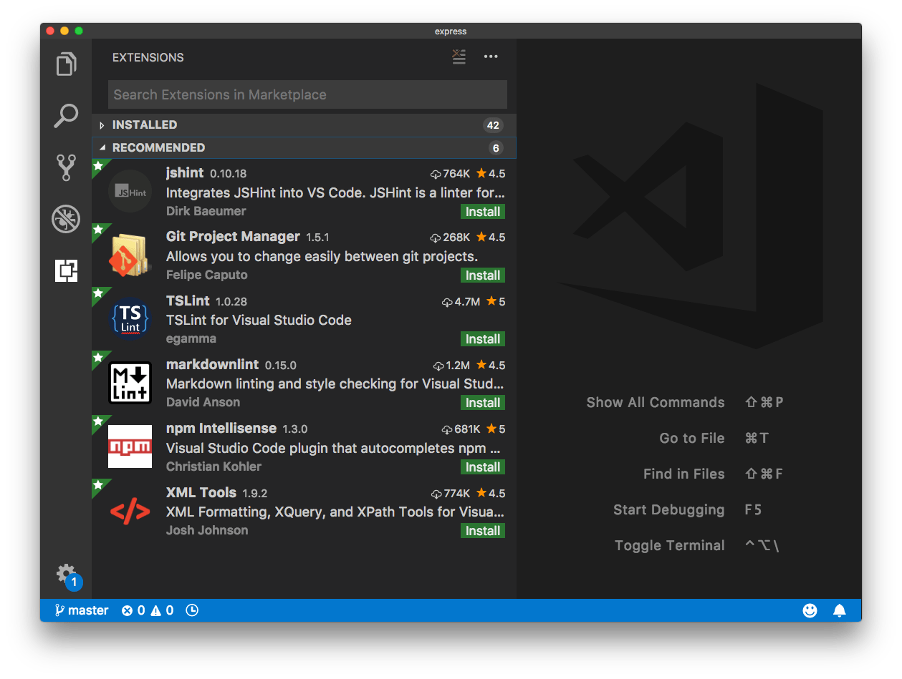

Since I edit lots of markdown files for my blog, VS Code suggests me the `markdownlint` extension, which provides linting and syntax checking for Markdown files.

As an example, let's install it.

First, I inspect the number of views. It's 1.2M, so many! And the reviews are positive (4.5/5). Clicking the extension name opens the details on the right.

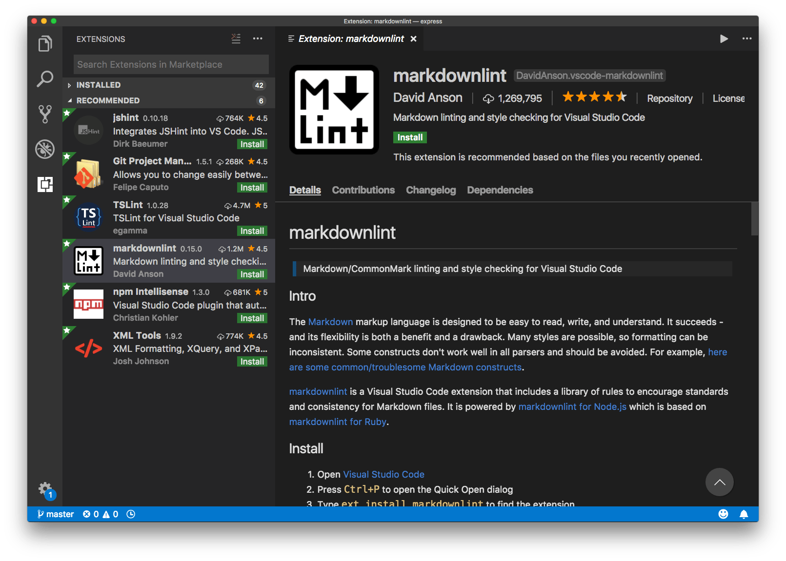

Pressing the green Install button starts the installation process, which is straightforward. It does everything for you, and you just need to click the "Reload" button to activate it, which basically reboots the editor window.

Done! Let's test it by creating a markdown file with an error, like a missing `alt` attribute on an image. It successfully tells us so:

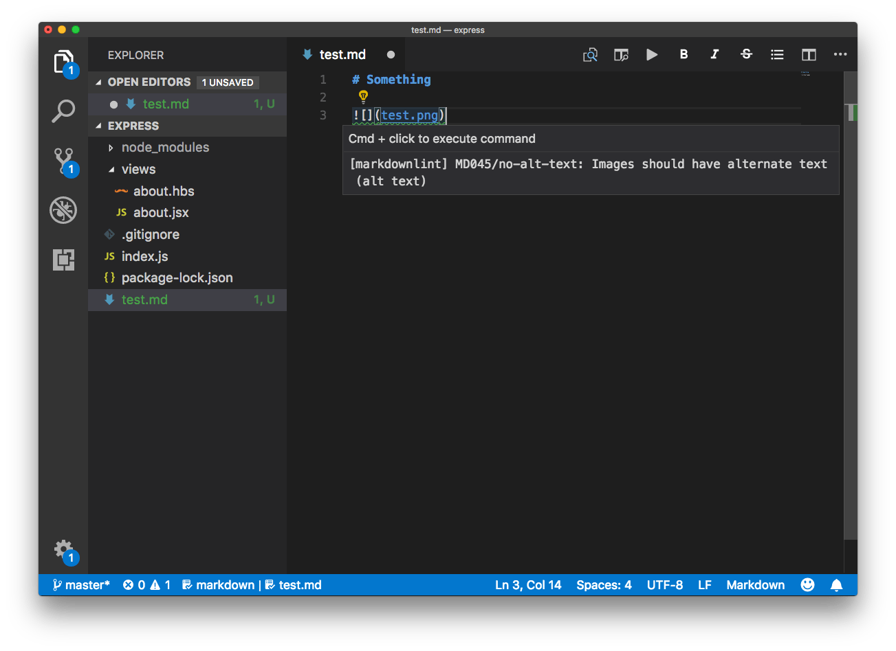

Down below I introduce some popular extensions you don't want to miss, and the ones I use the most.

## The Terminal

VS Code has an integrated terminal.

You can activate it from the menu `View ➤ Integrated Terminal`, or using `CMD+\`` and it will open with your default shell.


This is very convenient because in modern web development you almost always have some `npm` or `yarn` process running in the background.

You can create more than one terminal tab, and show them one next to the other, and also stack them to the right rather than in the bottom of the window:


## The Command Palette

The Command Palette is a very powerful tool. You enable it by clicking `View ➤ Command Palette`, or using `CMD+SHIFT+P`

A modal window will appear at the top, offering you various options, depending on which plugins you have installed, and which commands you used last.

Common operations I perform are:

- **Extensions: Install Extensions**
- **Preferences: Color Theme** to change the color theme (I sometimes change from night to day)
- **Format Document**, which formats code automatically
- **Run Code**, which is provided by Code Runner, and executes the highlighted lines of JavaScript

you can activate any of those by starting typing, and the autocomplete functionality will show you the one you want.

Remember when you typed `CMD+P` to see the list of files, before? That's a shortcut to a specific feature of the Command Palette. There are others:

- `Ctrl-Shift-Tab` shows you the active files
- `Ctrl-G` opens the command palette to let you enter a line number to go to
- `CMD+SHIFT+O` shows the list of symbols found in the current file

What symbols _are_ depends on the file type. In JavaScript, those might be classes or functions. In Markdown, section titles.

## Themes

You can switch the color theme used by clicking `CMD-k` + `CMD-t`, or by invoking the _Preferences: Color Theme_ command.

This will show you the list of themes installed:


you can click one, or move with the keyboard, and VS Code will show you a preview. Click enter to apply the theme:


Themes are just extensions. You can install new themes by going to the extensions manager.

Probably the best thing for discoverability is to use [the marketplace website](https://marketplace.visualstudio.com/search?target=VSCode&category=Themes&sortBy=Downloads).

My favorite theme is [Ayu](https://marketplace.visualstudio.com/items?itemName=teabyii.ayu), which provides a great style for any time of the day, night, morning/evenings and afternoon.

## Customization

Theme is just one customization you can make.

The sidebar icons that are assigned to a file are also a big part of a nice user experience.

You can change those by going to `Preferences ➤ File Icon Theme`. Ayu comes with its own icons theme, which perfectly matches the theme colors:


All those customizations we made so far, the theme and the icon theme, are saved to the user preferences.

Go to `Preferences ➤ Settings` (also reachable via `CMD-,`) to see them:


The view shows the default settings on the left, for an easy reference, and the overridden settings on the right. You can see the name of the theme and the icon theme we set up, in `workbench.colorTheme` and `workbench.iconTheme`.

I zoomed in using `CMD-+`, and this setting was saved as well to `window.zoomLevel`, so the next time VS Code starts up, it remembers my choice for zooming.

You can decide to apply some setting globally, in **User Settings**, or relative to a workspace, in **Workspace settings**.

Most of the times those settings are automatically added by extensions or by the VS Code itself, but in some cases you'll directly edit them in this place.

## Nice configuration options

Some nice configuration options I set in my code:

Option   | Description
---------|----------
`"editor.minimap.enabled": false` | Remove the minimap, which is shown at the right of the editor
`"explorer.confirmDelete": false` | Stop asking me for confirmation when I want to remove a file (I have source control!)
`"explorer.confirmDragAndDrop": false` | Disable the confirmation for drag and drop
`"editor.formatOnSave": true` | Format the code automatically when I save it
`"editor.formatOnPaste": true` | Format the code automatically when I paste it in my code
`"javascript.format.enable": true` | Enable formatting for JavaScript code
`"files.trimTrailingWhitespace": true` | Trim whitespace in files
`"editor.multiCursorModifier": "alt"` | When clicking the Alt key and clicking with the mouse, I can select multiple lines
`"editor.detectIndentation": true` | Adapt to the file indentation, useful when editing other people code
`"editor.quickSuggestionsDelay": 0` | Show the code suggestion immediately, not after some seconds

## The best font for coding

I like [Fira Code](https://github.com/tonsky/FiraCode). It's free, and has some very nice programming ligatures, which transform common constructs like `!==` and `=>` to nicer symbols:


Enable it by installing the font and adding this to your configuration:

```json
"editor.fontFamily": "Fira Code",
"editor.fontLigatures": true`
```

## Workspaces

All User settings can be overridden in Workspace settings. They take precedence. They are useful for example when you use a project that has linting rules different from all the other projects you use, and you don't want to edit your favorite settings just for it.

You create a workspace from an existing project by clicking the `File ➤ Save Workspace as...` menu.

The currently opened folder will be enabled as the workspace main folder.

The next time you open VS code, or you switch project, instead of opening a folder, you open a workspace, and that will automatically open the folder containing your code, and it will remember all the settings you set specific to that workspace.

In addition to having workspace-level settings, you can disable extensions for a specific workspace.

You can just work with folders until you have a specific reason for wanting a workspace.

One good reason is the ability to have multiple, separate root folders. You can use the `File ➤ Add Folder to Workspace` to add a new root folder, which can be located anywhere in the filesystem, but will be shown along with the other existing folder you had.

## Editing

### IntelliSense

When you edit in one of the supported languages (JavaScript, JSON, HTML, CSS, Less, Sass, C# and [TypeScript](/typescript/)) VS Code has IntelliSense, a technology that hints at autocompletion of functions and parameters, as you type them.

### Code Formatting

Two handy commands (`Format Document` and `Format Selection`) are available on the Commands Palette to autoformat the code. VS Code by defaults supports automatic formatting for HTML, JavaScript, TypeScript and JSON.

### Errors and warnings

When you open a file you will see on the right a bar with some colors. Those colors indicate some issues in your code. For example here's what I see right now:

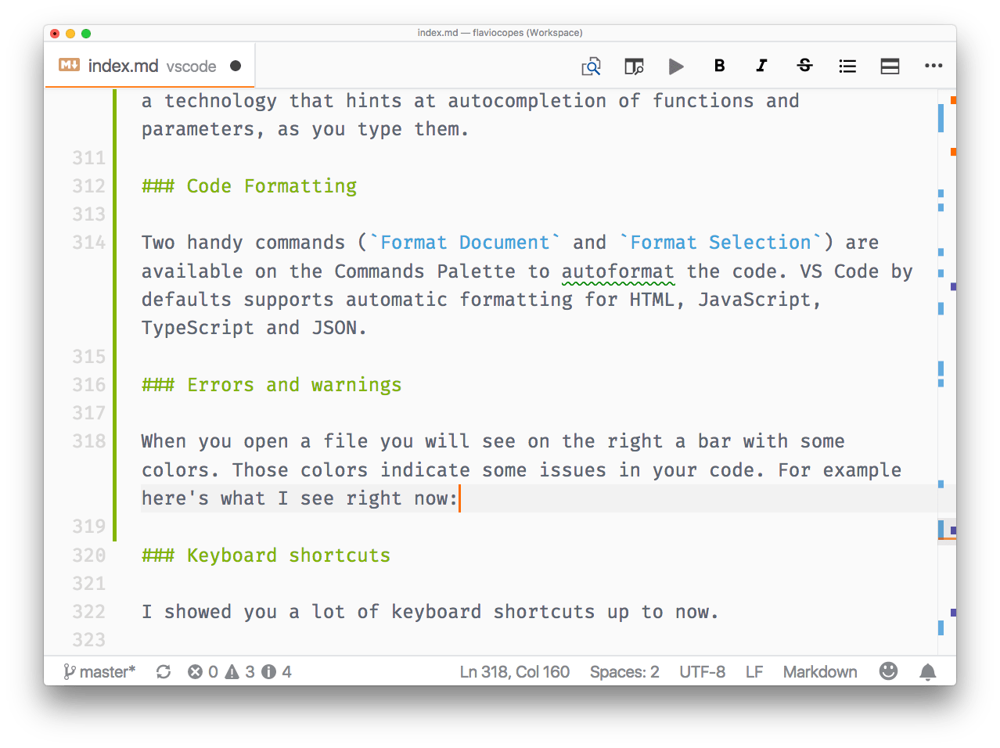

Those are al warnings or errors. You can try to find them in the code, where you see pieces underlined in red, or you can also press `CMD-Shift-M` (or choose `View ➤ Problems`)

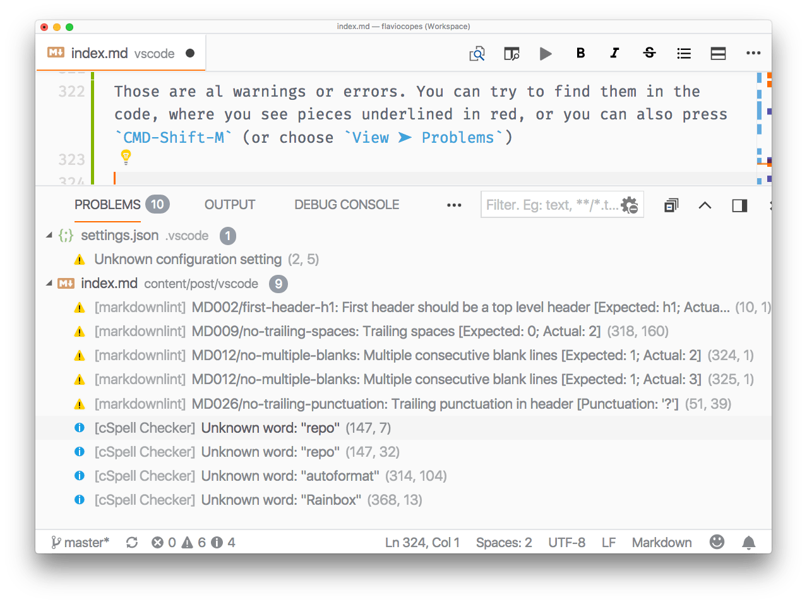

### Keyboard shortcuts

I showed you a lot of keyboard shortcuts up to now.

It's starting to get complicated to remember them all, but they are a nice productivity aid. I suggest to print the official shortcuts cheat sheet, for [Mac](https://code.visualstudio.com/shortcuts/keyboard-shortcuts-macos.pdf), [Linux](https://code.visualstudio.com/shortcuts/keyboard-shortcuts-linux.pdf) and [Windows](https://code.visualstudio.com/shortcuts/keyboard-shortcuts-windows.pdf).

### Keymaps

If you're used to keyboard shortcuts from other editors, maybe because you worked with one editor for a long time, you can use a keymap.

The VS Code team provides keymaps for the most popular editors out of the box: vim, Sublime Text, Atom, IntelliJ, Eclipse and more. They are available as plugins. By opening the `Preferences ➤ Keymaps Extensions` menu.

## Code snippets

Snippets are very cool.

For every language you might be developing in, there are extensions that provide ready-made snippets for you to use.

For JavaScript/React, one popular one is [VS Code ES7 React/Redux/React-Native/JS snippets](https://marketplace.visualstudio.com/items?itemName=dsznajder.es7-react-js-snippets)

You just type `rfe`, press TAB and this appears in your editor:

```js
import React from 'react'

const $1 = props => {
  return <div>$0</div>
}

export default $1
```

there are lots of these shortcuts, and they save a lot of time. Not just from typing, but also from looking up the correct syntax.

You can also define your own snippets. Click `Preferences ➤ User Snippets` and follow the instructions to create your own snippets file.

## Extensions showcase

- [**GitLens**](https://marketplace.visualstudio.com/items?itemName=eamodio.gitlens): visualize who made the last change to a line of your code, and when this happened
- [**Git History**](https://marketplace.visualstudio.com/items?itemName=donjayamanne.githistory) visualize and search the Git history
- [**CSS Peek**](https://marketplace.visualstudio.com/items?itemName=pranaygp.vscode-css-peek) lets you see and edit CSS definitions by inspecting the class of an HTML element. Very handy.
- [**Code Runner**](https://marketplace.visualstudio.com/items?itemName=formulahendry.code-runner) lets you run bits of code that you select in the editor, and much more. Supports lots of languages.
- [**Debugger for Chrome**](https://marketplace.visualstudio.com/items?itemName=msjsdiag.debugger-for-chrome) allows you to debug a JavaScript code running in the browser using the VS code debugger.
- [**Bracket Pair Colorizer**](https://marketplace.visualstudio.com/items?itemName=CoenraadS.bracket-pair-colorizer) handy for visualizing brackets endings in your code.
- [**Indent-Rainbow**](https://marketplace.visualstudio.com/items?itemName=oderwat.indent-rainbow) colors the indentation levels of your code.
- [**Prettier**](https://marketplace.visualstudio.com/items?itemName=esbenp.prettier-vscode) check my [Prettier guide](/prettier/)
- [**ESLint**](https://marketplace.visualstudio.com/items?itemName=dbaeumer.vscode-eslint) check my [ESLint guide](/eslint/)
- [**IntelliSense for CSS**](https://marketplace.visualstudio.com/items?itemName=Zignd.html-css-class-completion) improved autocompletion for CSS based on your workspace definitions
- [**npm**](https://marketplace.visualstudio.com/items?itemName=eg2.vscode-npm-script) enables [npm](/npm/) utility functions from the command palette
- [**Auto Close Tag**](https://marketplace.visualstudio.com/items?itemName=formulahendry.auto-close-tag) automatically close HTML/JSX/* tags
- [**Auto Rename Tag**](https://marketplace.visualstudio.com/items?itemName=formulahendry.auto-rename-tag) automatically renames the closing tag when you change the opening one, and the opposite as well

## The VS Code CLI command

When you install VS Code, the `code` command is available globally in your command line.

This is very useful to start the editor and open a new window with the content of the current folder, with `code .`.

`code -n` will create a new window.

A useful thing that's not always known is that VS Code can quickly show the diff between two files, with `code --diff file1.js file2.js`.

## Solving high usage CPU issues

I ran into an issue of high CPU usage, and spinning fans, with a project with lots of files under `node_modules`. I added this configuration and things looked normal again:

```json
  "files.useExperimentalFileWatcher": true,
  "files.exclude": {
    "/.git": true,
    "/.DS_Store": true,
    "/node_modules": true,
    "/node_modules/": true
  },
  "search.exclude": {
    "/node_modules": true
  },
  "files.watcherExclude": {
    "/node_modules/": true
  },
```
