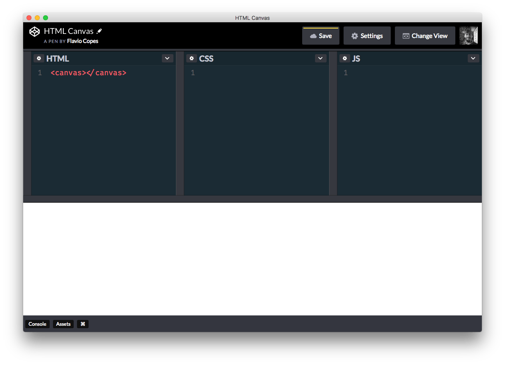
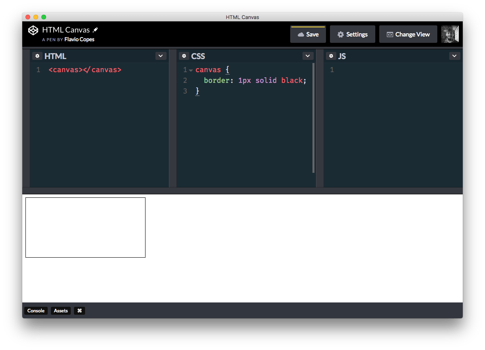
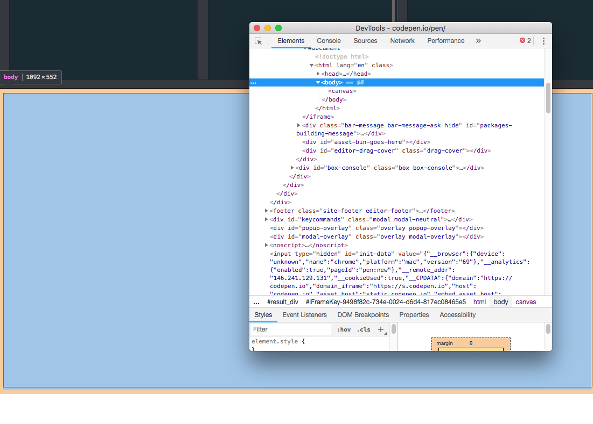
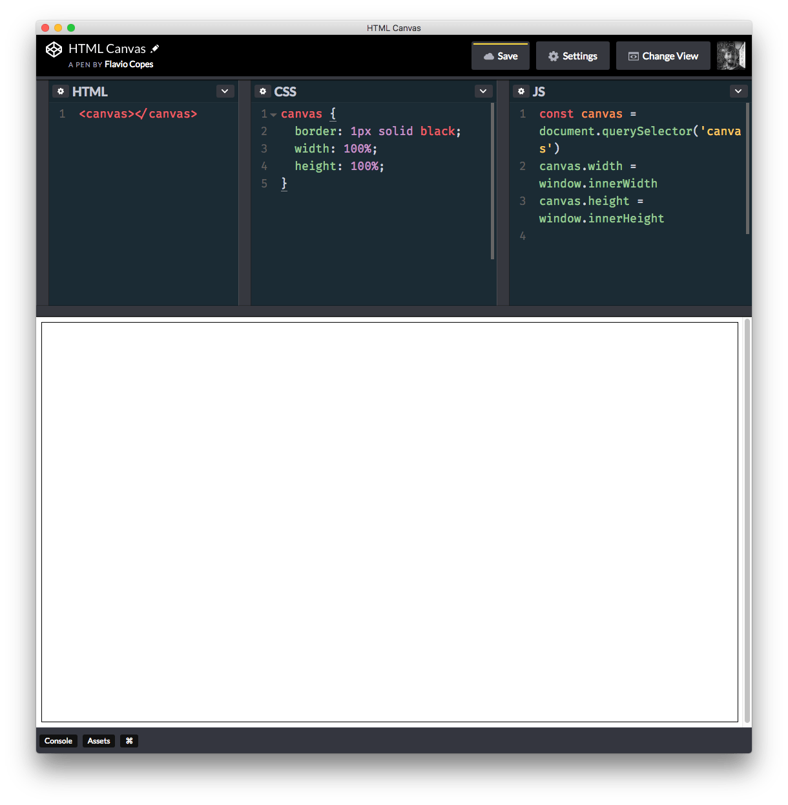
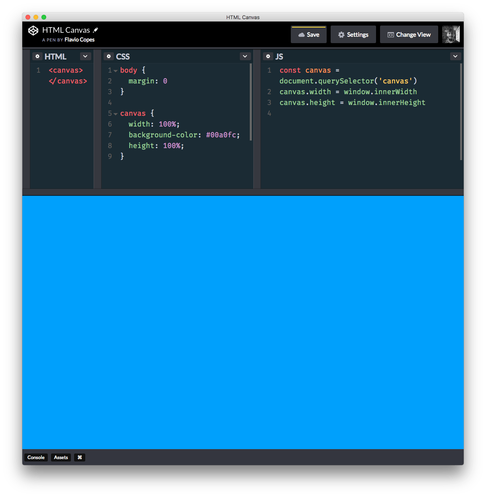
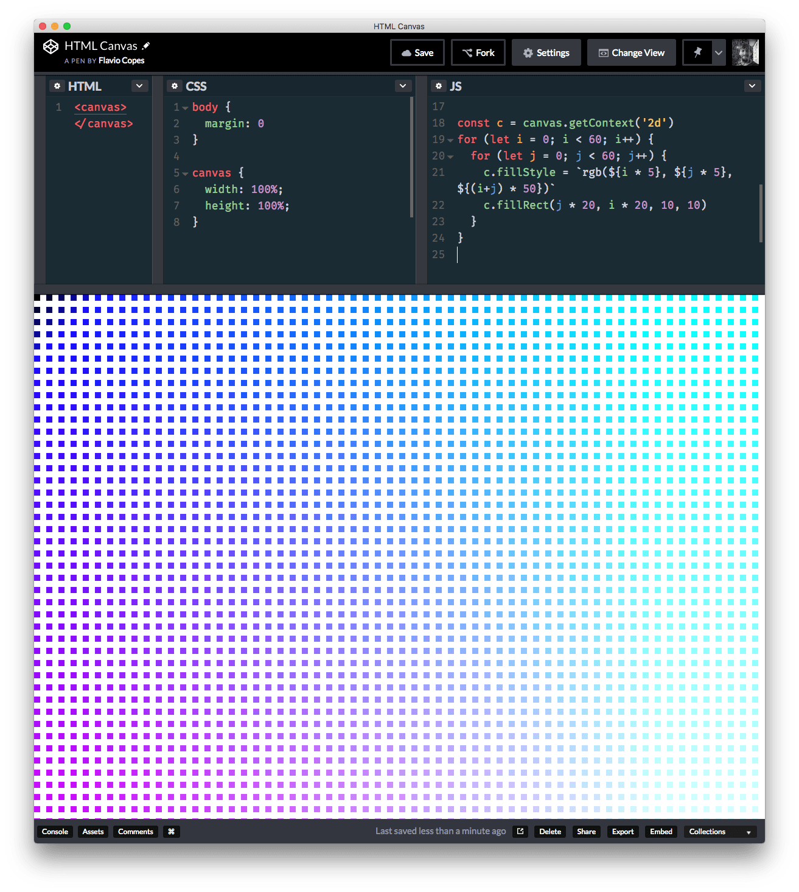
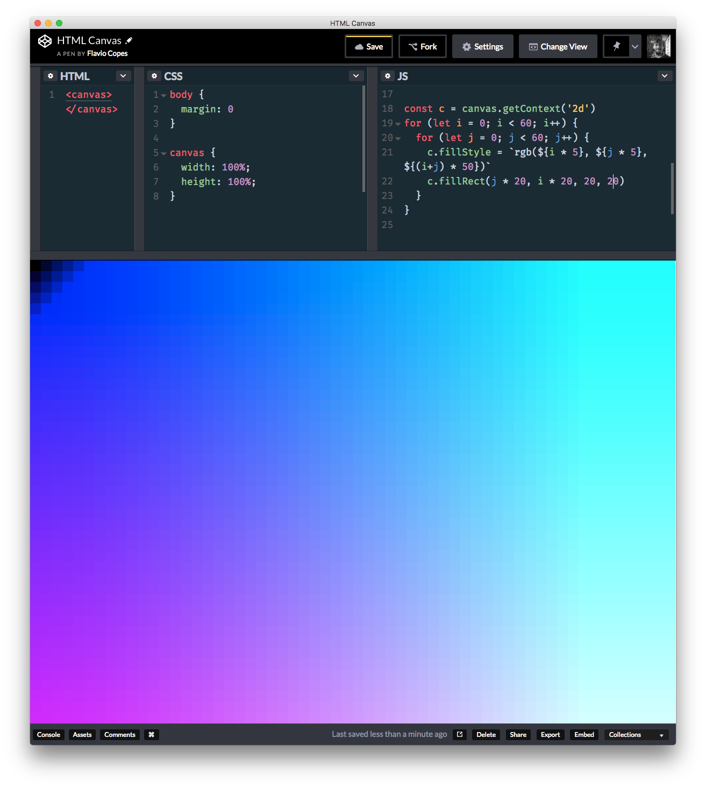
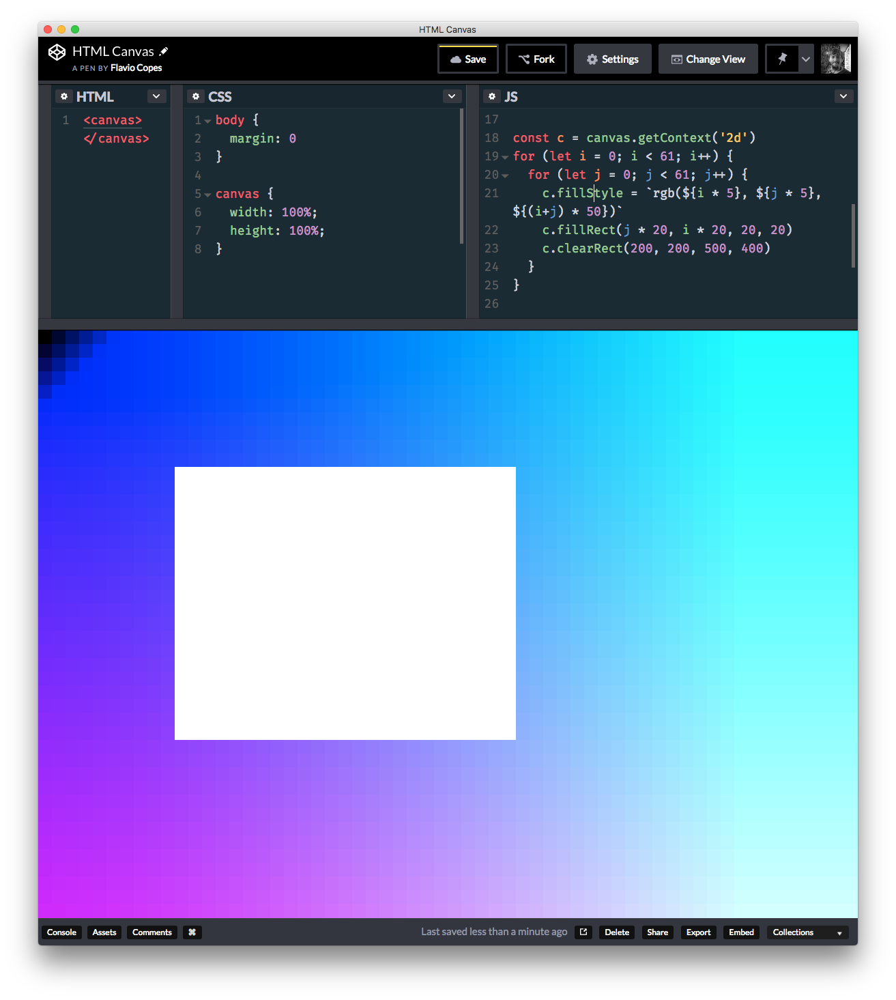
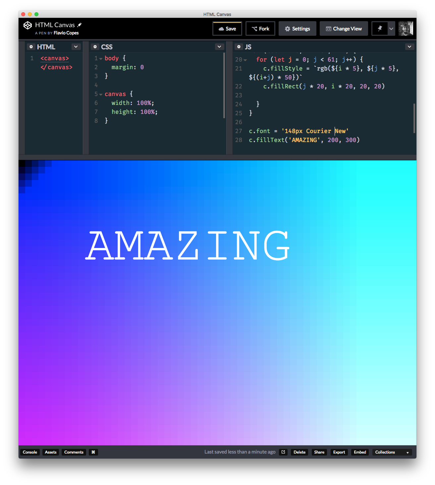
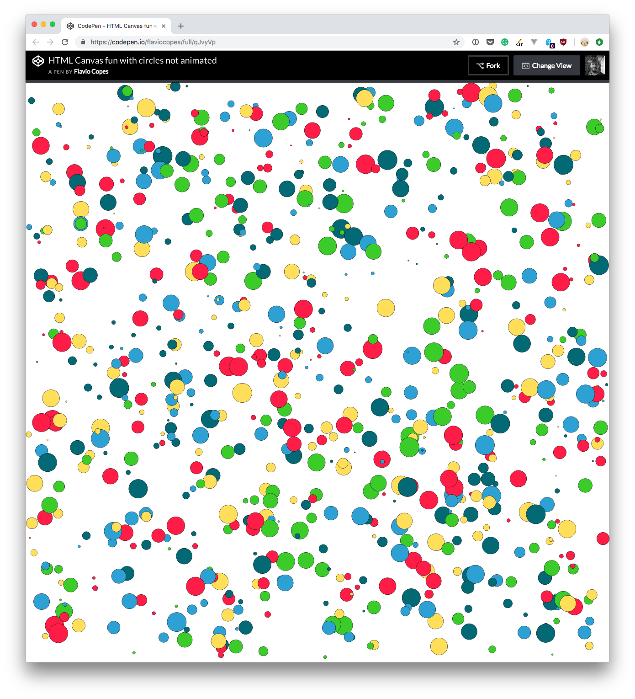

The HTML canvas is an HTML tag, `<canvas>`, which is an element where we can draw to using the Canvas API.

## Create a canvas

Creating a canvas is as simple as dropping a `<canvas></canvas>` in a blank HTML file:



You don't see anything in the page because the canvas is an invisible element. Let's add some border:



Chrome automatically adds an 8px margin to the `body` element. This is why our border looks like a frame, and you can remove that margin by setting

```css
body {
  margin: 0;
}
```

We'll leave the default for now.

Our canvas is now reachable from JavaScript using the [DOM Selectors API](/selectors-api/), so we can use `document.querySelector()`:

```js
const canvas = document.querySelector('canvas')
```

## Change the background color of a canvas

You do that in CSS:

```css
canvas {
  background-color: lightblue;
}
```

## Resize a canvas

You can set the width and height in CSS:

```css
canvas {
  border: 1px solid black;
  width: 100%;
  height: 100%;
}
```

and in this way the canvas will expand to fill all the outer element size.

If you put the canvas as a first level element in the HTML, the above code will expand the canvas to fit the entire body.



The body is not filling the entire window size. To fill the entire page instead we need to use JavaScript:

```js
canvas.width = window.innerWidth
canvas.height = window.innerHeight
```



If you now remove the body margin and set the background of the canvas using CSS, we can fill our entire page with the canvas and we can start drawing on it:



If the window resizes we need to recalculate the canvas width as well, using a **debounce** to avoid calling too many times our canvas resizing (the `resize` event can be called hundreds of times as you move the window with the mouse, for example):

```js
const debounce = (func) => {
  let timer
  return (event) => {
    if (timer) { clearTimeout(timer) }
    timer = setTimeout(func, 100, event)
  }
}

window.addEventListener('resize', debounce(() => {
  canvas.width = window.innerWidth
  canvas.height = window.innerHeight
}))
```

## Get a context from the canvas

We want to draw to the canvas.

To do this, we need to get a context:

```js
const c = canvas.getContext('2d')
```

> Some assign the context to a variable named `c`, some `ctx` - it's a common way to shortcut "context"

The [`getContext()`](https://developer.mozilla.org/en-US/docs/Web/API/HTMLCanvasElement/getContext) method returns a drawing context on the canvas, according to the type that you pass as parameter.

Valid values are

- `2d`, the one we'll use
- `webgl` to use WebGL version 1
- `webgl2` to use WebGL version 2
- `bitmaprenderer` to use with [ImageBitmap](https://developer.mozilla.org/en-US/docs/Web/API/ImageBitmap)

Based on the context type, you can pass a second parameter to `getContext()` to specify additional options.

In the case of the `2d` context, we basically have one parameter we can use in all browsers, and it's `alpha`, a boolean that defaults to true. If set to false, the browser knows the canvas does not have a transparent background and can speed up rendering.

## Draw elements to a canvas

With the context we can now draw elements.

We have several methods to do so. We can draw:

- text
- lines
- rectangles
- paths
- images

and for each of those elements we can alter the fill, the stroke, the gradient, the pattern, the shadow, rotate them, scale and perform a lot of operations.

Let's start with the simplest thing: a rectangle.

The `fillRect(x, y, width, height)` method serves this purpose:

```js
c.fillRect(100, 100, 100, 100)
```

This is going to draw a black rectangle of 100 x 100 pixels, starting from position x 100 and y 100:


You can color the rectangle by using the `fillStyle()` method, passing any valid CSS color string:

```js
c.fillStyle = 'white'
c.fillRect(100, 100, 100, 100)
```

You can get creative now and draw many things in this way:

```js
for (let i = 0; i < 60; i++) {
  for (let j = 0; j < 60; j++) {
    c.fillStyle = `rgb(${i * 5}, ${j * 5}, ${(i+j) * 50})`
    c.fillRect(j * 20, i * 20, 10, 10)
  }
}
```



or

```js
for (let i = 0; i < 60; i++) {
  for (let j = 0; j < 60; j++) {
    c.fillStyle = `rgb(${i * 5}, ${j * 5}, ${(i+j) * 50})`
    c.fillRect(j * 20, i * 20, 20, 20)
  }
}
```



## Drawing elements

As mentioned you can draw many things:

- text
- lines
- rectangles
- paths
- images

Let's just see a few of them, rectangles and text, to get the gist of how things work. You can find the API for all the rest that you need [here](https://developer.mozilla.org/en-US/docs/Web/API/CanvasRenderingContext2D).

### Changing the colors

Use the `fillStyle` and `strokeStyle` properties to change the fill and stroke colors of any figure. They accept any valid CSS color, including strings and RGB calculations:

```js
c.strokeStyle = `rgb(255, 255, 255)`
c.fillStyle = `white`
```

### Rectangles

- clearRect(x, y, width, height)
- fillRect(x, y, width, height)
- strokeRect(x, y, width, height)

We saw `fillRect()` in the previous section. `strokeRect()` is similar in how it's called, but instead of filling a rect, it just draws the stroke using the current stroke style (which can be changed using the `strokeStyle` context property):

```js
const c = canvas.getContext('2d')
for (let i = 0; i < 61; i++) {
  for (let j = 0; j < 61; j++) {
    c.strokeStyle = `rgb(${i * 5}, ${j * 5}, ${(i+j) * 50})`
    c.strokeRect(j * 20, i * 20, 20, 20)
  }
}
```


`clearRect()` sets an area as transparent:



### Text

Drawing text is similar to rectangles. You have 2 methods

- fillText(text, x, y)
- strokeText(text, x, y)

which let you write text on the canvas.

`x` and `y` refer to the bottom-left corner.

You change the font family and size using the `font` property of the canvas:

```js
c.font = '148px Courier New'
```



There are other properties you can change, related to text (* = default):

- `textAlign` (start*, end, left, right, center)
- `textBaseline` (top, hanging, middle, alphabetic*, ideographic, bottom)
- `direction` (ltr, rtl, inherit*)

### Lines

To draw a line you first call the `beginPath()` method, then you provide a starting point with `moveTo(x, y)`, and then you call `lineTo(x, y)` to make the line to that new coordinates set. You finally call `stroke()`:

```js
c.beginPath()
c.moveTo(10, 10)
c.lineTo(300, 300)
c.stroke()
```

The line is going to be colored according to the `c.strokeStyle` property value.

## A more complex example

This code creates a canvas that generates 800 circles:



Every circle is perfectly contained in the canvas, and its radius is randomized.

Any time you resize the window, the elements are regenerated.

You can play around with on [Codepen](https://codepen.io/flaviocopes/pen/qJvyVp).

```js
const canvas = document.querySelector('canvas')
canvas.width = window.innerWidth
canvas.height = window.innerHeight
const c = canvas.getContext('2d')

const circlesCount = 800

const colorArray = [
  '#046975',
  '#2EA1D4',
  '#3BCC2A',
  '#FFDF59',
  '#FF1D47'
]

const debounce = (func) => {
  let timer
  return (event) => {
    if (timer) { clearTimeout(timer) }
    timer = setTimeout(func, 100, event)
  }
}

window.addEventListener('resize', debounce(() => {
  canvas.width = window.innerWidth
  canvas.height = window.innerHeight

  init()
}))

const init = () => {
  for (let i = 0; i < circlesCount; i++) {
    const radius = Math.random() * 20 + 1
    const x = Math.random() * (innerWidth - radius  * 2) + radius
    const y = Math.random() * (innerHeight - radius  * 2) + radius
    const dx = (Math.random() - 0.5) * 2
    const dy = (Math.random() - 0.5) * 2

    const circle = new Circle(x, y, dx, dy, radius)
    circle.draw()
  }
}

const Circle = function(x, y, dx, dy, radius) {
  this.x = x
  this.y = y
  this.dx = dx
  this.dy = dy
  this.radius = radius
  this.minRadius = radius
  this.color = colorArray[Math.floor(Math.random() * colorArray.length)]

  this.draw = function() {
    c.beginPath()
    c.arc(this.x, this.y, this.radius, 0, Math.PI * 2, false)
    c.strokeStyle = 'black'
    c.stroke()
    c.fillStyle = this.color
    c.fill()
  }
}

init()
```

## Another example: animating elements on the canvas

Based on the example above, we animate the elements using a loop. Every circle has its own "life" and moves within the borders of the canvas. When the border is reached it bounces back:

<p data-height="265" data-theme-id="0" data-slug-hash="MPxBBb" data-default-tab="js,result" data-user="flaviocopes" data-pen-title="HTML Canvas fun with circles, not interactive" data-preview="true" class="codepen">See the Pen <a href="https://codepen.io/flaviocopes/pen/MPxBBb/">HTML Canvas fun with circles, not interactive</a> by Flavio Copes (<a href="https://codepen.io/flaviocopes">@flaviocopes</a>) on <a href="https://codepen.io">CodePen</a>.</p>
<script async src="https://static.codepen.io/assets/embed/ei.js"></script>

We achieve this by using [`requestAnimationFrame()`](/requestanimationframe/) and slightly moving the image at every frame rendering iteration.

## Interact with the elements on the canvas

Here is the above example expanded to let you interact with the circles using the mouse.

When you hover the canvas, the items near your mouse will increase in size, and they will return back to normal when you move somewhere else:

<p data-height="265" data-theme-id="0" data-slug-hash="YJgarj" data-default-tab="js,result" data-user="flaviocopes" data-pen-title="HTML Canvas fun with circles" data-preview="true" class="codepen">See the Pen <a href="https://codepen.io/flaviocopes/pen/YJgarj/">HTML Canvas fun with circles</a> by Flavio Copes (<a href="https://codepen.io/flaviocopes">@flaviocopes</a>) on <a href="https://codepen.io">CodePen</a>.</p>
<script async src="https://static.codepen.io/assets/embed/ei.js"></script>

How does it work? Well, first I track the mouse position using 2 variables:

```js
let mousex = undefined
let mousey = undefined

window.addEventListener('mousemove', (e) => {
  mousex = e.x
  mousey = e.y
})
```

Then we use those variables inside the update() method of Circle, to determine if the radius should increase (or decrease):

```js
if (mousex - this.x < distanceFromMouse && mousex - this.x > -distanceFromMouse && mousey - this.y < distanceFromMouse && mousey - this.y > -distanceFromMouse) {
  if (this.radius < maxRadius) this.radius += 1
} else {
  if (this.radius > this.minRadius) this.radius -= 1
}
```

`distanceFromMouse` is a value expressed in pixels (set to 200) that defines how far we want the circles to react to the mouse.

## Performance

If you try to edit those projects above and add a bunch more circles and moving parts, you'll probably notice performance issues. Browsers consume a lot of energy to render the canvas with animations and interactions, so pay attention so that the experience is not ruined on less performant machines than yours.

In particular I had issues when trying to create a similar experience with emojis rather than circles, and I found that text takes a lot more power to render, and so it was sluggish pretty quickly.

<p data-height="265" data-theme-id="0" data-slug-hash="vVPagr" data-default-tab="js,result" data-user="flaviocopes" data-pen-title="HTML Canvas fun with Emojis" data-preview="true" class="codepen">See the Pen <a href="https://codepen.io/flaviocopes/pen/vVPagr/">HTML Canvas fun with Emojis</a> by Flavio Copes (<a href="https://codepen.io/flaviocopes">@flaviocopes</a>) on <a href="https://codepen.io">CodePen</a>.</p>
<script async src="https://static.codepen.io/assets/embed/ei.js"></script>

[This page on MDN](https://developer.mozilla.org/en-US/docs/Web/API/Canvas_API/Tutorial/Optimizing_canvas) lists many performance tips.

## Closing words

This was just an introduction to the possibilities of Canvas, an amazing tool that you can use to create incredible experiences on your web pages.
