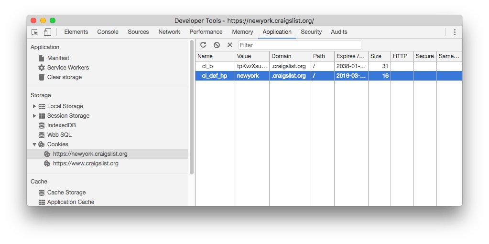
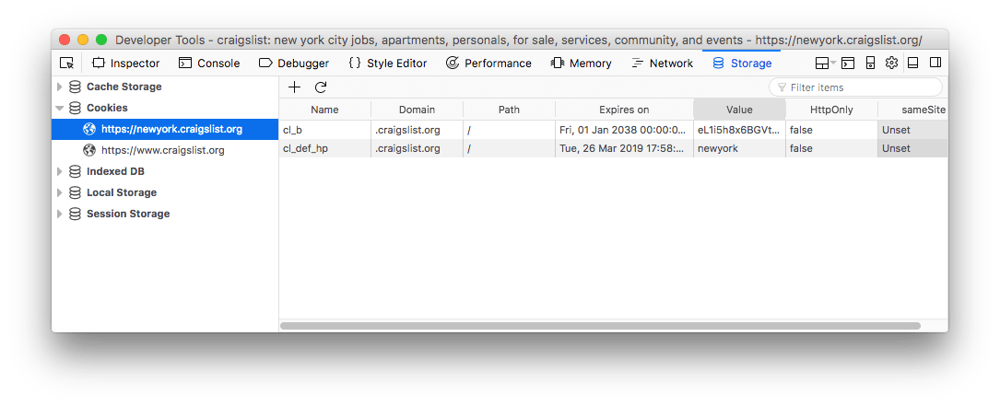

<!-- TOC -->

- [Introduction](#introduction)
- [Restrictions of cookies](#restrictions-of-cookies)
- [Set cookies](#set-cookies)
- [Set a cookie expiration date](#set-a-cookie-expiration-date)
- [Set a cookie path](#set-a-cookie-path)
- [Set a cookie domain](#set-a-cookie-domain)
- [Cookie Security](#cookie-security)
  - [`Secure`](#secure)
  - [`HttpOnly`](#httponly)
  - [`SameSite`](#samesite)
- [Update a cookie value or parameter](#update-a-cookie-value-or-parameter)
- [Delete a cookie](#delete-a-cookie)
    - [Access the cookies values](#access-the-cookies-values)
- [Check if a cookie exists](#check-if-a-cookie-exists)
- [Abstractions libraries](#abstractions-libraries)
- [Use cookies server-side](#use-cookies-server-side)
- [Inspect cookies with the Browser DevTools](#inspect-cookies-with-the-browser-devtools)
  - [Chrome](#chrome)
  - [Firefox](#firefox)
  - [Safari](#safari)
- [Alternatives to cookies](#alternatives-to-cookies)

<!-- /TOC -->

## Introduction

By using Cookies we can exchange information between the server and the browser to provide a way to customize a user session, and for servers to recognize the user between requests.

HTTP is stateless, which means all request origins to a server are exactly the same and a server cannot determine if a request comes from a client that already did a request before, or it's a new one.

Cookies are sent by the browser to the server when an HTTP request starts, and they are sent back from the server, which can edit their content.

**Cookies are essentially used to store a session id**.

In the past cookies were used to store various types of data, since there was no alternative. But nowadays with the [Web Storage API](/web-storage-api/) (Local Storage and Session Storage) and [IndexedDB](/indexeddb/), we have much better alternatives.

Especially because cookies have a very low limit in the data they can hold, since they are sent back-and-forth for every HTTP request to our server - including requests for assets like images or CSS / [JavaScript](/javascript/) files.

Cookies have a long history, they had their first version in 1994, and over time they were standardized in multiple RFC revisions.

> RFC stands for Request for Comments, the way standards are defined by the Internet Engineering Task Force (IETF), the entity responsible for setting standards for the Internet

The latest specification for Cookies is defined in the [RFC 6265](https://tools.ietf.org/html/rfc6265), which is dated 2011.

## Restrictions of cookies

- Cookies can only store **4KB of data**
- Cookies are **private to the domain**. A site can only read the cookies it set, not other domains cookies
- You can have up to 20 limits of cookies per domain (but the exact number depends on the specific browser implementation)
- Cookies are limited in their total number (but the exact number depends on the specific browser implementation). If this number is exceeded, new cookies replace the older ones.

Cookies can be set or read server side, or client side.

In the client side, cookies are exposed by the [document object](/dom/) as `document.cookie`

## Set cookies

The simplest example to set a cookie is:

```js
document.cookie = 'name=Flavio'
```

This will add a new cookie to the existing ones (it does not overwrite existing cookies)

The cookie value should be url encoded with [`encodeURIComponent()`](https://developer.mozilla.org/en-US/docs/JavaScript/Reference/Global_Objects/encodeURIComponent), to make sure it does not contain any whitespace, comma or semicolon which are not valid in cookie values.

## Set a cookie expiration date

If you don't set anything else, the cookie will expire when the browser is closed. To prevent so, add an expiration date, expressed in the UTC format (`Mon, 26 Mar 2018 17:04:05 UTC`)

```js
document.cookie = 'name=Flavio; expires=Mon, 26 Mar 2018 17:04:05 UTC'
```

A simple JavaScript snippet to set a cookie that expires in 24 hours is:

```js
const date = new Date()
date.setHours(date.getHours() + 5)
document.cookie = 'name=Flavio; expires=' + date.toUTCString()
```

Alternatively you can use the `max-age` parameter to set an expiration expressed in number of seconds:

```js
document.cookie = 'name=Flavio; max-age=3600' //expires in 60 minutes
document.cookie = 'name=Flavio; max-age=31536000' //expires in 1 year
```

## Set a cookie path

The `path` parameter specifies a document location for the cookie, so it's assigned to a specific path, and sent to the server only if the path matches the current document location, or a parent:

```js
document.cookie = 'name=Flavio; path="/dashboard"'
```

this cookie is sent on `/dashboard`, `/dashboard/today` and other sub-urls of `/dashboard/`, but not on `/posts` for example.

If you don't set a path, it defaults to the current document location. This means that to apply a global cookie from an inner page, you need to specify `path="/"`.

## Set a cookie domain

The `domain` can be used to specify a subdomain for your cookie.

```js
document.cookie = 'name=Flavio; domain="mysite.com";'
```

If not set, it defaults to the host portion even if using a subdomain (if on subdomain.mydomain.com, by default it's set to mydomain.com). Domain cookies are included in subdomains.

## Cookie Security

### `Secure`

Adding the `Secure` parameter makes sure the cookie can only be transmitted securely over HTTPS, and it will not be sent over unencrypted HTTP connections:

```js
document.cookie = 'name=Flavio; Secure;'
```

> Note that this does not make cookies secure in any way - always avoid adding sensitive information to cookies

### `HttpOnly`

One useful parameter is `HttpOnly`, which makes cookies inaccessible via the `document.cookie` API, so they are only editable by the server:

```js
document.cookie = 'name=Flavio; Secure; HttpOnly'
```

### `SameSite`

`SameSite`, still experimental and only supported by Chrome and Firefox (<https://caniuse.com/#feat=same-site-cookie-attribute>, lets servers require that a cookie is not sent on cross-site requests, but only on resources that have the cookie domain as the origin, which should be a great help towards reducing the risk of CSRF (Cross Site Request Forgery) attacks.

## Update a cookie value or parameter

To update the value of a cookie, just assign a new value to the cookie name:

```js
document.cookie = 'name=Flavio2'
```

Similar to updating the value, to update the expiration date, reassign the value with a new `expires` or `max-age` property:

```js
document.cookie = 'name=Flavio; max-age=31536000' //expires in 1 year
```

Just remember to also add any additional parameters you added in the first place, like `path` or `domain`.

## Delete a cookie

To delete a cookie, unset its value and pass a date in the past:

```js
document.cookie = 'name=; expires=Thu, 01 Jan 1970 00:00:00 UTC;'
```

(and again, with all the parameters you used to set it)

#### Access the cookies values

To access a cookie, lookup `document.cookie`:

```js
const cookies = document.cookie
```

This will return a string with all the cookies set for the page, semicolon separated:

```js
'name1=Flavio1; name2=Flavio2; name3=Flavio3'
```

## Check if a cookie exists

```js
//ES5
if (
  document.cookie.split(';').filter(item => {
    return item.indexOf('name=') >= 0
  }).length
) {
  //name exists
}

//ES2016
if (
  document.cookie.split(';').filter(item => {
    return item.includes('name=')
  }).length
) {
  //name exists
}
```

## Abstractions libraries

There are a number of different libraries that will provide a friendlier API to manage cookies. One of them is <https://github.com/js-cookie/js-cookie>, which supports up to IE7, and has a lot of stars on GitHub (which is always good).

Some examples of its usage:

```js
Cookies.set('name', 'value')
Cookies.set('name', 'value', {
  expires: 7,
  path: '',
  domain: 'subdomain.site.com',
  secure: true
})

Cookies.get('name') // => 'value'
Cookies.remove('name')

//JSON
Cookies.set('name', { name: 'Flavio' })
Cookies.getJSON('name') // => { name: 'Flavio' }
```

Use that or the native Cookies API?

It all comes down to adding more kilobytes to download for each user, so it's your choice.

## Use cookies server-side

Every environment used to build an HTTP server allows you to interact with cookies, because cookies are a pillar of the Modern Web, and not much could be built without them.

PHP has $\_COOKIE
Go has cookies facilities in the `net/http` standard library

and so on.

Let's do an example with Node.js

When using Express.js, you can create cookies using the [`res.cookie`](http://expressjs.com/en/api.html#res.cookie) API:

```js
res.cookie('name1', '1Flavio', {
  domain: '.example.com',
  path: '/admin',
  secure: true
})
res.cookie('name2', 'Flavio2', {
  expires: new Date(Date.now() + 900000),
  httpOnly: true
})
res.cookie('name3', 'Flavio3', { maxAge: 900000, httpOnly: true })

//takes care of serializing JSON
res.cookie('name4', { items: [1, 2, 3] }, { maxAge: 900000 })
```

To parse cookies, a good choice is to use the <https://github.com/expressjs/cookie-parser> middleware. Every Request object will have cookies information in the [`req.cookie`](http://expressjs.com/en/api.html#req.cookies) property:

```js
req.cookies.name //Flavio
req.cookies.name1 //Flavio1
```

If you create your cookies using `signed: true`:

```js
res.cookie('name5', 'Flavio5', { signed: true })
```

they will be available in the `req.signedCookies` object instead. Signed cookies will be completely unreadable in the frontend, but transparently encoded/decoded on the server side.

<https://github.com/expressjs/session> and <https://github.com/expressjs/cookie-session> are two different middleware options to build cookie-based authentication, which one to use depends on your needs.

## Inspect cookies with the Browser DevTools

All browsers in their [DevTools](/browser-dev-tools/) provide an interface to inspect and edit cookies.

### Chrome



### Firefox



### Safari


## Alternatives to cookies

Are cookies the only way to build authentication and sessions on the Web?

No! There is a technology that recently got popular, called **JSON Web Tokens** ([**JWT**](/jwt/)), which is a **Token-based Authentication**.
