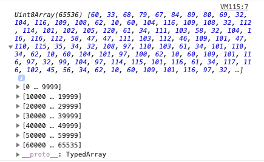
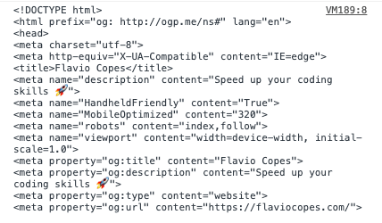

Using streams we can receive a resource from the network, or from other sources, and process it as soon as the first bit arrives.

Instead of waiting for the resource to completely download before using it, we can immediately work with it.

## What is a stream

The first example that comes to mind is loading a YouTube video - you don't have to fully load it before you can start watching it.

Or live streaming, where you don't even know when the content will end.

The content does not even have to end. It could be generated indefinitely.

## The Streams API

The Streams API allows us to work with this kind of content.

We have 2 different streaming modes: reading from a stream, and writing to a stream.

Readable streams are available in all modern browsers except Internet Explorer.

Writable streams are not available on Firefox and Internet Explorer.

As always, check [caniuse.com](https://caniuse.com/#feat=streams) for the most up-to-date information on this matter.

Let's start with readable streams

## Readable streams

We have 3 classes of objects when it comes to readable streams:

- `ReadableStream`
- `ReadableStreamDefaultReader`
- `ReadableStreamDefaultController`

We can consume streams using a ReadableStream object.

Here is the first example of a readable stream. The Fetch API allows to get a resource from the network and make it available as a stream:

```js
const stream = fetch('/resource')
  .then(response => response.body)
```

The `body` property of the fetch response is a `ReadableStream` object instance. This is our readable stream.

## The reader

Calling `getReader()` on a `ReadableStream` object returns a `ReadableStreamDefaultReader` object, the reader. We can get it this way:

```js
const stream = fetch('/resource').then(response => response.body)
const reader = stream.getReader()
```

or more concise:

```js
const reader = fetch('/resource').then(response => response.body.getReader())
```

We read data in chunks, where a chunk is a byte or a typed array. Chunks are enqueued in the stream, and we read them one chunk at a time.

A single stream can contain different kind of chunks.

Once we have a `ReadableStreamDefaultReader ` object we can access the data using the `read()` method.

As soon as a reader is created, the stream is locked and no other reader can get chunks from it, until we call `releaseLock()` on it.

> You can tee a stream to achieve this effect, more on this later on

## Reading data from a readable stream

Once we have a `ReadableStreamDefaultReader` object instance we can read data from it.

This is how you can read the first chunk of the stream of the HTML content from the  flaviocopes.com web page, byte by byte (for CORS reasons, you can execute this in the DevTools window opened on that webpage).

```js
fetch('https://flaviocopes.com/')
  .then(response => {
    response.body
      .getReader()
      .read()
      .then(({value, done}) => {
        console.log(value)
      })
  })
```




If you open each single group of array items, you'll get to the single items. Those are bytes, stored in a `Uint8Array`:


You can transform those bytes to characters using the **Encoding API**:

```js
const decoder = new TextDecoder('utf-8')
fetch('https://flaviocopes.com/')
  .then(response => {
    response.body
      .getReader()
      .read()
      .then(({value, done}) => {
        console.log(decoder.decode(value))
      })
  })
```

which will print out the characters loaded in the page:



This new version of the code loads every chunk of the stream, and prints it:

```js
(async () => {
  const fetchedResource = await fetch('https://flaviocopes.com/')
  const reader = await fetchedResource.body.getReader()

  let charsReceived = 0
  let result = ''

  reader.read().then(function processText({ done, value }) {
    if (done) {
      console.log('Stream finished. Content received:')
      console.log(result)
      return
    }

    console.log(`Received ${result.length} chars so far!`)

    result += value

    return reader.read().then(processText)
  })
})()
```

I wrapped this in an `async` immediately-invoked function to use `await`.

The processText() function we create receives an object with 2 properties.

- `done` true if the stream ended and we got all the data
- `value` the value of the current chunk received

We create this recursive function to process the entire stream.

## Creating a stream

> Warning: not supported in Edge and Internet Explorer

We just saw how to consume a readable stream generated by the Fetch API, which is a great way to start working with streams, as the use case is practical.

Now let's see how to create a readable stream, so we can give access to a resource with our code.

We already used a `ReadableStream` object before. Let's now create a brand new one using the `new` keyword:

```js
const stream = new ReadableStream()
```

This stream now is very useful at all. It is an empty stream, and if anyone wants to read from it, there's no data.

We can define what how the stream behaves by passing an object during the initialization. This object can define those properties:

- `start` a function called when the readable stream is created. In here you connect to the data source and perform administrative tasks.
- `pull` a function called repeatedly to get data, while the internal queue high water mark is not reached
- `cancel` a function called when the stream is cancelled, for example when the `cancel()` method is called on the receiving end

Here is a bare bones example of the object structure:

```js
const stream = new ReadableStream({
  start(controller) {

  },
  pull(controller) {

  },
  cancel(reason) {

  }
})
```

`start()` and `pull()` get a controller object, is an instance of the `ReadableStreamDefaultController` object, which lets you control the stream state and the internal queue.

To add data to the stream, we call `controller.enqueue()` passing the variable that holds our data:

```js
const stream = new ReadableStream({
  start(controller) {
    controller.enqueue('Hello')
  }
})
```

When we are ready to close the stream, we call `controller.close()`.

`cancel()` gets a `reason` which is a string provided to the `ReadableStream.cancel()` method invocation when the stream is cancelled.

We can also pass an optional second object that determines the queuing strategy. It contains 2 properties:

- `highWaterMark` the total number of chunks that can be stored in the internal queue. We mentioned this when talking about `pull()` before
- `size`, a method that you can use to change the chunk size, expressed in bytes

```js
{
  highWaterMark,
  size()
}
```

those are useful mainly for controlling the pressure on the stream, especially in the context of a **pipe chain**, something still experimental in the Web APIs.

When the `highWaterMark` value of a stream is reached, a **backpressure** signal is sent to the previous streams in the pipe to tell them to slow down data pressure.

We have 2 built-in objects that define the queuing strategy:

- `ByteLengthQueuingStrategy` which waits until the accumulated size in bytes of the chunks goes over the specified high water mark
- `CountQueuingStrategy` wich waits until the accumulated number of chunks goes over the specified high water mark

Example setting a 32 bytes high water mark:

```js
new ByteLengthQueuingStrategy({ highWaterMark: 32 * 1024 }
```

Example setting a 1 chunk high water mark:

```js
new CountQueuingStrategy({ highWaterMark: 1 })
```

I mention this to tell you that you *can* control the amount of data flowing into a stream, and communicate with the other actors, but we're not going into more details as things get complicated pretty fast.

## Teeing streams

Previously I mentioned that as soon as we start reading a stream, it's locked and other readers can't access it until we call `releaseLock()` on it.

We can however duplicate the stream using the `tee()` method on the stream itself:

```js
const stream = //...
const tees = stream.tee()
```

`tees` is now an array that contains 2 new streams, which you can use to read from using `tees[0]` and `tees[1]`.

## Writable streams

We have 3 classes of objects when it comes to writable streams:

- `WritableStream`
- `WritableStreamDefaultReader`
- `WritableStreamDefaultController`

We can create streams that we can later consume, using a WritableStream object.

This is how we create a new writable stream:

```js
const stream = new WritableStream()
```

We must pass an object in order to be useful. This object will have the following optional methods implementations:

- `start()` called when the object is initialized
- `write()` called when a chunk is ready to be written to the sink (the underlying structure holding the stream data before it's written)
- `close()` called when we finished writing chunks
- `abort()` called when we want to signal an error

Here is a skeleton:

```js
const stream = new WritableStream({
  start(controller) {

  },
  write(chunk, controller) {

  },
  close(controller) {

  },
  abort(reason) {

  }
})
```

`start()`, `close()` and `write()` get passed the controller, a `WritableStreamDefaultController` object instance.

As for `ReadableStream()`, we can pass a second object to `new WritableStream()` which sets the queuing strategy.

For example let's create a stream that given a string that is stored in memory, creates a stream that consumers can connect to.

We start by defining a decoder which we'll use to transform the bytes we receive into characters using the **Encoding API** `TextDecoder()` constructor:

```js
const decoder = new TextDecoder("utf-8")
```

We can initialize the WritableStream implementing the `close()` method, which will print to the console when the message is fully received and the client code calls it:

```js
const writableStream = new WritableStream({
  write(chunk) {
    //...
  },
  close() {
    console.log(`The message is ${result}`)
  }
})
```

We start the `write()` implementation by initializing an ArrayBuffer and by adding it the chunk. We then proceed to decode this chunk, which is a byte, into a character using the decoder.decode() method of the Encoding API. We then add this value to a `result` string which we declare outside this object:

```js
let result

const writableStream = new WritableStream({
  write(chunk) {
    const buffer = new ArrayBuffer(2)
    const view = new Uint16Array(buffer)
    view[0] = chunk
    const decoded = decoder.decode(view, { stream: true })
    result += decoded
  },
  close() {
    //...
  }
})
```

The WritableStream object is now initialized.

We now go and implement the client code that will use this stream.

We first get the `WritableStreamDefaultWriter` object from the `writableStream` object:

```js
const writer = writableStream.getWriter()
```

Next we define a message to be sent:

```js
const message = 'Hello!'
```

Then we initialize the encoder to _encode_ the characters we want to send to the stream:

```js
const encoder = new TextEncoder()
const encoded = encoder.encode(message, { stream: true })
```

At this point the string has been encoded in an array of bytes. Now, we use the `forEach` loop on this array to send each byte to the stream. Before each call to the `write()` method of the stream writer, we check the `ready` property which returns a promise, so we only write when the stream writer is ready:

```js
encoded.forEach(chunk => {
  writer.ready.then(() => {
    return writer.write(chunk)
  })
})
```

The only thing we miss now is to close the writer. `forEach` is a synchronous loop, which means we reach this point only after each item has been written.

We still check for the `ready` property, then we call the close() method:

```js
writer.ready.then(() => {
  writer.close()
})
```
