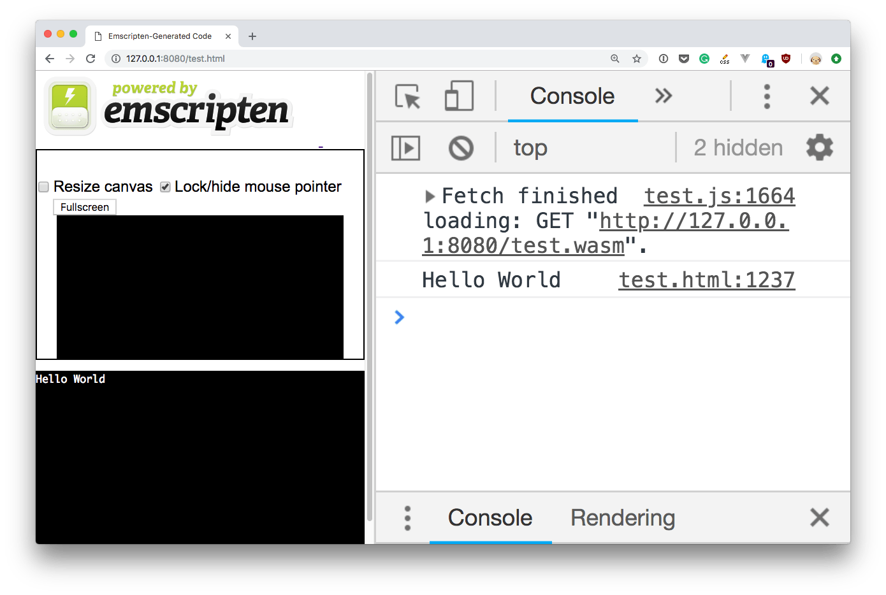
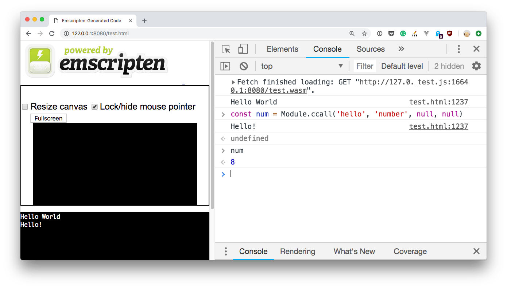
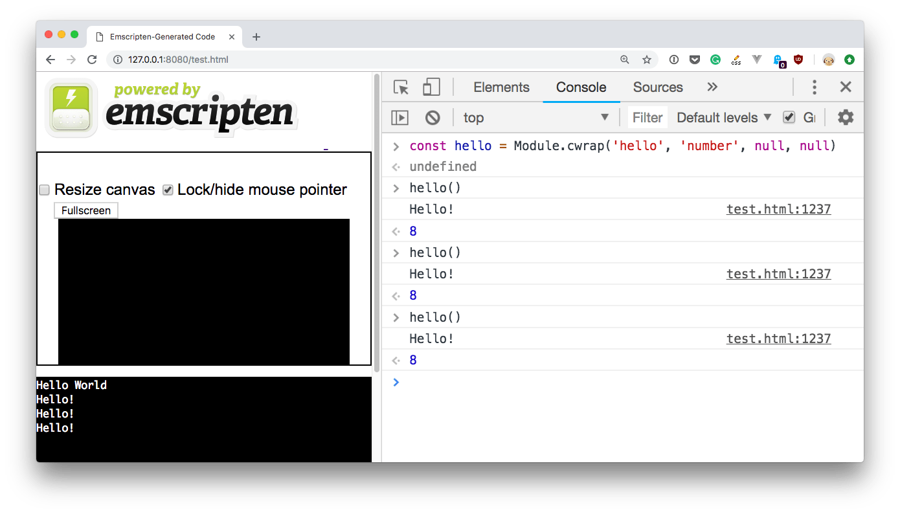

[WebAssembly](https://webassembly.org/) is a very cool topic nowadays.

WebAssembly is a new low-level binary format for the web. It's not a programming language you are going to write, but instead other higher level languages (at the moment C, Rust and C++) are going to be compiled to WebAssembly to have the opportunity to run in the browser.

It's designed to be fast, memory-safe, and open.

You'll never write code in WebAssembly (also called WASM) but instead WebAssembly is the low level format to which other languages are compiled to.

It's the second language ever to be understandable by Web Browsers, after the JavaScript introduction in the 90's.

WebAssembly is a standard developed by the [W3C WebAssembly Working Group](https://www.w3.org/wasm/). Today all modern browsers (Chrome, Firefox, Safari, Edge, mobile browsers) and Node.js support it.

Did I say Node.js? Yes, because WebAssembly was born in the browser, but Node already supports it since version 8 and you can build parts of a Node.js application in any language other than JavaScript.

People that dislike JavaScript, or prefer writing in other languages, thanks to WebAssembly will now have the option to write parts of their applications for the Web in languages different than JavaScript.

Be aware though: **WebAssembly is not meant to replace JavaScript**, but it's a way to port programs written in other languages to the browser, to power parts of the application that are either better created in those languages, or pre-existing.

JavaScript and WebAssembly code interoperate to provide great user experiences on the Web.

It's a win-win for the web, since we can use the flexibility and ease of use of JavaScript and complement it with the power and performance of WebAssembly.

## Safety

WebAssembly code runs in a sandboxed environment, with the same security policy that JavaScript has, and the browser will ensure same-origin and permissions policies.

If you are interested in the subject I recommend to read [Memory in WebAssembly](https://hacks.mozilla.org/2017/07/memory-in-webassembly-and-why-its-safer-than-you-think/) and the [Security docs of webassembly.org](https://webassembly.org/docs/security/).

## Performance

WebAssembly was designed for speed. Its main goal is to be really, really fast. It's a compiled language, which means programs are going to be transformed to binaries before being executed.

It can reach performance that can closely match natively compiled languages like C.

Compared to JavaScript, which is a dynamic and interpreted programming language, speed cannot be compared. WebAssembly is always going to beat JavaScript performance, because when executing JavaScript the browser must interpret the instructions and perform any optimization it can on the fly.

## Who is using WebAssembly today?

Is WebAssembly ready for use? Yes! Many companies are already using it to make their products better on the Web.

A great example you probably already used is [Figma](https://figma.com), a design application which I also use to create some of the graphics I use in the day-to-day work. This application runs inside the browser, and it's really fast.

The app is built using React, but the main part of the app, the graphics editor, is a C++ application compiled to WebAssembly, rendered in a Canvas using WebGL.

In early 2018 AutoCAD released its popular design product running inside a Web App, using WebAssembly to render its complex editor, which was built using C++ (and migrated from the desktop client codebase)

The Web is not a limiting technology any more for those products that require a very performant piece to their core.

## How can you use WebAssembly?

C and C++ applications can be ported to WebAssembly using [Emscripten](http://kripken.github.io/emscripten-site/), a toolchain that can compile your code to two files:

- a  `.wasm` file
- a  `.js`  file

where the `.wasm` file contains the actual  WASM code, and the `.js` file contains the glue that will allow the JavaScript code to run the WASM.

Emscripten will do a lot of work for you, like converting OpenGL calls to WebGL, will provide bindings for the DOM API and other browsers and device APIs, will provide filesystem utilities that you can use inside the browser, and much more. By default those things are not accessible in WebAssembly directly, so it's a great help.

Rust code is different, as it can be directly compiled to WebAssembly as its output target, and there's an [https://developer.mozilla.org/en-US/docs/WebAssembly/Rust_to_wasm](https://developer.mozilla.org/en-US/docs/WebAssembly/Rust_to_wasm).

## What's coming for WebAssembly in the future? How is it evolving?

WebAssembly is now at version 1.0. It currently officially supports only 3 languages (C, Rust, C++) but many more are coming. Go, Java and C# cannot currently be (officially) compiled to WebAssembly because there is no support for garbage collection yet.

When making any call to browser APIs using WebAssembly you currently need to interact with JavaScript first. There is work in progress to make WebAssembly a more first class citizen in the browser and make it able to call DOM, Web Workers or other browser APIs directly.

Also, there is work in progress to be able to make JavaScript code being able to load WebAssembly modules, through the [ES Modules](https://flaviocopes.com/es-modules/) specification.

## Installing Emscripten

Install Emscripten by cloning the `emsdk` GitHub repo:

```bash
git clone https://github.com/juj/emsdk.git
```

then

```bash
dev cd emsdk
```

Now, make sure you have an up to date version of Python installed. I had 2.7.10 and this caused a TLS error.

I had to download the new one (2.7.15) from <https://www.python.org/getit/> install it and then run the `Install Certificates.command` program that comes with the installation.

Then

```bash
./emsdk install latest
```

let it download and install the packages, then run

```bash
./emsdk activate latest
```

and add the paths to your shell by running:

```bash
source ./emsdk_env.sh
```

## Compile a C program to WebAssembly

I am going to create a simple C program and I want it to execute inside the browser.

This is a pretty standard "Hello World" program:

```c
#include <stdio.h>

int main(int argc, char ** argv) {
  printf("Hello World\n");
}
```

You could compile it using:

```bash
gcc -o test test.c
```

and running `./test` would print "Hello World" to the console.

Let's compile this program using Emscripten to run it in the browser:

```bash
emcc test.c -s WASM=1 -o test.html
```

Emscripten gave us a html page that already wraps the WebAssembly program compiled, ready to run. You need to open it from a web server though, not from the local filesystem, so start a local web server, for example the `http-server` global npm package (install it using `npm install -g http-server` if you don't have it installed already). Here it is:



As you can see, the program ran and printed "Hello World" in the console.

This was one way to run a program compiled to WebAssembly. Another option is to make a program expose a function you are going to call from JavaScript.

## Call a WebAssembly function from JavaScript

Let's tweak the Hello World defined previously.

Include the `emscripten` headers:

```c
#include <emscripten/emscripten.h>
```

and define an `hello` function:

```c
int EMSCRIPTEN_KEEPALIVE hello(int argc, char ** argv) {
  printf("Hello!\n");
  return 8;
}
```

`EMSCRIPTEN_KEEPALIVE` is needed to preserve the function from being automatically stripped if not called from `main()` or other code executed at startup (as the compiler would otherwise optimize the resulting compiled code and remove unused functions - but we're going to call this dynamically from JS, and the compiler does now know this).

This little function prints Hello! and returns the number 8.

Now if we compile again using `emcc`:

```bash
emcc test.c -s WASM=1 -o test.html -s "EXTRA_EXPORTED_RUNTIME_METHODS=['ccall', 'cwrap']"
```

This time we added a `EXTRA_EXPORTED_RUNTIME_METHODS` flag to tell the compiler to leave the `ccall` and `cwrap` functions on the Module object, which we'll use in JavaScript.

Now we can fire up the Web Server again and once the page is open call `Module.ccall('hello', 'number', null, null)` in the console, and it will print "Hello!" and return 8:



The 4 parameters that `Module.ccall` takes are the C function name, the return type, the types of the arguments (an array), and the arguments (also an array).

If our function accepted 2 strings as parameters, for example, we would have called it like this:

```js
Module.ccall('hello', 'number', ['string', 'string'], ['hello', 'world'])
```

The types we can use are `null`, `string`, `number`, `array`, `boolean`.

We can also create a JavaScript wrapper for the `hello` function by using the `Module.cwrap` function, so that we can call the function as many times we want by using the JS counterpart:

```js
const hello = Module.cwrap('hello', number, null, null)
```



[Here's the official docs for `ccall` and `cwrap`](https://kripken.github.io/emscripten-site/docs/api_reference/preamble.js.html#cwrap).